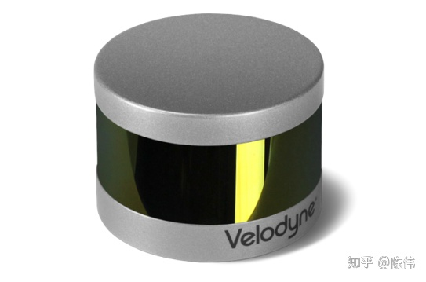
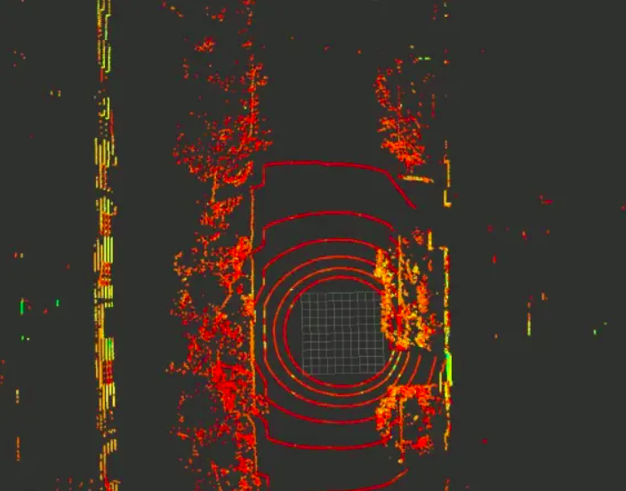
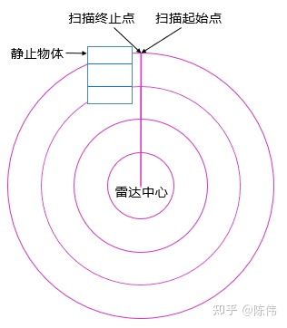
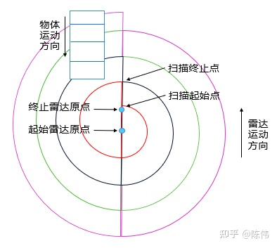
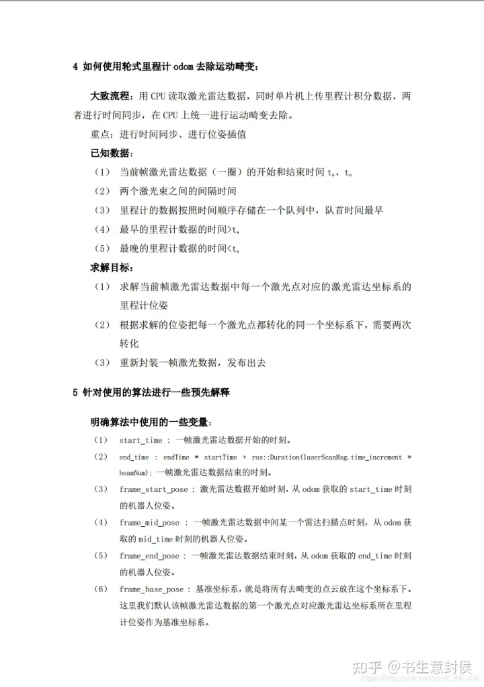
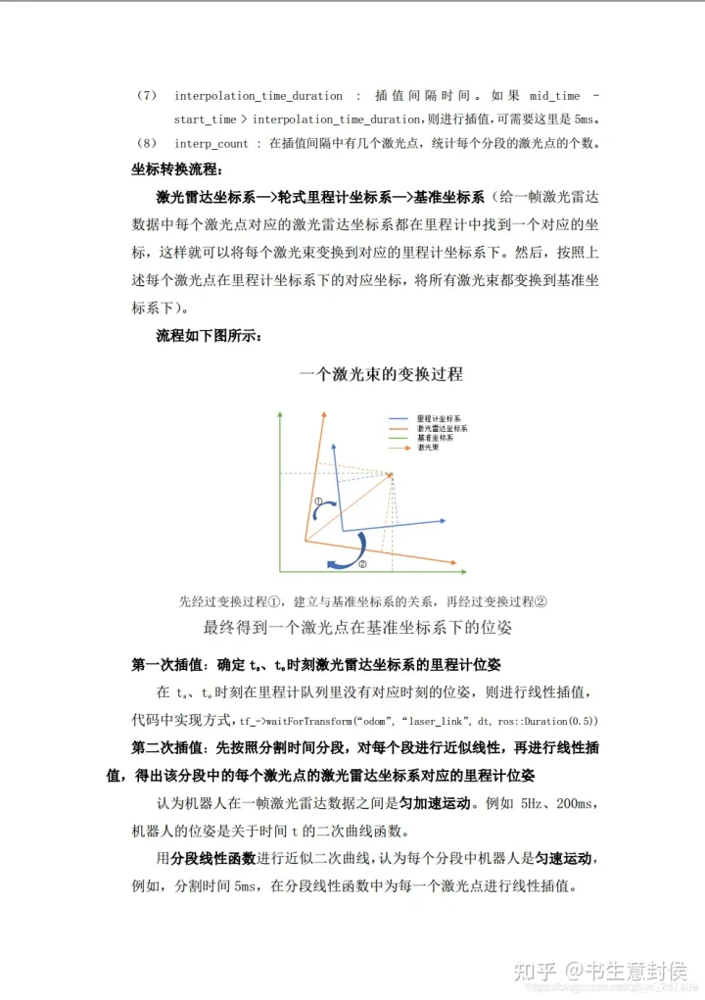
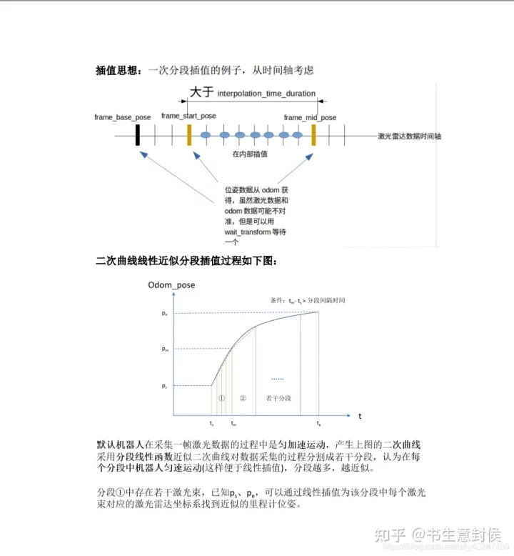

# 2d激光雷达运动补偿方法(去畸变)

## 1.点云畸变原理

我们以VLP-16为例，纵向排列着16个激光发射器和接收器。VLP-16的垂直测量角度从-15°到+15°，每条激光线之间的角分辨率为2°，在10Hz扫描频率下，水平角分辨率是0.2°，理论上一帧有28800个点。

#### **下面我们先了解下VLP-16的扫描模式：**

VLP-16中单个线束为一个Scan，全部16线组成的一帧点云称为一个Sweep，一帧内所有的点，都是按顺序串行扫描的，同一个时间点，只会有一次发送，紧接着一次接收。先从水平第一个角度，一般在0°左右扫描这个水平角度上竖直方向所有16个点(对应16个SCAN)的深度，当然这16个点也是串行按顺序的，然后转到下一个水平角度，比如0.3°开始，水平分辨率0.4°，那么下个角度就是0.7°，然后1.1°。一直顺时针扫完一圈，完成一个Sweep数据的采集。

由于垂直角分辨率是2°，VLP-16激光雷达水平安装，我们可以看到地面上的点云有6~7圈。如下图所示：

在静止的场景中，即激光雷达载体本身静止且环境中没有运动物体，那么采集到的一帧点云没有畸变，如下图所示，每一条线束打到地面上形成一个闭合的圆形：

在运动的场景中，即激光雷达载体运动或者环境中存在运动物体，采集到的点云数据有畸变现象，如下图所示：激光雷达向前运动，物体相对运动，同一种颜色的线表示一条激光打到地面的线束。采集一帧数据起始点时的雷达原点位置和采集一帧数据终止点时的雷达原点位置出现了位移，三维环境信息出现了拉伸的畸变。（运动物体同理）

#### **由此得出机械式激光点云的畸变产生原因：**

- 激光点的数据不是瞬时获得的
- 激光测量时伴随载体或目标的运动
- 激光帧率较低时，载体或目标运动畸变不能忽略

由于雷达计算激光点坐标时，都是以接收到激光束时刻的雷达自身坐标系为基础的，所以载体运动过程中，每一列激光点的基准坐标系都是不一样的，但是他们在同一帧点云里，我们希望能统一在同一个坐标系下，所以我们需要知道每次采集时的坐标系相对于初始时刻坐标系的转换关系。

## 2.去除运动畸变的原理

去除激光雷达运动畸变的原理是把一帧激光雷达数据的每个激光点对应的激光雷达坐标转换到不同时刻的机器人里程计上（近似对应的里程计的位置，达到尽可能去除畸变的目的）。

## 3.畸变补偿方法

点云的畸变是由于一帧数据的采集过程中，雷达载体进行运动导致，因此我们需要先计算采集过程中雷达的运动，然后在每帧中根据每个点的相对时间进行补偿这个运动量，包括旋转和平移的补偿。

#### **点云去畸变的方法包括：**

- 纯估计方法（ICP/VICP）
- 传感器辅助方法（IMU/ODOM）
- 融合的方法（用里程计与icp的方法共同使用，即为融合方法）

本文介绍一种利用odom进行畸变校正的方法，相关代码已经上传到[我的仓库](https://github.com/hanlin-cheng/lidar_undistortion_2d)

## 4.Code

相关实现代码可以在以下仓库中找到

https://github.com/hanlin-cheng/lidar_undistortion_2d

## 5.reference

https://zhuanlan.zhihu.com/p/351109327

https://zhuanlan.zhihu.com/p/470795318