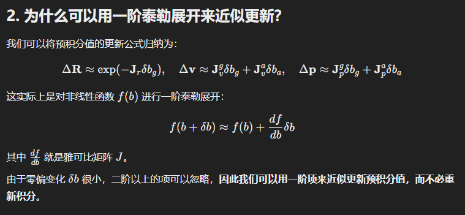
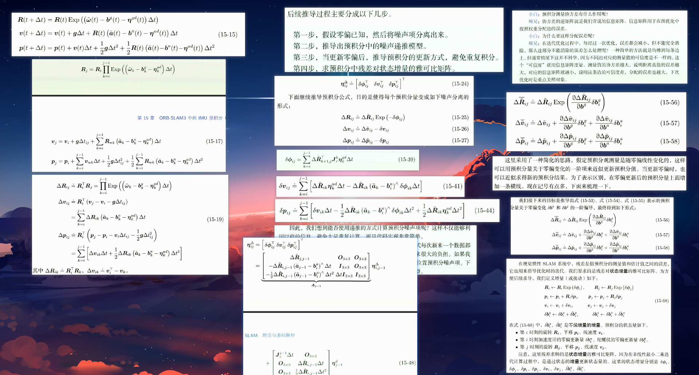

# IMU预积分

## 简述		

​		惯性导航的核心原理基于牛顿第二定律，即位置的导数等于速度，速度的导数等于加速度。如果我们假设参考坐标系下载体的初始速度和初始位置已知，利用载体运动过程中参考系下的加速度信息，就可以不断地进行积分运算，更新实时的速度和位置。

​		传感器总是存在噪声的，惯性导航这种积分运算，必然使得 IMU 器件中的测量噪声不断的累积，从而造成定位和姿态误差。IMU中主要的误差有两种，分别为零偏和噪声。

#### 1.零偏（Bias, Bias Drift, or Offset）

**定义**：零偏是指当 IMU 的传感器（加速度计或陀螺仪）在没有任何运动或旋转的情况下，输出的非零信号。理想情况下，当传感器没有受到加速度或角速度时，它的输出应该是零。然而，由于制造误差、温度变化和电路的不稳定性，传感器在静止状态下仍会产生一些非零输出，这种误差就是零偏。

**影响**：零偏会导致累计误差，特别是在长期积分（如计算位置或角度）时。这是因为零偏引入了一个恒定的误差，即使没有任何实际运动，IMU 也会产生虚假的信号。

**漂移**：零偏不是恒定的，它可能随着时间、温度、震动等环境因素的变化而漂移。因此，在使用 IMU 时，通常需要定期校准以减少零偏对测量精度的影响。

#### 2.噪声（Noise）

**定义**：噪声是指 IMU 输出信号中随机的波动或不规则的变化。噪声来源于电子元器件的热噪声、电磁干扰、量子噪声等。噪声本质上是高频的随机误差，通常以标准差或均方根（RMS）形式量化。

**影响**：噪声会使 IMU 的输出信号变得不稳定，在短时间内造成读数的波动。尽管噪声在单次测量中的影响可能较小，但在进行积分操作（例如计算速度和位置）时，噪声会被累积，从而导致测量结果的精度降低。

**处理方法**：为了减少噪声的影响，常使用滤波器（如卡尔曼滤波器）来平滑信号，并在设计中选择低噪声的传感器。

#### 3.总结

**零偏** 是一种系统性的误差，通常需要通过校准和补偿来处理。

**噪声** 是一种随机误差，通常通过滤波和信号处理来减小影响。

## 为什么要进行IMU预积分

​	IMU的频率一般在100Hz ~ 1kHz之间，在如此高的数据输出频率下，如果利用好数据，如何高效的利用数据是非常具有挑战任务的，这对于实时性要求比较好的slam系统来说十分重要。IMU测量的角速度和加速度过多次积分可以得到旋转角度和位移量， 那么以什么样的频率积分呢？如果对每个IMU数据都进行积分， 那么计算量将是非常可怕的， 而且也没必要。 所以通常的做法是对两个图像帧之间的IMU数据进行积分， 从而构建图像帧之间的相对位姿约束。 这时就出现了一个问题， 两个图像帧之间的IMU积分需要给定第一个帧的状态估计量作为积分初始条件。 而每次优化迭代， 这些状态估计量都会更新， 这就需要不断重复地进行所有帧之间的IMU积分。IMU预积分就是为了解决这个问题提出的， 它用某种巧妙的设计避免了重复积分， 进而可以推导出优化所需的雅可比矩阵的解析表达式， 比较完美地解决了如何利用好数据和如何高效地利用数据的问题。

## IMU模型和运动积分

## 附注

