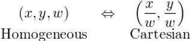
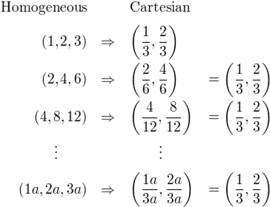
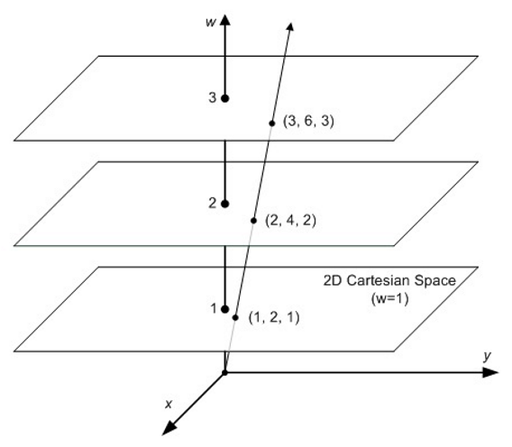
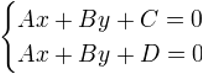
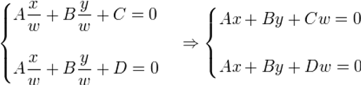

# 为什么使用齐次坐标

在计算机图形学里面会经常碰到几何体的平移,旋转,缩放以及投影变换. 一般情况下会涉及到齐次坐标与变换矩阵. 为了后续对变换矩阵内容的讲解, 在这里先简要的介绍一下什么是齐次坐标.

## **问题:两条平行线可以相交?**

在欧氏空间（几何学）中，同一平面上的两条平行线不能相交，或者说不能永远相交。这是一个大家都熟悉的常识。

但是，在投影空间中就不一样了，比如，下图上的火车铁路在远离眼睛的时候会变得更窄。最后，两条平行的铁轨在地平线处相交，也就是无限远处的一点。

铁路变窄，在地平线处相交。

欧氏空间（或笛卡尔空间）能很好地描述我们的2D/3D几何，但它们不足以处理投影空间（实际上，欧氏几何是投影几何的一个子集）。一个2D点的笛卡尔坐标可以表示为（x，y）。

如果这个点远去到无穷远呢？无穷远处的点在欧氏空间中无法具体展示。在投影空间中，平行线会在无穷远处相遇，但在欧氏空间中却做不到。

那么数学家如何用数学的方法来描述这个问题呢?

## **解决方案: 齐次坐标**

由 August Ferdinand Möbius(不错,就是那个莫比乌斯圈的那位) 提出的齐次坐标，使图形和几何学的计算在投影空间中成为可能。齐次坐标是用N+1个数来表示N维坐标的一种方式。

要制作二维齐次坐标，我们只需在现有坐标中增加一个额外的变量w。因此，笛卡尔坐标中的一点，(X，Y)在齐次坐标中就变成了(x，y，w)。而笛卡儿坐标中的X和Y在齐次坐标中的x、y和w则重新表达为

X = x/w

Y = y/w

## **为什么叫 “齐次”呢？**

如前所述，为了将齐次坐标（x，y，w）转换为笛卡尔坐标，我们只需将x和y除以w即可。

 

将Homogeneous转换为Cartesian，我们可以发现一个重要的事实。让我们看看下面的例子。

 

如你所见 (1, 2, 3), (2, 4, 6)和(4, 8, 12)这三个点对应于同一个欧氏点(1/3, 2/3). 而任何乘以a的数（1a，2a，3a）与欧氏空间中的（1/3，2/3）是同一个点。因此，这些点是 “homogeneous/齐次 “的，因为它们在欧氏空间（或笛卡尔空间）中代表同一个点。换句话说，齐次坐标是与乘数a不相关的。

 

## **数学证明: 两条平行线可以相交**

考虑以下欧氏空间的线性系统。

 

而我们知道，由于C≠D，所以上述方程没有解。 如果C=D，那么两条线是相同的（重叠的）。

让我们重写投影空间的方程，将x和y分别替换为x/w，y/w。

 

现在，我们有一个解，(x，y，0)，因为(C-D)w=0，∴w=0. 因此，两条平行线在(x，y，0)处相交.

(x,y,0)在几何上代表一条没有起点与终点, 也没有长度的射线，它只有方向。

## **齐次坐标的应用**

齐次坐标在计算机图形学中是非常有用的基本概念，通过增加一个额外的维度W后，可以用来对几何体进行缩放,旋转,平移,透视投影的矩阵变换.

任何N维度齐次坐标，只要W不为0，都可以通过将每一个分量除以W来转换到 W=1的向量, 然后获得其N-1维的欧式空间的点值。

而当W=0时，这个坐标表示无限长的一个向量，通常表示N-1维的矢量。