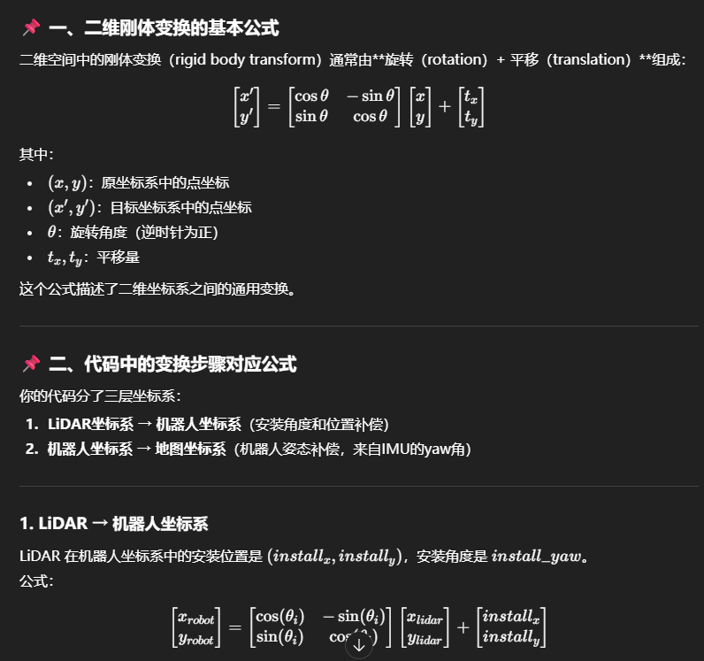

# 二维空间中的点坐标旋转关系

## 坐标点旋转后的点坐标

问：坐标系不变，某点绕坐标系（原点）旋转θ 角度，求旋转后点的坐标：

$x$，$y$表示旋转前的坐标

$x_1$，$x_1$表示旋转后的坐标

θ某点绕坐标系（原点）逆时针旋转θ角度

则逆时针旋转公式：
$x_1 = xcos(θ) - ysin(θ)$
$y_1 = xsin(θ) + ycos(θ)$

如果是顺时针方向旋转，把θ变成负的即可：-θ

## 坐标点A绕着坐标点点B旋转后的点坐标

$x_b$，$y_b$表示点B的坐标

$x$，$y$表示点A旋转前的坐标

$x_1$，$y_1$表示点A旋转后的坐标

θ表示某点绕坐标系（原点）逆时针旋转θ角度

逆时针旋转公式：

$x_1=(x-x_b)cosθ - (y-y_b)sinθ + x_b$

$y_1=(y-y_b)cosθ + (x-x_b)sinθ + y_b$

如果是顺时针方向旋转，把θ变成负的即可：-θ

## 坐标系旋转后的点坐标

问：坐标系A绕着原点逆时针方向旋转了θ 度，形成新的坐标系B。

$x$，$y$表示旋转前的坐标

$x_1$，$y_1$表示旋转后的坐标

θ 表示两个坐标系旋转相差的角度

逆时针旋转 公式：

$x_1 = xcos(θ) + ysin(θ)$

$y_1 = -xsin(θ) + ycos(θ)$

如果是顺时针方向旋转，把θ变成负的即可：-θ

