# 匈牙利算法

## 1.为什么需要匈牙利算法

因为在目标跟踪中，不同时刻，物体的位置等信息会发生变化，但我们需要让它保持同一个ID

**eg:**

假设本来视频帧只出现一辆车，那么我们一直采用目标检测的方法也没有问题，可以一直把该黄车标成ID = 1

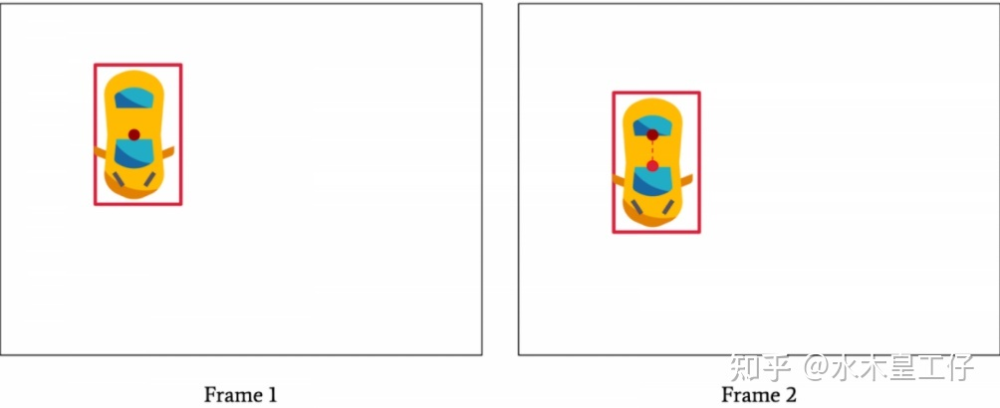

但如果出现了另外一台车，而且我们的目标检测器只有分类出“车”这个能力的话，我们便无法知道这个黄车的ID是否等于1了

## 2. 算法简易图解

我们先来一个定性的理解

匈牙利算法会建立一个图，其中有当前帧`t=1` 和前一帧`t=0` 的节点。然后会计算两帧节点互相的距离，易得，这个距离越小，那么当前帧的物体与前一帧相同的概率越大

如下图，（虽然不理解这个人怎么走的比车还快：）

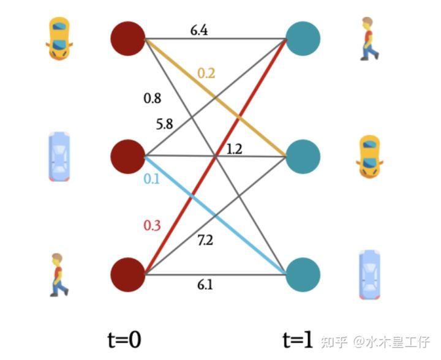

至此，我们得到了一个这个算法的关键：**得到了距离的话我们怎么选出来呢**

## 3. 解决优化任务问题（抽象例子）

我们来举一个具体的例子：

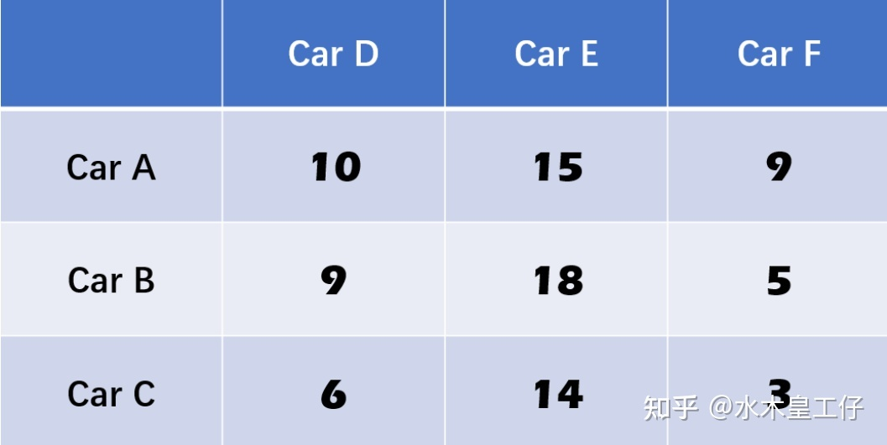

假设我们现在就有两帧的图片，第一帧我们看到图片中有CarA, CarB, CarC, 并且通过我们的目标检测器找到了这三辆车；第二帧，同样，也看到了三辆车，CarD, CarE, CarF，两帧都只存在这三辆车，但由于目标检测器只能分辨出他们是车，而不能分辨出CarD对应的是CarA还是其它车

但我们可以测量出两帧之间他们对应的**距离（如，第二帧看到的CarF离第一帧看到的CarA有9m）**，如上图数字所示

接下来我们就采用匈牙利算法来进行这个**匹配**

### （1）**第一步：每行减去最小值**

如：第一行最小的是9，那么我们减去9，以此类推

最后变为：

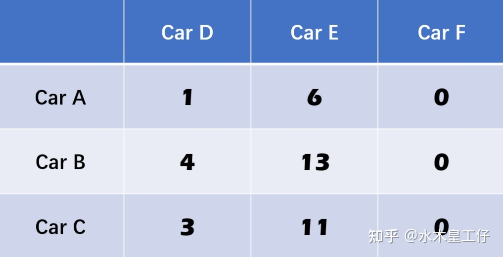

### （2）**第二步：每列减去最小值**

如：第一列最小的是1，那么我们减去1，以此类推

最后变为：

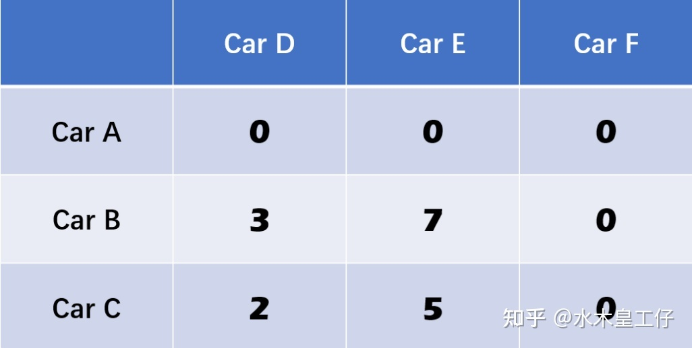

### （3）**第三步：以最少数量的线条划掉所有零**

划掉所有零有不少方式，如下图：

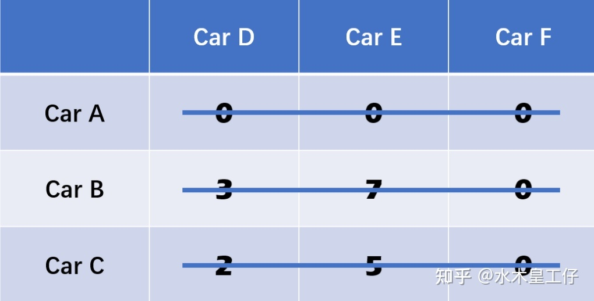

但明显最少的方式应该是两条：

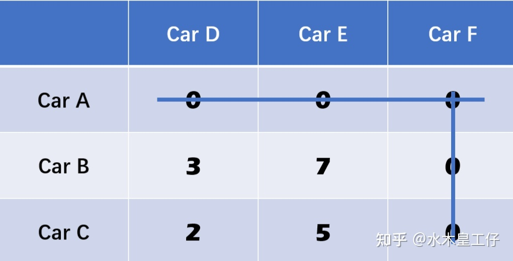

如果这个数量大于等于矩阵的行列数，那么跳到**第五步**

### （4）**第四步：在剩下的矩阵中，减去最小值；如果有零被交叉，那么把这个最小值加上去**

剩下的矩阵为【【3， 7】，【2， 5】】，都减去2

然后右上角交叉的0加上2

变成：

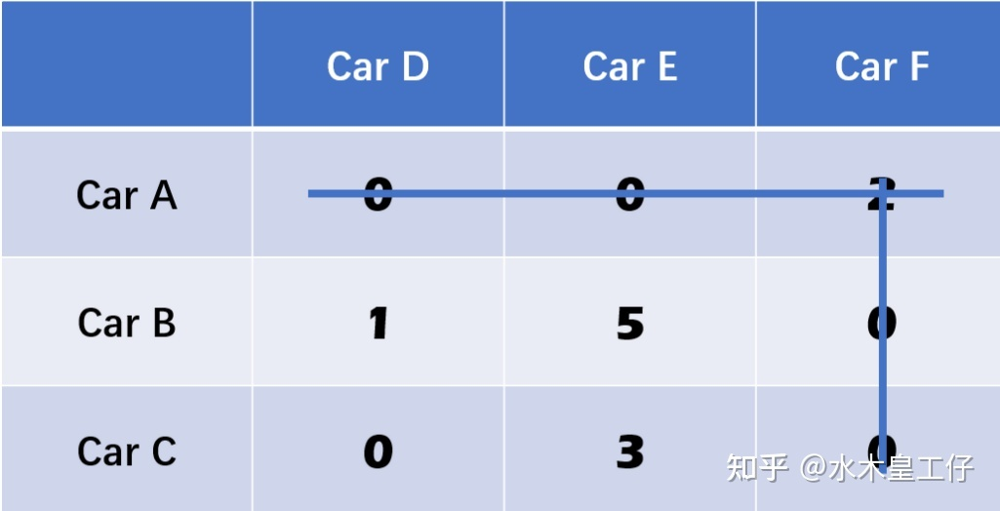

然后重复**第三步**

变为：

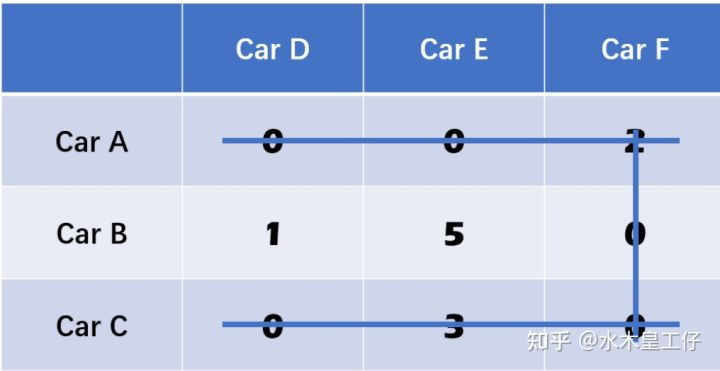

这时我们有3条线了，那么跳到第五步

### （5）**第五步：从只有一个零的行开始一一对应，对应完则整个行列删除**

第二行只有一个零，那么**Car F 对应了car B**，然后**删掉行列**

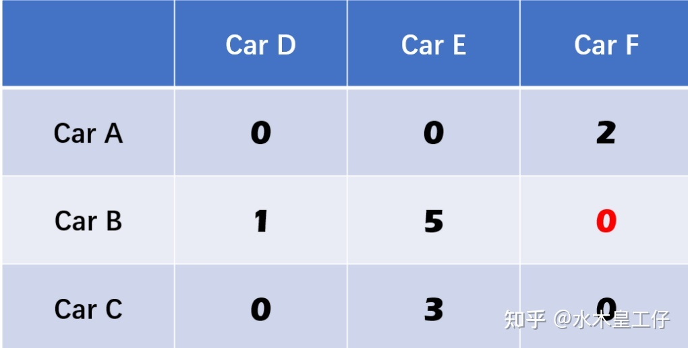

第三行，Car C对应了Car D

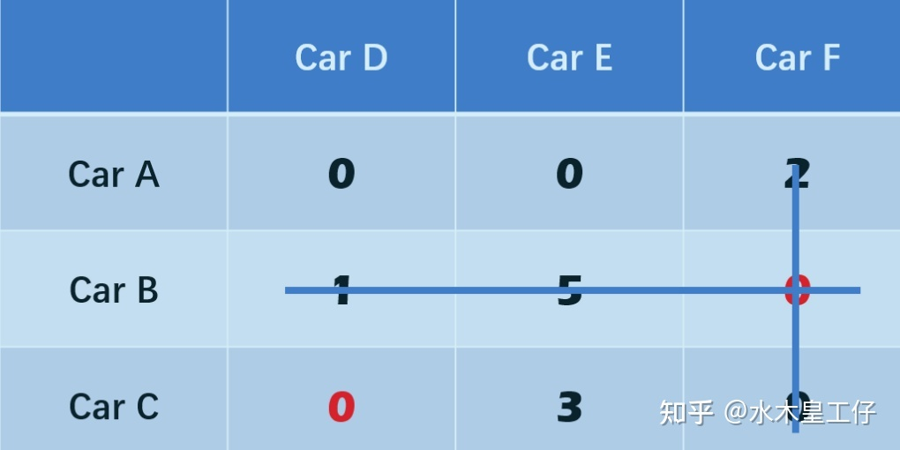

剩下就是**Car A**对应**Car E**了

最终结果：

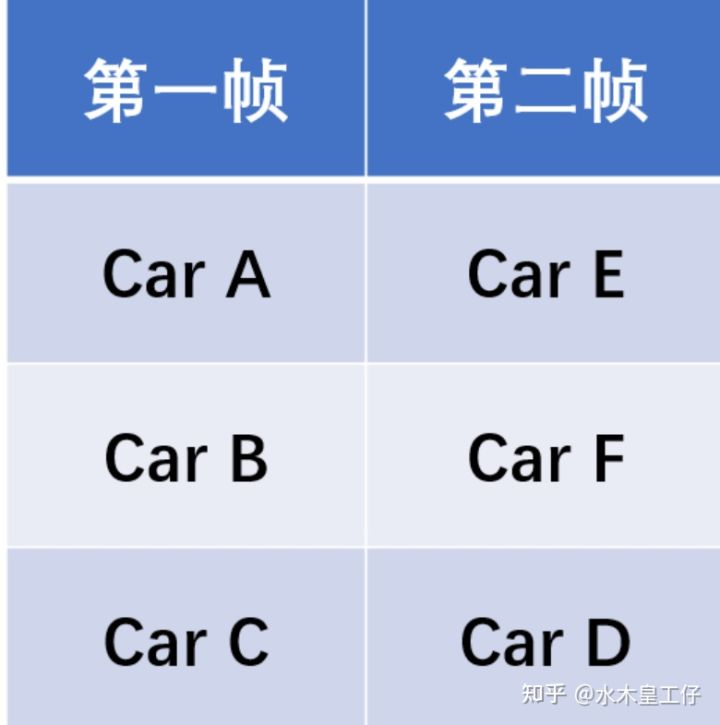

## 4. 目标框的距离计算

那在实际的目标跟踪当中，我们获取到了前一帧的跟踪框`track` 和当前帧的检测框`detection` ，之间的距离`Cost Metric` 如何计算的呢？

> 检测框则是当前帧的目标检测器检测出来的bounding box, 跟踪框是上一帧最后输出预测出来的框，并不是检测框

下面介绍三种方法：

### 欧式距离

我们可以把两帧的目标框的中心点进行一个距离的计算：
$$
d = √[(x2 – x1)^2 + (y2 – y1)^2]
$$
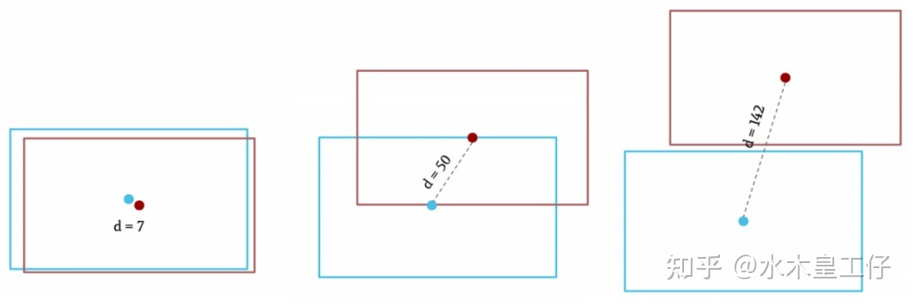

这种方法最简单了，但如果目标的形状发生了变化，或者目标与其他发生了重叠，会有不少问题

### IOU匹配

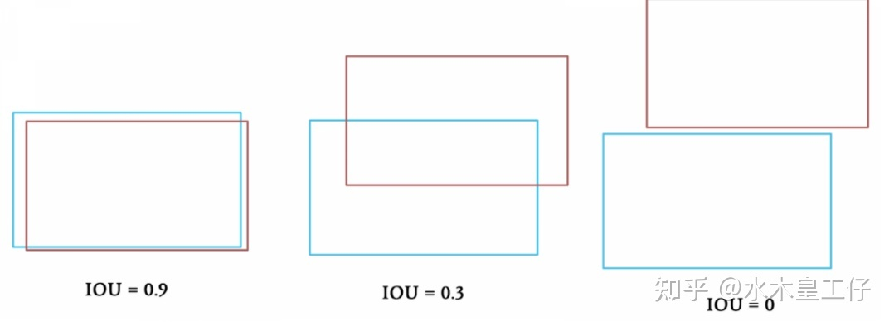

看图可得

这种方法有个问题，就是我们现在不是求最小，而是求最大，所以会与上述说的方法有一些出入

### 外观相似度（Convolutional Cost）

IOU匹配是很常用的，但是如果出现了目标的重叠阻挡等问题，目标框也会发生变化，IOU匹配也会不准确

但即使目标有遮挡，但如果我们一样能检测其中一部分，那么我们能不能用一个卷积网络提取其中的特征，然后和原本的框的特征进行相比呢？如下图

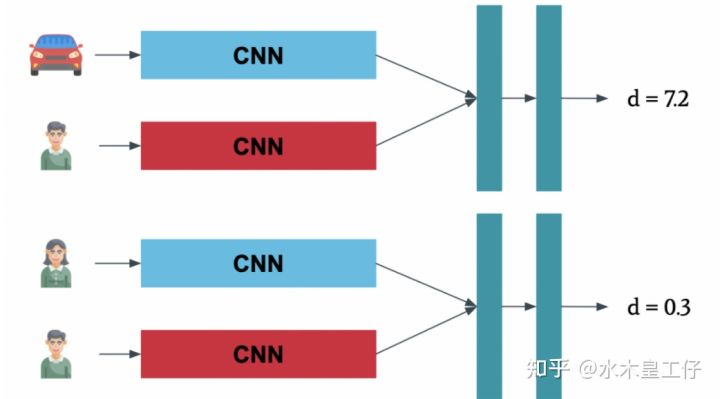

这里也是DeepSort相比Sort的其中一个创新点，加入了外观信息，借用了ReID领域模型来提取特征，减少了ID switch

在我们所应用的DeepSort里面，我们把**IOU匹配**和**外观相似度**这两个`cost metric`结合了起来一起计算这个“距离”

## 5. 特例考虑

### NxN vs NxM

刚刚我们的矩阵的行列数是相等的，那是因为两帧的图片都只出现了三辆车，那么如果第一帧三辆车，第二帧出现了四辆车呢？

如果出现这种情况，我们只需要添加一个新的边缘给我们的图标，这个值是我们原先的最大值就可以了。

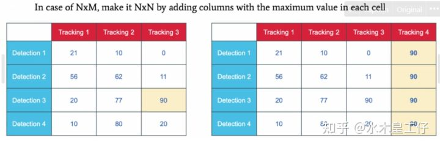

### 最大值 vs 最小值

如果我们使用IOU匹配的话，我们需要优化的是最大值

我们只需要在第一步进行一个转换

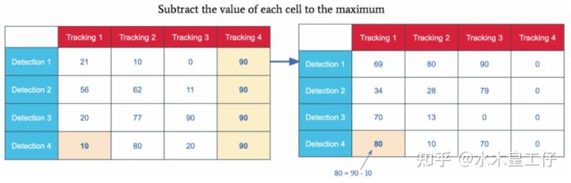

比如在Detenction 4, Tracking 1中（行4列1），cost metric 只有10，如果是IOU匹配的话，表示这个匹配度很低，我们把所有的值都让最大值减去这个值，比如10，我们让90 - 10 = 80

这样就可以啦

## 总结

- 匈牙利算法可以帮助您匹配由cost metric计算后的两组元素
- 跟踪边界框时，成本可以是 IOU、欧几里德距离、卷积相似度或您自己的损失函数（可结合）
- 该算法分 5 步工作：我们首先对矩阵进行缩减，然后交叉 0，最后再次缩减，直到我们可以对元素进行配对
- 如果你有一个最大化问题，比如 IOU，你总是可以把它变成一个最小化问题
- 如果您有 NxM 矩阵，则可以通过添加具有最大值的列来使其成为 NxN 矩阵
- 编码时，可以通过矩阵调用sklearn中的函数linear_assignment()，直接得到算法的输出