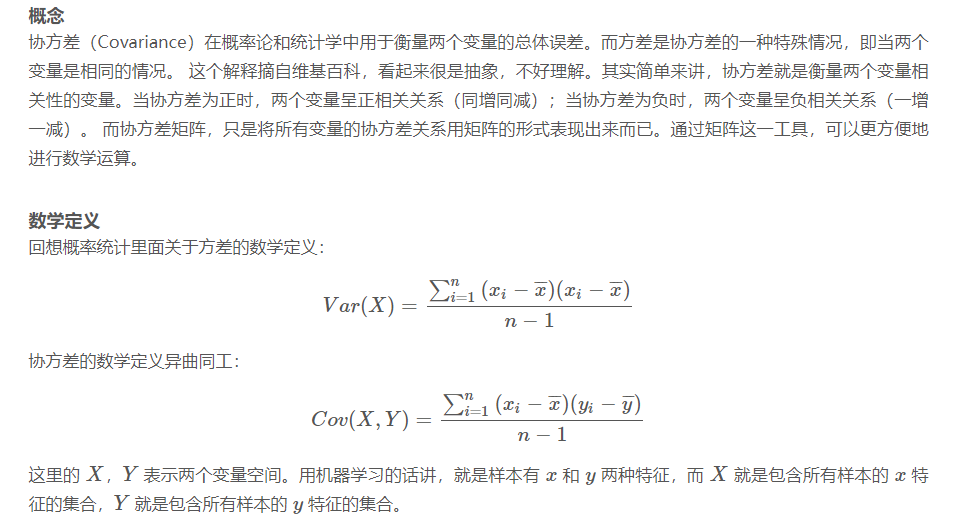
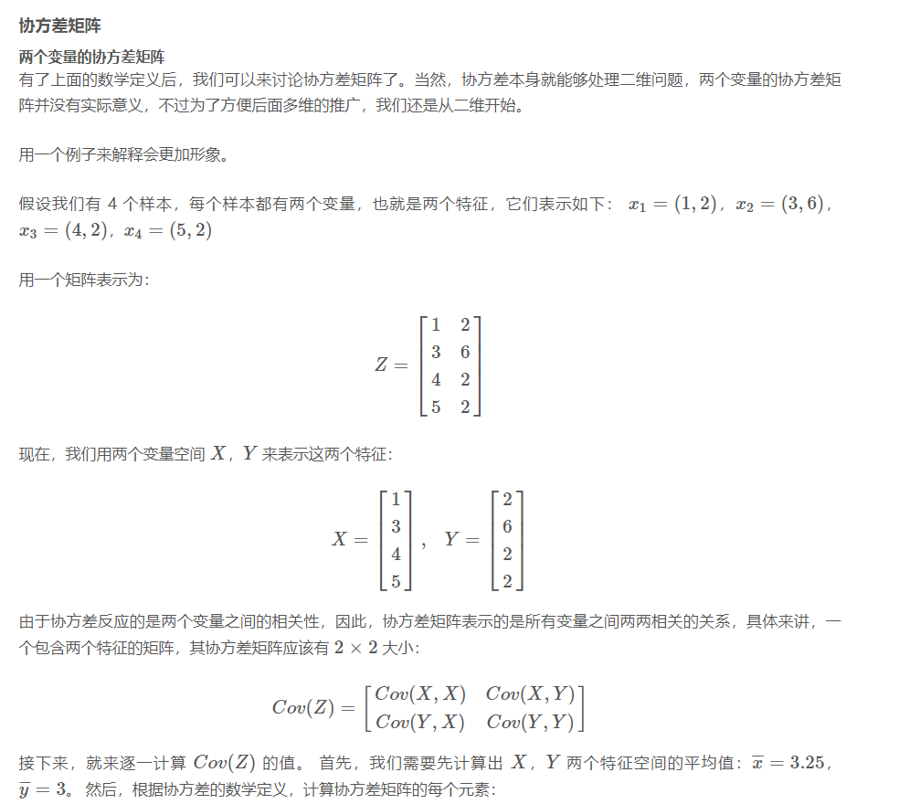
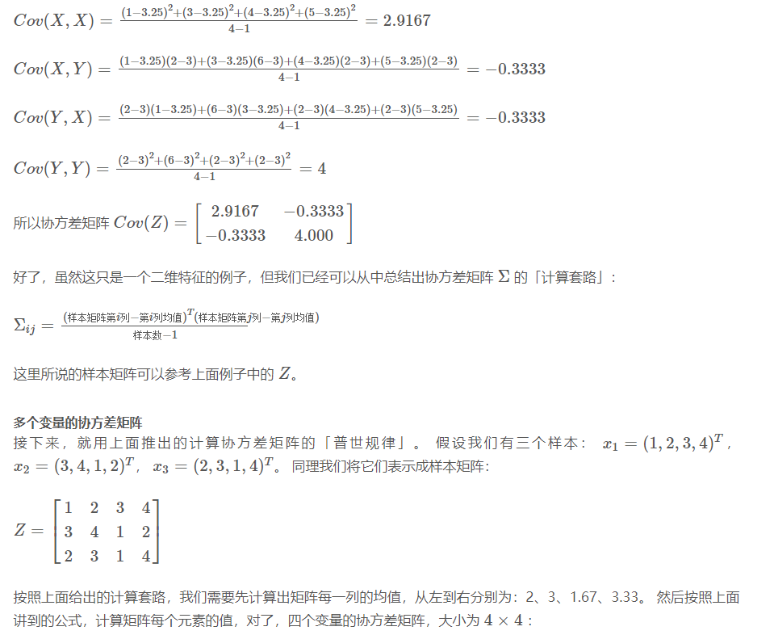

# 协方差矩阵

协方差矩阵（Covariance Matrix）在概率统计和机器学习中有许多重要作用，主要用于描述多个随机变量之间的相关性和分布情况。它的核心作用包括：

### 1. **描述变量间的相关性**

- 协方差矩阵的元素表示不同随机变量之间的协方差。
    
- 对角线元素是各变量的方差，表示变量自身的离散程度。
    
- 非对角线元素表示不同变量之间的协方差，反映它们的相关性：
    
    - 正协方差：两个变量呈正相关（一个增大，另一个也增大）。
        
    - 负协方差：两个变量呈负相关（一个增大，另一个减小）。
        
    - 0 协方差：两个变量无线性相关性。
        

### 2. **衡量数据分布的形状**

- 协方差矩阵可以用于描述多维数据的分布特征，如数据的伸展方向和主轴。
    
- 在机器学习中，PCA（主成分分析）利用协方差矩阵找到数据的主方向，以降低维度。
    

### 3. **不确定性建模（如卡尔曼滤波）**

- 在状态估计（如 SLAM、机器人定位）中，协方差矩阵用于衡量状态变量的不确定性。
    
- 例如，卡尔曼滤波（Kalman Filter）使用协方差矩阵来量化预测误差和观测误差，进而优化状态估计。
    

### 4. **特征分析与数据降维**

- 协方差矩阵的特征值和特征向量可用于分析数据的主方向，如 PCA 方法。
    
- 通过计算协方差矩阵并对其进行特征分解，可以找到数据最主要的变化方向，从而降维。
    

### 5. **正态分布与马哈拉诺比斯距离**

- 在多元正态分布中，协方差矩阵用于描述数据的分布情况。
    
- 马哈拉诺比斯距离（Mahalanobis Distance）利用协方差矩阵来衡量数据点与均值之间的相似性，考虑数据的相关性和尺度。

![[file-20250325134659505.png]]