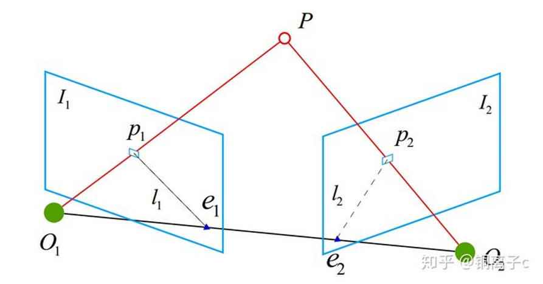

# 单目视觉的尺度等价性

视觉SLAM根据传感器硬件可以分为不同的流派，如单目，双目，深度相机等。其中，单目SLAM的难度较其它传感器实现的SLAM要困难许多，原因在于纯粹的单目相机缺乏真实的深度信息，会出现尺度等价性问题。

单目相机的初始化往往由对极几何约束完成。对极几何约束应用的场景是已知两幅图像之间若干匹配点，求解两幅图像之间的相机运动，是一个2D-2D的问题。详细的推导过程可以参考《视觉SLAM14讲》中的过程，其核心求解是一个本质矩阵E（或者带有内参矩阵的基础矩阵），本质矩阵E的特点是具有尺度等价性。位姿R和t是由E通过奇异值分解得到的，其中R是正交矩阵，其逆等于自身的转置，相当于自身的约束可以克服掉尺度等价性；但是t没有办法克服尺度等价性，即这个t乘上任意一个非零的正数，都能满足对极几何约束。

对极几何约束的几何意义是O1，O2和P三点共面，纯旋转情况下O1，O2共点，t为0，本质矩阵也为0,无法分解出R。

通常的初始化做法是，将t归一化，让其长度等于1，并作为单位计算相机的运动和图像特征点对应的3D点位置。初始化之后，便可以利用3D-2D的PnP方法，求解后续相邻帧的运动位姿。

至于这个长度1对应到真实世界中的长度可能是5cm,也可能是40m，这就需要额外的深度信息介入进行确定，这个以t的长度作为单位的尺度世界只和真实世界之间相差一个尺度因子。