# 占据栅格地图构建（Occupancy Grid Map）

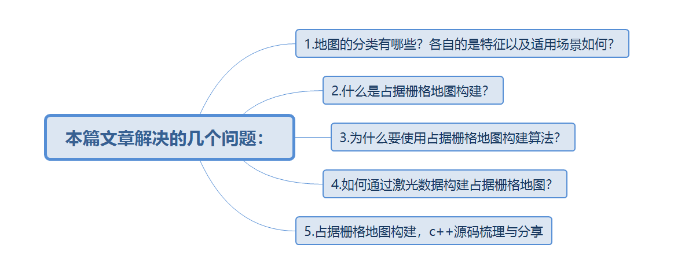

### 1、地图的分类

移动机器人常见的地图有三种：尺度地图、拓扑地图、语义地图。

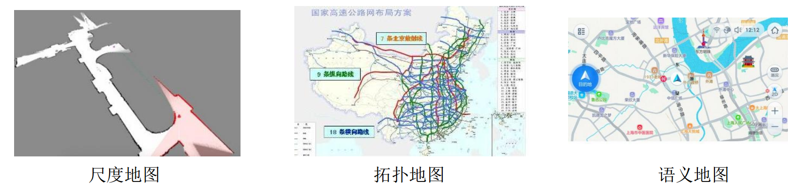

**尺度地图**：具有真实的物理尺寸，如**栅格地图、特征地图、点云地图**；常用于地图构建、定位、SLAM、小规模路径规划。 **拓扑地图**：不具备真实的物理尺寸，只表示不同地点的连通关系和距离，如铁路网，常用于超大规模的机器人路径规划。 **语义地图**：加标签的尺度地图，公认SLAM的未来—SLAM和深度学习的结合，常用于人机交互。 其中对尺度地图进行补充说明，如下图所示。

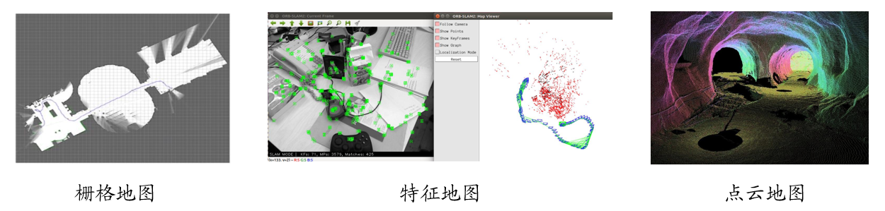

### 2、占据栅格地图构建算法

顾名思义，占据栅格地图构建算法当然构建的是栅格地图。

#### 2.1、为什么使用占用栅格地图构建算法构建地图?

在开始讲解之前，我们要明确一些事情。 **第一**，构建栅格地图需要使用激光雷达传感器。 **第二**，激光雷达传感器是有噪声存在的，通俗的说，**“不一定准”**。 **举个例子**，机器人在同一位姿下的不同时刻，通过激光雷达对一个固定的障碍物的探测距离不一致，一帧为5m，一帧为5.1m，我们难道要把5m和5.1m的位置都标记为障碍物？**这也就是使用占据栅格地图构建算法的原因。**

#### 2.2、什么是占据栅格地图构建算法？

为了解决这一问题，我们引入**占据栅格地图**（Occupancy Grid Map）的概念。我们将地图栅格化，对于每一个栅格的状态要么占用，要么空闲，要么未知（即初始化状态）。

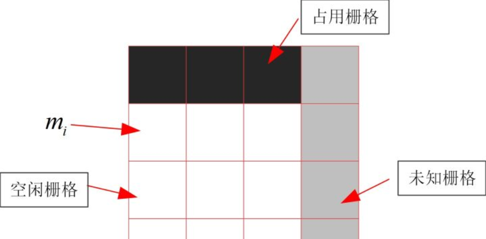

关于占据栅格地图构建算法的引出、推导、演化，从下面的图片得出。（哈哈，图省事，在word里推导的）

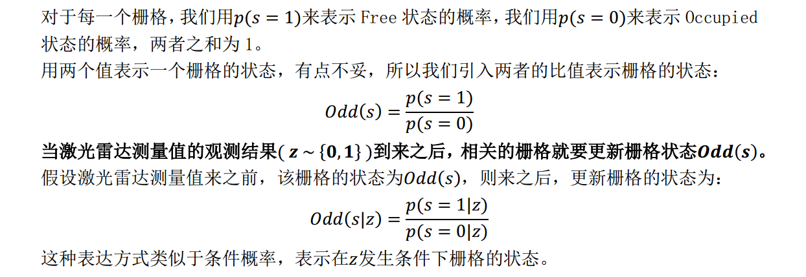

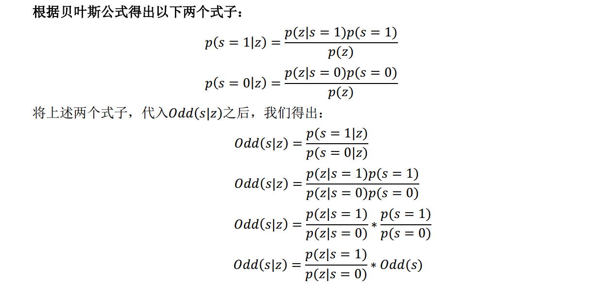

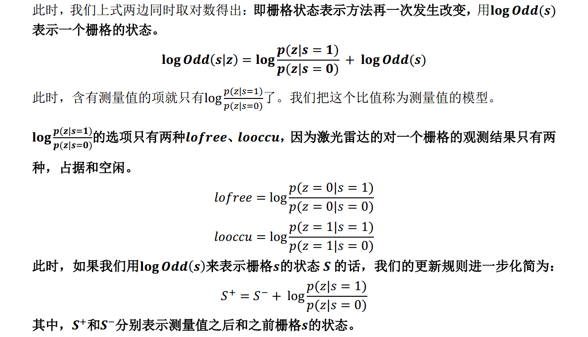

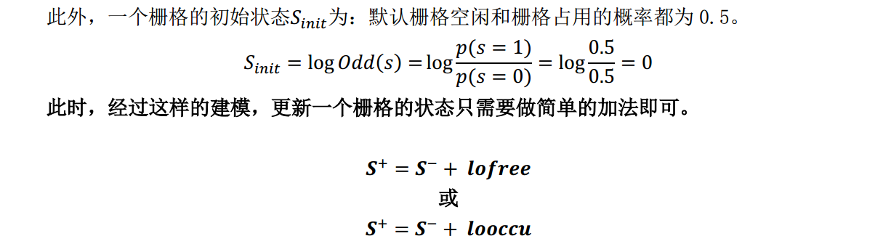

#### 2.3、举个例子验证占据栅格地图构建算法

首先，我们假设 looccu = 0.9，lofree = -0.7。那么，显而易见，一个栅格状态的数值越大，就越表示该栅格为占据状态，相反数值越小，就表示改栅格为空闲状态。**（这也就解决了此前文中提出的激光雷达观测值”不一定准”的问题）**

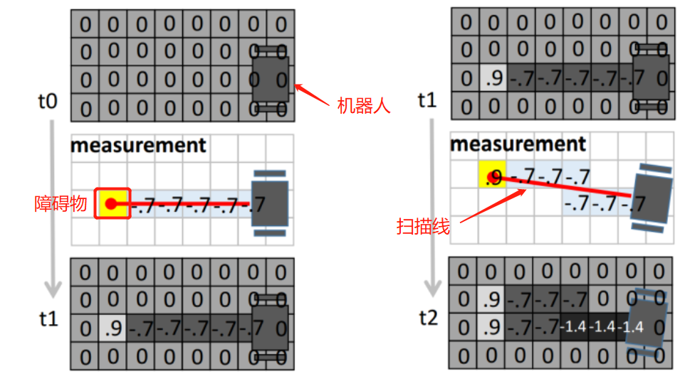](https://img-blog.csd

上图是用两次激光扫描数据更新地图的过程。在结果中，颜色越深越表示栅格是空闲的，颜色越浅越表示是占据的。这里要区分常用的激光SLAM算法中的地图，只是表述方式的不同，没有对错之分。

#### 2.4、cell value

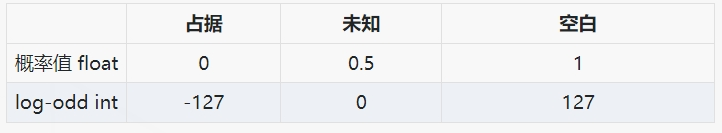

### 3、如何通过激光数据构建栅格地图？

#### 3.1、算法核心依据

通过上述的讲解，你是否了抓住算法实现的的重要依据是什么？要是没有，你就要反思一下自己是否仔细读了这篇文章？ 显然，整篇文章得出的一个结论就是下图所示，这里假设lofree和looccu为确定的数值，一般情况下一正一负。


然后，我们通过激光雷达数据栅格进行判断，如果判定栅格是空闲，就执行上面公式；如果判定栅格是占据，就执行下面的公式。在经过许多帧激光雷达数据的洗礼之后，每一个栅格都存储了一个值，此时我们可以自己设定阈值与该值比较，来做栅格最终状态的判定。

#### 3.2、算法输入数据

激光雷达数据包（每个扫描点包含角度（逆时针为正方向）和距离，每帧激光数据包含若干扫描点，激光雷达数据包包含若干帧激光雷达数据） 机器人位姿数据包（每一个位姿包含世界坐标系下的机器人位置和航向角，初始航向角与世界坐标系X轴正方向重合，逆时针为正方向） 地图参数（需要构建地图的高度和宽度，构建地图的起始点，lofree和looccu的设定值，地图的分辨率） 假设激光雷达坐标系和机器人坐标系重合

#### 3.3、算法步骤

这里以处理第一帧激光雷达为例，从上向下依次介绍。 （1）读取一帧激光雷达数据和该帧对应的机器人位姿

```cpp
//获取每一帧的激光雷达、机器人位姿数据
GeneralLaserScan scan = scans[i];
Eigen::Vector3d robotPose = robot_poses[i];
```

（2）计算该帧机器人位置的栅格序号

```cpp
//获取该帧机器人位姿的栅格序号
GridIndex robotIndex = ConvertWorld2GridIndex(robotPose(0),robotPose(1));
```

即从世界坐标系转入栅格坐标系，每个栅格序号有x，y两个数字。这里与地图分辨率有关，比如说：地图分辨率为0.05，也就是1m用20个栅格表示。 例如：世界坐标系下机器人位置（1,1）对应栅格坐标系的（20,20）。 **注意**：世界坐标系与像素坐标系区分开来，他们之间的y轴方向相反，其他都一致，地图的显示使用的像素坐标系（栅格坐标系）。 （3）遍历该帧激光雷达数据的所有扫描点执行以下操作 计算每一个激光点击中栅格在像素坐标系下的栅格序号

```cpp
//明确这里的世界坐标系world_x，不是真实的世界坐标系，而是像素坐标系，y轴与真实的世界坐标系相反，这样是laser_y加负号的原因
double laser_x =   dist * cos(theta + angle);
double laser_y =  -dist * sin(theta + angle);

//得到该激光扫描点，在世界坐标系下（像素坐标系下）的位置
double world_x = laser_x + robotPose(0);
double world_y = laser_y + robotPose(1);

//将该激光扫描点在世界坐标系下的位置，转化为栅格序号
GridIndex mapIndex = ConvertWorld2GridIndex(world_x,world_y);
```

从当前机器人位姿的栅格序号到该激光扫描点的栅格序号划线，找出所有空闲的栅格序号

```cpp
//从机器人的栅格序号到该激光扫描点的栅格序号划线
//目的：找到两点之间途径的空闲栅格，将栅格序号存入std::vector<GridIndex>中
std::vector<GridIndex> freeIndex = TraceLine(robotIndex.x,robotIndex.y,mapIndex.x,mapIndex.y);
```

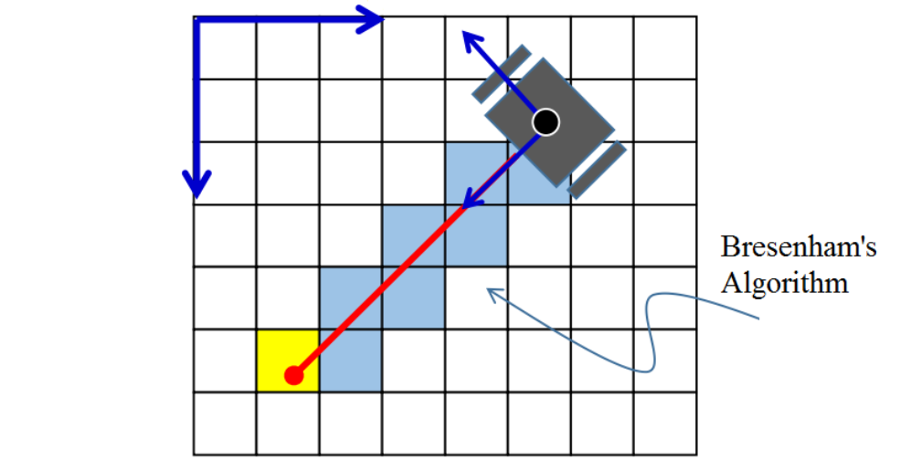

遍历所有空闲的栅格更新空闲栅格状态 

```cpp
data += mapParams.log_free;//log_free=-1，data将变小
```

更新该激光扫描点击中的栅格状态 

```cpp
data += mapParams.log_occ;//log_occ=2，data将变大
```

（4）结束

### 4、占据栅格地图构建算法c++实现

```c++
//占据栅格地图构建算法
//输入激光雷达数据和机器人位姿数据
//目的：通过遍历所有帧数据，为pMap[]中的每个穿过的空闲栅格或者击中栅格赋新值，中间有个计算方法，也就是占用栅格地图构建的理论实现
void OccupanyMapping(std::vector<GeneralLaserScan>& scans,std::vector<Eigen::Vector3d>& robot_poses)
{
  std::cout <<"Scans Size:"<<scans.size()<<std::endl;
  std::cout <<"Poses Size:"<<robot_poses.size()<<std::endl;
 
  //遍历所有帧激光雷达数据
  for(int i = 0; i < scans.size();i++)
  {
    //获取每一帧的激光雷达、机器人位姿数据
    GeneralLaserScan scan = scans[i];
    Eigen::Vector3d robotPose = robot_poses[i];
 
    //获取该帧机器人位姿的栅格序号
    GridIndex robotIndex = ConvertWorld2GridIndex(robotPose(0),robotPose(1));
 
    //判断该帧机器人位姿的栅格序号，是否在自己设定的栅格地图范围内
    if(isValidGridIndex(robotIndex) == false) continue;
 
    //遍历该帧激光雷达数据所有扫描点
    for(int id = 0; id < scan.range_readings.size();id++)
    {
      //取出该激光雷达扫描点的距离和角度
      double dist = scan.range_readings[id];
      double angle = scan.angle_readings[id];
      //剔除异常数据，跳过该次循环，不作处理
      if(std::isinf(dist) || std::isnan(dist)) continue;
      //机器人航向角，机器人x轴与世界坐标系x轴夹角
      double theta = robotPose(2);
 
      //在旋转过后（与世界坐标系（像素坐标系下）平行）的激光雷达坐标系下的坐标x,y
      //该开始一直不理解这个为啥laser_y要加一个负号
      //明确激光雷达数据的角度逆时针变化
      //明确机器人航向角与世界坐标系x轴呈逆时针变化
      //明确这里的世界坐标系world_x，不是真实的世界坐标系，而是像素坐标系，y轴与真实的世界坐标系相反，这样是laser_y加负号的原因
      double laser_x =   dist * cos(theta + angle);
      double laser_y =  -dist * sin(theta + angle);
 
      //得到该激光扫描点，在世界坐标系下（像素坐标系下）的位置
      double world_x = laser_x + robotPose(0);
      double world_y = laser_y + robotPose(1);
 
      //将该激光扫描点在世界坐标系下的位置，转化为栅格序号
      GridIndex mapIndex = ConvertWorld2GridIndex(world_x,world_y);
 
      //判断该激光扫描点的栅格序号，是否在自己设定的栅格地图900x900范围内，如果不在则跳过
      if(isValidGridIndex(mapIndex) == false)continue;
 
      //从机器人的栅格序号到该激光扫描点的栅格序号划线
      //目的：找到两点之间途径的空闲栅格，将栅格序号存入std::vector<GridIndex>中
      std::vector<GridIndex> freeIndex = TraceLine(robotIndex.x,robotIndex.y,mapIndex.x,mapIndex.y);
 
      //遍历该扫描激光点通过的所有空闲栅格
      for(int k = 0; k < freeIndex.size();k++)
      {
        GridIndex tmpIndex = freeIndex[k];
        //将空闲栅格的栅格序号，转化到数组序号,该数组用于存储每一个栅格的数据
        int linearIndex = GridIndexToLinearIndex(tmpIndex);
        //取出该栅格代表的数据
        int data = pMap[linearIndex];
        //根据栅格空闲规则，执行data += mapParams.log_free;
        if(data > 0)//默认data=50
          data += mapParams.log_free;//log_free=-1，data将变小
        else
          data = 0;
        //给该空闲栅格赋新值，最小为0
        pMap[linearIndex] = data;
      }
      //更新该激光扫描点集中的栅格，
      int tmpIndex = GridIndexToLinearIndex(mapIndex);
      int data = pMap[tmpIndex];
      //根据栅格击中规则，执行data += mapParams.log_occ;
      if(data < 100)//默认data=50
        data += mapParams.log_occ;//log_occ=2，data将变大
      else
        data = 100;
      //给击中的栅格赋新值，最大100
      pMap[tmpIndex] = data;
      //到这里，对一个位姿下的一个激光扫描数据经过的空闲栅格和击中栅格的pMap进行了重新赋值
    }
    //到这里，对一个位姿下的一帧激光扫描数据经过的空闲栅格和击中栅格进行了重新赋值
  }
  //到这里，对所有帧激光扫描数据经过的空闲栅格和击中栅格进行了重新赋值
}
 
//从世界坐标系转换到栅格坐标系，主要是存在一个分辨率
//比如resolution = 0.04，世界坐标系下，单位1在栅格坐标系可以表示1/resolution=25个栅格
//目的：将机器人的实际位置，在900x900的栅格地图中找到对应的栅格序号，返回GridIndex对象
GridIndex ConvertWorld2GridIndex(double x,double y)
{
    GridIndex index;
    //ceil()向上取整函数
    index.x = std::ceil((x - mapParams.origin_x) / mapParams.resolution) + mapParams.offset_x;
    index.y = std::ceil((y - mapParams.origin_y) / mapParams.resolution) + mapParams.offset_y;
 
    return index;
}
```

```c++
//2D画线算法　来进行计算两个点之间的grid cell
//目的：找到两点之间途径的空闲栅格，将栅格序号存入std::vector<GridIndex>中
std::vector<GridIndex> TraceLine(int x0, int y0, int x1, int y1)
{
  GridIndex tmpIndex;
  std::vector<GridIndex> gridIndexVector;
 
  bool steep = abs(y1 - y0) > abs(x1 - x0);
  if (steep)
  {
    std::swap(x0, y0);
    std::swap(x1, y1);
  }
  if (x0 > x1)
  {
    std::swap(x0, x1);
    std::swap(y0, y1);
  }
 
  int deltaX = x1 - x0;
  int deltaY = abs(y1 - y0);
  int error = 0;
  int ystep;
  int y = y0;
 
  if (y0 < y1)
  {
    ystep = 1;
  }
  else
  {
    ystep = -1;
  }
 
  int pointX;
  int pointY;
  for (int x = x0; x <= x1; x++)
  {
    if (steep)
    {
      pointX = y;
      pointY = x;
    }
    else
    {
      pointX = x;
      pointY = y;
    }
 
    error += deltaY;
 
    if (2 * error >= deltaX)
    {
      y += ystep;
      error -= deltaX;
    }
 
    //不包含最后一个点．
    if(pointX == x1 && pointY == y1) continue;
 
    //保存所有的点
    tmpIndex.SetIndex(pointX,pointY);
 
    gridIndexVector.push_back(tmpIndex);
  }
 
  return gridIndexVector;
}
```

