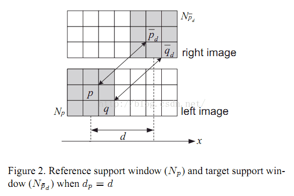

# 双目立体视觉SAD匹配算法

**1.算法原理**
    SAD(Sum of absolute differences)是一种图像匹配算法。基本思想：差的绝对值之和。此算法常用于图像块匹配，将每个像素对应数值之差的绝对值求和，据此评估两个图像块的相似度。该算法快速、但并不精确，通常用于多级处理的初步筛选。

2.基本流程
输入：两幅图像，一幅Left-Image，一幅Right-Image

对左图，依次扫描，选定一个锚点：

（1）构造一个小窗口,类似于卷积核；
（2）用窗口覆盖左边的图像,选择出窗口覆盖区域内的所有像素点；
（3）同样用窗口覆盖右边的图像并选择出覆盖区域的像素点；
（4）左边覆盖区域减去右边覆盖区域，并求出所有像素点灰度差的绝对值之和；
（5）移动右边图像的窗口，重复（3）-（4）的处理（这里有个搜索范围,超过这个范围跳出）；
（6）找到这个范围内SAD值最小的窗口,即找到了左图锚点的最佳匹配的像素块。


```c++
#include"iostream"
#include"opencv2/opencv.hpp"
#include"iomanip"
using namespace std;
using namespace cv;
 
class SAD
{
	public:
		SAD():winSize(7),DSR(30){}
		SAD(int _winSize,int _DSR):winSize(_winSize),DSR(_DSR){}
		Mat computerSAD(Mat &L,Mat &R); //计算SAD
	private:
		int winSize; //卷积核的尺寸
		int DSR;     //视差搜索范围
	
};
 
 Mat SAD::computerSAD(Mat &L,Mat &R)
	{
		int Height=L.rows;
	    int Width=L.cols;
		Mat Kernel_L(Size(winSize,winSize),CV_8U,Scalar::all(0));
	    Mat Kernel_R(Size(winSize,winSize),CV_8U,Scalar::all(0));
	    Mat Disparity(Height,Width,CV_8U,Scalar(0)); //视差图
 
		for(int i=0;i<Width-winSize;i++)  //左图从DSR开始遍历
		{
			for(int j=0;j<Height-winSize;j++)
			{
				Kernel_L=L(Rect(i,j,winSize,winSize));
			    Mat MM(1,DSR,CV_32F,Scalar(0)); //
 
				for(int k=0;k<DSR;k++)
				{
					int x=i-k;
					if(x>=0)
					{
					Kernel_R=R(Rect(x,j,winSize,winSize));
					Mat Dif;
			        absdiff(Kernel_L, Kernel_R, Dif);//
					Scalar ADD=sum(Dif);
					float a=ADD[0];
					MM.at<float>(k)=a;
					}
					
				}
				Point minLoc;
                minMaxLoc(MM, NULL, NULL,&minLoc,NULL);
			    
				int loc=minLoc.x;
				//int loc=DSR-loc;
				Disparity.at<char>(j,i)=loc*16;
				
			}
			double rate=double(i)/(Width);
			cout<<"已完成"<<setprecision(2)<<rate*100<<"%"<<endl; //处理进度
		}
		return Disparity;
	}
```

```c++
// MySAD.cpp : 定义控制台应用程序的入口点。
//
#include "stdafx.h"
#include"SAD.h"
int _tmain(int argc, _TCHAR* argv[])
{
	Mat Img_L=imread("imL.png",0);
	Mat Img_R=imread("imR.png",0);
    Mat Disparity;    //视差图
    
	//SAD mySAD;
	SAD mySAD(7,30);
	Disparity=mySAD.computerSAD(Img_L,Img_R);
 
	imshow("Img_L",Img_L);
	imshow("Img_R",Img_R);
	imshow("Disparity",Disparity);
	waitKey();
	return 0;
}
```

