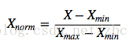
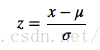

# 归一化与标准化 

## 1. 线性函数归一化(Min-Max scaling)
线性函数将原始数据线性化的方法转换到[0 1]的范围，归一化公式如下：

该方法实现对原始数据的等比例缩放，其中Xnorm为归一化后的数据，X为原始数据，Xmax、Xmin分别为原始数据集的最大值和最小值。 

## 2.0 均值标准化(Z-score standardization)
0均值归一化方法将原始数据集归一化为均值为0、方差1的数据集，归一化公式如下：

其中，μ、σ分别为原始数据集的均值和方法。该种归一化方式要求原始数据的分布可以近似为高斯分布，否则归一化的效果会变得很糟糕。 

以上为两种比较普通但是常用的归一化技术，那这两种归一化的应用场景是怎么样的呢？什么时候第一种方法比较好、什么时候第二种方法比较好呢？下面做一个简要的分析概括： 

- 在分类、聚类算法中，需要使用距离来度量相似性的时候、或者使用PCA技术进行降维的时候，第二种方法(Z-score standardization)表现更好。 

- 在不涉及距离度量、协方差计算、数据不符合正太分布的时候，可以使用第一种方法或其他归一化方法。比如图像处理中，将RGB图像转换为灰度图像后将其值限定在[0 255]的范围。 
## 3.优点
不同的评价指标往往具有不同的量纲（例如：对于评价房价来说量纲指：面积、房价数、楼层等；对于预测某个人患病率来说量纲指：身高、体重等。）和量纲单位（例如：面积单位：平方米、平方厘米等；身高：米、厘米等），这样的情况会影响到数据分析的结果，为了消除指标之间量纲的影响，需要进行数据标准化处理，以解决数据指标之间的可比性。原始数据经过数据标准化处理后，各指标处于同一数量级，适合进行综合对比评价。 

- 归一化后加快了梯度下降求最优解的速度。 

- 归一化有可能提高精度（归一化是让不同维度之间的特征在数值上有一定的比较性）。 