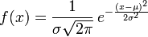
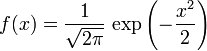
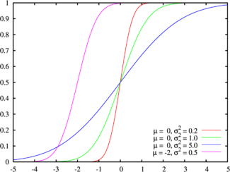
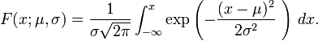
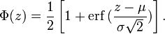
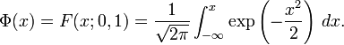
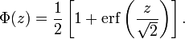
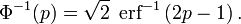

# 正态分布 

**正态分布**（**Normal distribution**）又名**高斯分布**（**Gaussian distribution**），是一个在[数学](http://zh.wikipedia.org/wiki/數學)、[物理](http://zh.wikipedia.org/wiki/物理)及[工程](http://zh.wikipedia.org/wiki/工程)等[领域](http://zh.wikipedia.org/w/index.php?title=領域&action=edit&redlink=1)都非常重要的概率分布，在统计学的许多方面有着重大的影响力。 

若[随机变量](http://zh.wikipedia.org/wiki/隨機變量)*X*服从一个[数学期望](http://zh.wikipedia.org/wiki/数学期望)为μ、[标准方差](http://zh.wikipedia.org/wiki/标准方差)为σ2的高斯分布，记为： 

 *X*∼*N*(μ,σ2), 

则其[概率密度函数](http://zh.wikipedia.org/wiki/概率密度函数)为 

正态分布的[期望值](http://zh.wikipedia.org/wiki/期望值)μ决定了其位置，其[标准差](http://zh.wikipedia.org/wiki/標準差)σ决定了分布的幅度。因其曲线呈钟形，因此人们又经常称之为**钟形曲线**。我们通常所说的**标准正态分布**是μ = 0,σ = 1的正态分布（见右图中绿色曲线）。 

 

## **概要** 

正态分布是[自然科学](http://zh.wikipedia.org/wiki/自然科學)与[行为科学](http://zh.wikipedia.org/wiki/行為科學)中的定量现象的一个方便模型。各种各样的[心理学](http://zh.wikipedia.org/wiki/心理學)测试分数和[物理](http://zh.wikipedia.org/wiki/物理)现象比如[光子](http://zh.wikipedia.org/wiki/光子)计数都被发现近似地服从正态分布。尽管这些现象的根本原因经常是未知的， 理论上可以证明如果把许多小作用加起来看做一个变量，那么这个变量服从正态分布(在R.N.Bracewell的Fourier transform and its application中可以找到一种简单的证明)。正态分布出现在许多区域[统计](http://zh.wikipedia.org/wiki/統計):例如, [采样分布](http://zh.wikipedia.org/w/index.php?title=採樣分佈&action=edit&redlink=1)[均值](http://zh.wikipedia.org/w/index.php?title=均值&action=edit&redlink=1)是近似地正态的，既使被采样的样本总体并不服从正态分布。另外，常态分布[信息熵](http://zh.wikipedia.org/wiki/信息熵)在所有的已知均值及方差的分布中最大，这使得它作为一种[均值](http://zh.wikipedia.org/w/index.php?title=均值&action=edit&redlink=1)以及[方差](http://zh.wikipedia.org/wiki/方差)已知的分布的自然选择。正态分布是在统计以及许多统计测试中最广泛应用的一类分布。在[概率论](http://zh.wikipedia.org/wiki/概率論)，正态分布是几种连续以及离散分布的[极限分布](http://zh.wikipedia.org/w/index.php?title=極限分佈&action=edit&redlink=1)。 

 

## **历史** 

常态分布最早是[亚伯拉罕·棣莫弗](http://zh.wikipedia.org/wiki/亞伯拉罕·棣莫弗)在[1734年](http://zh.wikipedia.org/wiki/1734年)发表的一篇关于[二项分布](http://zh.wikipedia.org/wiki/二項分佈)文章中提出的。[拉普拉斯](http://zh.wikipedia.org/wiki/拉普拉斯)在1812年发表的《分析概率论》（*Theorie Analytique des Probabilites*）中对棣莫佛的结论作了扩展。现在这一结论通常被称为[棣莫佛－拉普拉斯定理](http://zh.wikipedia.org/wiki/中心極限定理#.E6.A3.A3.E8.8E.AB.E4.BD.9B.EF.BC.8D.E6.8B.89.E6.99.AE.E6.8B.89.E6.96.AF.E5.AE.9A.E7.90.86)。 

拉普拉斯在[误差分析](http://zh.wikipedia.org/w/index.php?title=誤差分析&action=edit&redlink=1)试验中使用了正态分布。[勒让德](http://zh.wikipedia.org/wiki/勒讓德)于[1805年](http://zh.wikipedia.org/wiki/1805年)引入[最小二乘法](http://zh.wikipedia.org/wiki/最小二乘法)这一重要方法；而[高斯](http://zh.wikipedia.org/wiki/高斯)则宣称他早在[1794年](http://zh.wikipedia.org/wiki/1794年)就使用了该方法，并通过假设误差服从正态分布给出了严格的证明。 

“钟形曲线”这个名字可以追溯到[Jouffret](http://zh.wikipedia.org/w/index.php?title=Jouffret&action=edit&redlink=1)他在[1872年](http://zh.wikipedia.org/wiki/1872年)首次提出这个术语"钟形曲面"，用来指代[二元正态分布](http://zh.wikipedia.org/w/index.php?title=多元正态分布&action=edit&redlink=1)（[bivariate normal](http://zh.wikipedia.org/w/index.php?title=Multivariate_normal_distribution&action=edit&redlink=1)）。正态分布这个名字还被[Charles S. Peirce](http://zh.wikipedia.org/w/index.php?title=Charles_S._Peirce&action=edit&redlink=1)、[Francis Galton](http://zh.wikipedia.org/wiki/Francis_Galton)、[Wilhelm Lexis](http://zh.wikipedia.org/w/index.php?title=Wilhelm_Lexis&action=edit&redlink=1)在1875分布独立的使用。这个术语是不幸的，因为它反应和鼓励了一种谬误，即很多概率分布都是正态的。（请参考下面的“实例”） 

这个分布被称为“正态”或者“高斯”正好是[Stigler名字由来法则](http://zh.wikipedia.org/w/index.php?title=Stigler名字由來法則&action=edit&redlink=1)的一个例子，这个法则说“没有科学发现是以它最初的发现者命名的”。 

 

## **正态分布的定义** 

有几种不同的方法用来说明一个随机变量。最直观的方法是[概率密度函数](http://zh.wikipedia.org/wiki/概率密度函数)，这种方法能够表示随机变量每个取值有多大的可能性。[累积分布函数](http://zh.wikipedia.org/wiki/累积分布函数)是一种概率上更加清楚的方法，但是非专业人士看起来不直观（请看下边的例子）。还有一些其他的等价方法，例如[cumulant](http://zh.wikipedia.org/w/index.php?title=Cumulant&action=edit&redlink=1)、[特征函数](http://zh.wikipedia.org/wiki/特徵函數)、[动差生成函数](http://zh.wikipedia.org/wiki/動差生成函數)以及cumulant-[生成函数](http://zh.wikipedia.org/wiki/生成函數)。这些方法中有一些对于理论工作非常有用，但是不够直观。请参考关于[概率分布](http://zh.wikipedia.org/wiki/概率分布)的讨论。 

 

## **概率密度函数** 

**正态分布**的[概率密度函数](http://zh.wikipedia.org/wiki/概率密度函数)均值为μ [方差](http://zh.wikipedia.org/wiki/方差)为σ2 (或[标准差](http://zh.wikipedia.org/wiki/標準差)σ)是[高斯函数](http://zh.wikipedia.org/wiki/高斯函數)的一个实例： 

 .png)

(*请看*[*指数函数*](http://zh.wikipedia.org/wiki/指數函數)*以及π.*) 

如果一个[随机变量](http://zh.wikipedia.org/wiki/隨機變量)*X*服从这个分布，我们写作 *X* ~ *N*(μ,σ2). 如果μ = 0并且σ = 1，这个分布被称为*标准正态分布*，这个分布能够简化为 

右边是给出了不同参数的正态分布的函数图。 

正态分布中一些值得注意的量： 

- 密度函数关于平均值对称 
- 平均值是它的[众数](http://zh.wikipedia.org/wiki/众数_(数学))（statistical mode）以及[中位数](http://zh.wikipedia.org/wiki/中位數)（median） 
- 函数曲线下68.268949%的面积在平均值左右的一个[标准差](http://zh.wikipedia.org/wiki/標準差)范围内 
- 95.449974%的面积在平均值左右两个标准差2σ的范围内 
- 99.730020%的面积在平均值左右三个标准差3σ的范围内 
- 99.993666%的面积在平均值左右四个标准差4σ的范围内 
- [反曲点](http://zh.wikipedia.org/wiki/反曲點)（inflection point）在离平均值的距离为标准差之处 

**累积分布函数**

上图所示的概率密度函数的累积分布函数  

[累积分布函数](http://zh.wikipedia.org/wiki/累积分布函数)是指随机变量*X*小于或等于*x*的概率，用密度函数表示为 

正态分布的累积分布函数能够由一个叫做[误差函数](http://zh.wikipedia.org/wiki/误差函数)的[特殊函数](http://zh.wikipedia.org/wiki/特殊函数)表示：

标准正态分布的累积分布函数习惯上记为Φ，它仅仅是指μ = 0，σ = 1时的值， 

将一般正态分布用[误差函数](http://zh.wikipedia.org/wiki/误差函数)表示的公式简化，可得： 

它的[反函数](http://zh.wikipedia.org/wiki/反函數)被称为反误差函数，为： 

该分位数函数有时也被称为[probit](http://zh.wikipedia.org/w/index.php?title=Probit&action=edit&redlink=1)函数。[probit](http://zh.wikipedia.org/w/index.php?title=Probit&action=edit&redlink=1)函数已被证明没有初等原函数。 

正态分布的[分布函数](http://zh.wikipedia.org/w/index.php?title=分佈函數&action=edit&redlink=1)Φ(*x*)没有解析表达式，它的值可以通过[数值积分](http://zh.wikipedia.org/wiki/數值積分)、[泰勒级数](http://zh.wikipedia.org/wiki/泰勒级数)或者[渐进序列](http://zh.wikipedia.org/w/index.php?title=漸進序列&action=edit&redlink=1)近似得到 