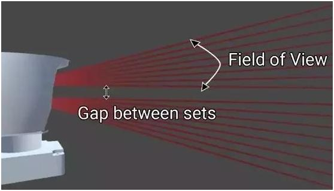
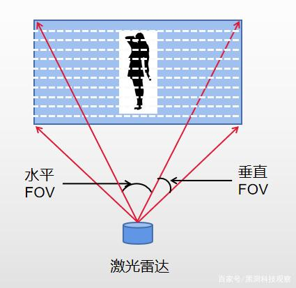
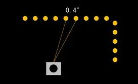

# 激光雷达性能指标

激光雷达的性能指标主要包括线数，波长，激光安全等级，测距能力和盲区，精度，视场角FOV，角分辨率，帧率，转速，出点数以及其他部分。

##  线数

车载激光雷达一般使用多线雷达，就是在垂直方向上具有多个发射器和接收器。对于激光雷达来说，线数越多、越密意味着可以更清晰、更完善的收集各类物体3D轮廓，目前自动驾驶车辆上大多使用16线、32线、64线、128线等。在类似于测绘，自动驾驶等场景下，激光雷达肯定是线数越高越好。

## 波长

两者相比之下，波长为1550nm的激光雷达所使用的铟镓砷(InGaAs)近红外探测器要比波长为905nm所使用的硅基光电探测器更贵，所以二者的成本会有区别，所谓一分价钱一分货，1550nm激光雷达的激光器功率是传统905nm硅光电系统的40倍；还有效解决了905纳米对雨雾的穿透力的不足的问题，因此在复杂气候天气下也能将有效探测距离保持在200米以上。

同时1550nm波长的激光也更加安全，对人眼没有危害。原因在于，要让激光雷达「看得更远」，就必须发射更强的光脉冲，然而波长越长能量越低，距离可见光越远。905纳米的激光，这对于人类来说是不可见的。但是如果它集中到了一个真人的眼球，而且具有足够的能量时，就会损伤人类的视网膜。相比之下1550纳米的激光，它在光谱的红外线部分距离可见光波段更远，因此无法穿透人的眼球。

## 激光安全等级

上述有提到了激光对人眼的伤害，其实国际电工委员会（IEC）已经制定了安全标准，它依据激光产品的波长、最大输出激光功率或能量，将激光产品分为7大安全等级，车载激光雷达一般要求人眼安全级别为Class1。

## 测距能力和盲区

这两个我们放一起谈，首先测距能力（量程），即能有效检测到最近和最远距离，另外目标的反射率越高则测量距离越远，目标的反射率越低则测量距离越近。

比如参数表中的“200m@10%反射率”意思是激光雷达发射光束到200米的距离可以看清最低10%光线反射率的物体，比如一张白纸。

盲区，顾名思义是激光雷达无法接收到激光回波信号的距离。一句话概括就是在可视范围之外即为盲区。

而盲区也会因为距离过近而产生，比如当物体紧贴激光雷达光罩时，性能好的激光雷达产品依然能够有效探测，做到“零盲区”，而有的激光雷达在0.2米时就产生盲区无法成像了。

## 精度

精度，即雷达可以感知的距离最小变化值。通常来说目标距离激光雷达越远测距准确度越低。以人眼为例，10米距离上我们可以清晰看到一个酒瓶盖大小的物体，而200米后就看不见了。

##  视场角FOV

视场角FOV（Field of View），即有效扫描角度，在该角度范围内目标物体可被检测到，它分为水平视场角和垂直视场角。以人眼为例，就是你直视前方时可以看到的上下和左右范围。

水平视场角，即是水平面上所侦测的范围，以64线激光雷达为例，单纯的64线激光束的范围是远远不够的，但如果增加线束的范围又会大大增加成本，所以诞生了安装马达的机械旋转式激光雷达，这样就可以配合旋转的动作形成360°水平视场角，而固态式激光雷达只能看到正前方某些度数（例如60°至120°）；

垂直视场角，垂直方位角指的是激光雷达垂直方向的检测角度，一般在40°以内。而且光束也不是垂直均匀分布的，而是中间密，两边稀疏，而且激光光束会尽量向下偏置一定的角度，这也是为了扫描到更多的障碍物，在一定程度上可弥补上面说过的近处盲区。

## 角分辨率

角分辨率，表示两个相邻测距点的角度。如下图，它也分为水平角分辨率和垂直角分辨率，如上面的FOV一样，水平角分辨率和垂直角分辨率分别表示水平面上点的夹角以及垂直面上点的夹角，这里就不过多赘述。

另外，角分辨率大小决定了一次扫描能返回的样本点数以及该激光雷达所能检测的最小障碍物大小，比如2个激光光束相邻测距点的角度为0.4°，那么当探测距离为200m的时候，2个激光光束之间的距离为200m*tan0.4°≈1.4m。也就是说在200m之后，只能检测到高于1.4m的障碍物了。

帧率帧率，扫描频率表示一秒内雷达进行多少次扫描，其计量单位是HZ（赫兹是电，磁，声波和机械振动周期循环时频率的单位。即每秒的周期次数“周期/秒”）。扫描频率越大，设备对外界环境的感知速度越快，系统实时性更高。

## 转速

转速，转速的国际标准单位为rps (转/秒)或 rpm (转/分)，1200rpm意思是当前激光雷达的马达引擎转速是每分钟转1200圈。与帧率一样，转速越高设备对外界环境的感知速度越快。

## 出点数

出点数（分单回波模式和双回波模式），就是单位时间内激光雷达可以扫描多少个点位。

我们以128线机械旋转激光雷达为例计算一下出点数：

已知：

机械旋转式激光雷达是360°水平视场角

10Hz帧率（每秒扫描转10圈）,也就是每100ms(10Hz)转360度

水平角分辨率为0.2°

所以，当水平角分辨率为0.2°，旋转一周将会产生360/0.2=1800个点

最终，出点数为128线*1800个点*10HZ=2304000点/秒（pts/s）

## 其他部分

对于车厂来说，车上所有电器元件的供电电压、产品功率、产品工作温度、IP防尘风水等防护等级都是非常重要的采购指标，这里就不是我们需要关注的啦。

> 参考：https://www.thepaper.cn/newsDetail_forward_11023962

