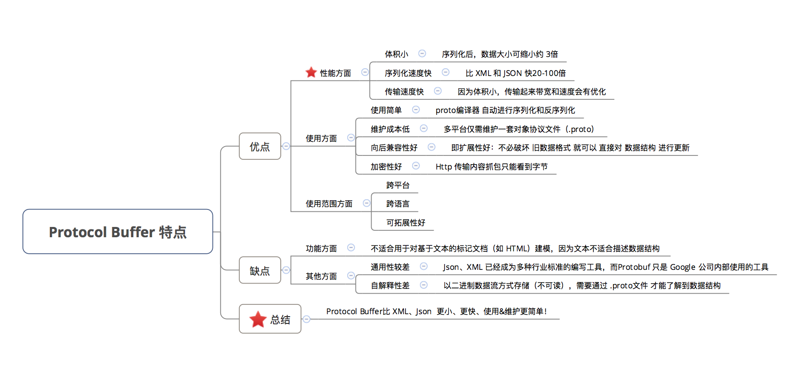
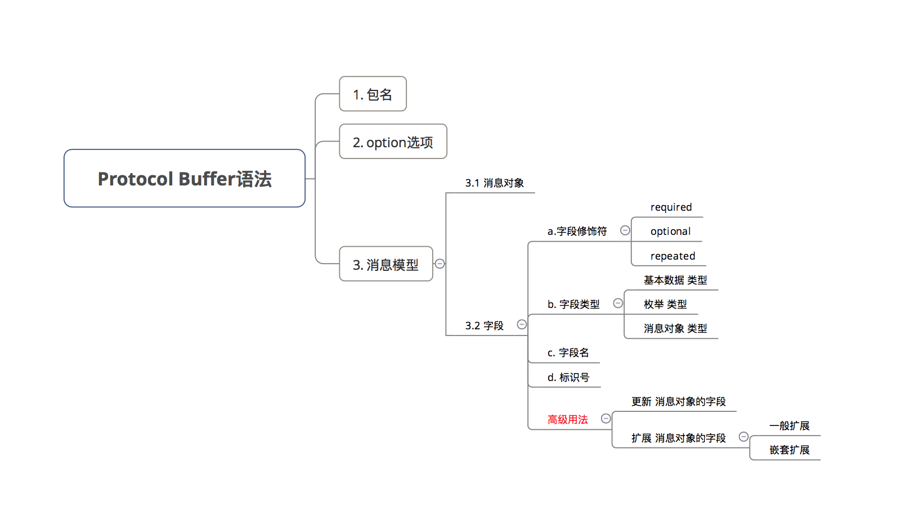
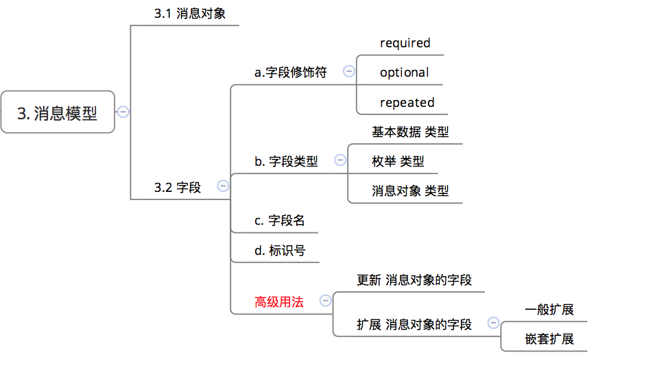
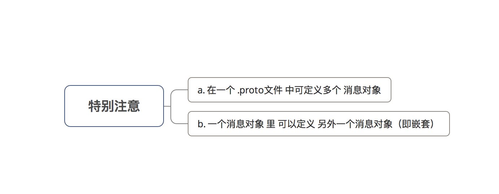
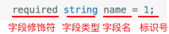
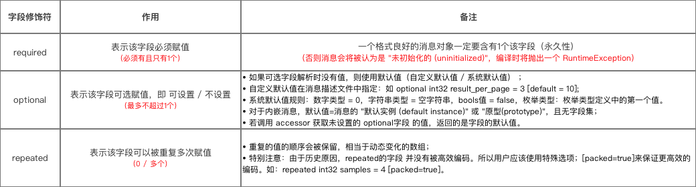
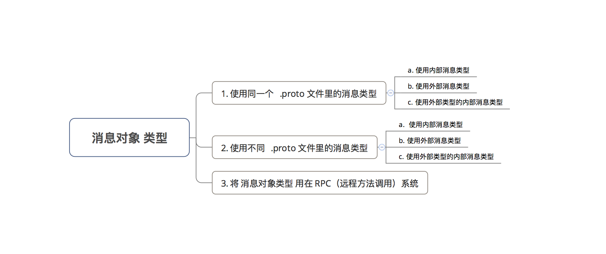

# Protocol Buffers基本使用

> - Protocol Buffer 和 XML、JSON一样都是结构数据序列化的工具，但它们的数据格式有比较大的区别：
>   - 首先，Protocol Buffer 序列化之后得到的数据不是可读的字符串，而是二进制流
>   - 其次，XML 和 JSON 格式的数据信息都包含在了序列化之后的数据中，不需要任何其它信息就能还原序列化之后的数据；但使用 Protocol Buffer 需要事先定义数据的格式(.proto 协议文件)，还原一个序列化之后的数据需要使用到这个定义好的数据格式
>   - 最后，在传输数据量较大的需求场景下，Protocol Buffer 比 XML、JSON 更小（3到10倍）、更快（20到100倍）、使用 & 维护更简单；而且 Protocol Buffer 可以跨平台、跨语音使用
> - Protobuf 安装：
>   - 安装 protobuf： apt-get install protobuf-compiler
>   - 安装 protobuf 的 python 模块：pip3 install protobuf==3.13.0
>   - 源码方式安装：可参考 Protobuf 安装及使用 && https://github.com/protocolbuffers/protobuf/blob/main/src/README.md
> - Protobuf 版本查看：
>   - protoc --version
>   - import google.protobuf as gp, gp.__version__

## Protocol Buffer 的作用

- 通过将结构化的数据（拥有多种属性）进行序列化，从而实现（内存与硬盘之间）数据存储和交换的功能
  - 序列化： 按照 `.proto` 协议文件将`数据结构或对象`转换成`二进制流`的过程
  - 反序列化：将在序列化过程中所生成的`二进制流`转换成`数据结构或对象`的过程



## Protocol Buffer 语法



### 关注1：包名

```protobuf
package protocobuff_Demo;
// 关注1：包名
```

- 作用：防止不同 .proto 项目间命名 发生冲突

- Protocol buffer包的解析过程如下：

  1. Protocol buffer 的类型名称解析与 C++ 一致：从 最内部 开始查找，依次向外进行每个包会被看作是其父类包的内部类
  2. Protocol buffer 编译器会解析 .proto文件中定义的所有类型名
  3. 生成器会根据 不同语言 生成 对应语言 的代码文件

  > a. 即对 不同语言 使用了 不同的规则 进行处理
  >
  > b. Protoco Buffer提供 C++、Java、Python 三种语言的 API

### 关注2：Option选项

```protobuf
option java_package = "com.carson.proto";
option java_outer_classname = "Demo";
// 关注2：option选项
```

- 作用：影响 特定环境下 的处理方式

- 常用Option选项如下：

  ```protobuf
  option java_package = "com.carson.proto";
  // 定义：Java包名
  // 作用：指定生成的类应该放在什么Java包名下
  // 注：如不显式指定，默认包名为：按照应用名称倒序方式进行排序
  
  option java_outer_classname = "Demo";
  // 定义：类名
  // 作用：生成对应.java 文件的类名（不能跟下面message的类名相同）
  // 注：如不显式指定，则默认为把.proto文件名转换为首字母大写来生成
  // 如.proto文件名="my_proto.proto"，默认情况下，将使用 "MyProto" 做为类名
  
  option optimize_for = ***;
  // 作用：影响 C++  & java 代码的生成
  // ***参数如下：
  // 1. SPEED (默认):：protocol buffer编译器将通过在消息类型上执行序列化、语法分析及其他通用的操作。（最优方式）
  // 2. CODE_SIZE:：编译器将会产生最少量的类，通过共享或基于反射的代码来实现序列化、语法分析及各种其它操作。
    // 特点：采用该方式产生的代码将比SPEED要少很多， 但是效率较低；
    // 使用场景：常用在 包含大量.proto文件 但 不追求效率 的应用中。
  //3.  LITE_RUNTIME:：编译器依赖于运行时 核心类库 来生成代码（即采用libprotobuf-lite 替代libprotobuf）。
    // 特点：这种核心类库要比全类库小得多（忽略了 一些描述符及反射 ）；编译器采用该模式产生的方法实现与SPEED模式不相上下，产生的类通过实现 MessageLite接口，但它仅仅是Messager接口的一个子集。
    // 应用场景：移动手机平台应用
  
  option cc_generic_services = false;
  option java_generic_services = false;
  option py_generic_services = false;
  // 作用：定义在C++、java、python中，protocol buffer编译器是否应该 基于服务定义 产生 抽象服务代码（2.3.0版本前该值默认 = true）
  // 自2.3.0版本以来，官方认为通过提供 代码生成器插件 来对 RPC实现 更可取，而不是依赖于“抽象”服务
  
  optional repeated int32 samples = 4 [packed=true];
  // 如果该选项在一个整型基本类型上被设置为真，则采用更紧凑的编码方式（不会对数值造成损失）
  // 在2.3.0版本前，解析器将会忽略 非期望的包装值。因此，它不可能在 不破坏现有框架的兼容性上 而 改变压缩格式。
  // 在2.3.0之后，这种改变将是安全的，解析器能够接受上述两种格式。
  
  optional int32 old_field = 6 [deprecated=true];
  // 作用：判断该字段是否已经被弃用
  // 作用同 在java中的注解@Deprecated
  ```

### 关注3：消息模型

- 作用：真正用于描述 数据结构

```protobuf
// 消息对象用message修饰
message Person {

  required string name = 1;
  required int32 id = 2;
  optional string email = 3;

  enum PhoneType {
    MOBILE = 0;
    HOME = 1;
    WORK = 2;
  }

  message PhoneNumber {
    optional PhoneType type = 2 [default = HOME];
  }

  repeated PhoneNumber phone = 4;
}

message AddressBook {
  repeated Person person = 1;
}
```

- 组成：在ProtocolBuffers中：
  1. 一个 `.proto` 消息模型 = 一个 `.proto`文件 = 消息对象 + 字段
  2. 一个消息对象（`Message`） = 一个 结构化数据
  3. 消息对象（`Message`）里的 字段 = 结构化数据 里的成员变量


下面会详细介绍 `.proto` 消息模型里的 消息对象 & 字段



#### 1. 消息对象

在 `ProtocolBuffers` 中：

- 一个消息对象（`Message`） = 一个 结构化数据
- 消息对象用 修饰符 `message` 修饰
- 消息对象 含有 字段：消息对象（`Message`）里的 字段 = 结构化数据 里的成员变量




##### a. 添加：在一个 .proto文件 中可定义多个 消息对象

- 应用场景：尽可能将与 某一消息类型 对应的响应消息格式 定义到相同的 `.proto`文件 中
- 实例：

```protobuf
message SearchRequest {

  required string query = 1;
  optional int32 page_number = 2;
  optional int32 result_per_page = 3;

}

// 与SearchRequest消息类型 对应的 响应消息类型SearchResponse
message SearchResponse {
 …
}
```

##### b. 一个消息对象 里 可以定义 另外一个消息对象（即嵌套）

```
message Person {
  required string name = 1;
  required int32 id = 2;
  optional string email = 3;

// 该消息类型 定义在 Person消息类型的内部
// 即Person消息类型 是 PhoneNumber消息类型的父消息类型
  message PhoneNumber {
    required string number = 1;
  }
}

<-- 多重嵌套 -->
message Outer {   // Level 0
  message MiddleAA {  // Level 1
    message Inner {   // Level 2
      required int64 ival = 1;
      optional bool  booly = 2;
    }
  }
}
```

#### 2. 字段

- 消息对象的字段 组成主要是：**字段 = 字段修饰符 + 字段类型 +字段名 +标识号**



##### **a. 字段修饰符**

- 作用：设置该字段解析时的规则

- 具体类型如下：

  

**b. 字段类型**
字段类型主要有 三 类：

- 基本数据 类型
- 枚举 类型
- 消息对象 类型

```protobuf
message Person {

  // 基本数据类型 字段
  required string name = 1;
  required int32 id = 2;
  optional string email = 3;

  enum PhoneType {
    MOBILE = 0;
    HOME = 1;
    WORK = 2;
  }

  message PhoneNumber {
    optional PhoneType type = 2 [default = HOME];
    // 枚举类型 字段
  }

  repeated PhoneNumber phone = 4;
  // 消息类型 字段
}
```

###### 1.基本数据类型

| .proto中的类型 | 注意                                                         | C++中类型 | java中类型 |
| -------------- | ------------------------------------------------------------ | --------- | ---------- |
| double         |                                                              | double    | double     |
| float          |                                                              | float     | float      |
| int32          | 自动调整编码长度，如果需要保存负数，请使用sint32             | int32     | int        |
| int64          | 自动调整编码长度，如果需要保存负数，请使用sint64             | int64     | long       |
| uint32         | 自动调整编码长度                                             | uint32    | int        |
| uint64         | 自动调整编码长度                                             | uint64    | long       |
| sint32         | 自动调整编码长度，表示有符号数，负数的编码效率高于int32      | int32     | int        |
| sint64         | 自动调整编码长度，表示有符号数，负数的编码效率高于int64      | int64     | long       |
| fixed32        | 固定使用4bytes编码，在编码大数(228228)的时候比uint32更有效率 | int32     | int        |
| fixed32        | 固定使用8bytes编码，在编码大数(256256)的时候比uint64更有效率 | int42     | long       |
| sfixed32       | 固定使用4bytes编码                                           | int32     | int        |
| sfixed64       | 固定使用8bytes编码                                           | int64     | long       |
| bool           |                                                              | bool      | boolean    |
| string         | string只能包含UTF-8和7-bit ASCII文本                         | string    | String     |
| bytes          | 包含任意长度的bytes                                          | string    | ByteString |

###### 2. 枚举类型

- 作用：为字段指定一个 可能取值的字段集合

> 该字段只能从 该指定的字段集合里 取值

- 说明：如下面例子，电话号码 可能是手机号、家庭电话号或工作电话号的其中一个，那么就将`PhoneType`定义为枚举类型，并将加入电话的集合（ `MOBILE`、 `HOME`、`WORK`）

```protobuf
// 枚举类型需要先定义才能进行使用

// 枚举类型 定义
 enum PhoneType {
    MOBILE = 0;
    HOME = 1;
    WORK = 2;
// 电话类型字段 只能从 这个集合里 取值
  }

// 特别注意：
// 1. 枚举类型的定义可在一个消息对象的内部或外部
// 2. 都可以在 同一.proto文件 中的任何消息对象里使用
// 3. 当枚举类型是在一消息内部定义，希望在 另一个消息中 使用时，需要采用MessageType.EnumType的语法格式

  message PhoneNumber {
    required string number = 1;
    optional PhoneType type = 2 [default = HOME];
    // 使用枚举类型的字段（设置了默认值）
  }

// 特别注意：
// 1.  枚举常量必须在32位整型值的范围内
// 2. 不推荐在enum中使用负数：因为enum值是使用可变编码方式的，对负数不够高
```

###### 3. 消息对象 类型

一个消息对象 可以将 其他消息对象类型 用作字段类型，情况如下：



- **使用 内部消息类型**

  - 先在 消息类型 中定义 其他消息类型 ，然后再使用

  ```protobuf
  message Person {
    required string name = 1;
    required int32 id = 2;
    optional string email = 3;
  
  // 该消息类型 定义在 Person消息类型的内部
  // 即Person消息类型 是 PhoneNumber消息类型的父消息类型
    message PhoneNumber {
      required string number = 1;
    }
  
    repeated PhoneNumber phone = 4;
    // 直接使用内部消息类型
  }
  ```

- **使用** **外部消息类型**

  - 即外部重用，需要 用作字段类型的消息类型 定义在 该消息类型外部

  ```protobuf
  message Person {
    required string name = 1;
    required int32 id = 2;
    optional string email = 3;
  }
  
  message AddressBook {
    repeated Person person = 1;
    // 直接使用了 Person消息类型作为消息字段
  }
  ```

- **使用** **外部消息的内部消息类型**

  ```protobuf
  message Person {
    required string name = 1;
    required int32 id = 2;
    optional string email = 3;
  
  // PhoneNumber消息类型 是 Person消息类型的内部消息类型
    message PhoneNumber {
      required string number = 1;
      optional PhoneType type = 2 [default = HOME];
    }
  }
  
  // 若父消息类型外部的消息类型需要重用该内部消息类型
  // 需要以 Parent.Type 的形式去使用
  // Parent = 需要使用消息类型的父消息类型，Type = 需要使用的消息类型
  
  // PhoneNumber父消息类型Person 的外部 OtherMessage消息类型 需要使用 PhoneNumber消息类型
  message OtherMessage {
    optional Person.PhoneNumber phonenumber = 1;
  // 以 Parent.Type = Person.PhoneNumber  的形式去使用
  
  }
  ```

- **使用不同** .**proto** **文件里的消息类型**

  - 目的：需要在 `A.proto`文件 使用 `B.proto`文件里的消息类型

  - 解决方案：在 `A.proto`文件 通过导入（ `import`） `B.proto`文件中来使用 `B.proto`文件 里的消息类型

    ```protobuf
    import "myproject/other_protos.proto"
    // 在A.proto 文件中添加 B.proto文件路径的导入声明
    // ProtocolBuffer编译器 会在 该目录中 查找需要被导入的 .proto文件
    // 如果不提供参数，编译器就在 其调用的目录下 查找
    ```

    