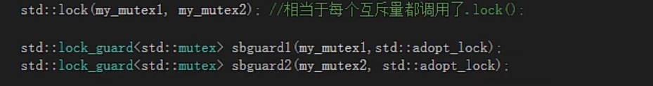
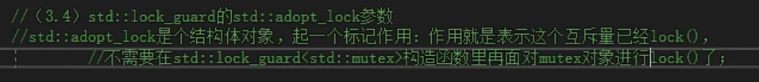

# c++并发与多线程

显示转换在主线程中构造，没有问题，隐式转换在子线程中构造，会出现问题

![/ / 二 ： 互 斥 量 的 用 氵 去  / / （ 2 ． 1) lock() ， unlock()  / / 步 驶 ： 先 1 。 ck() ， 操 作 共 享 据 ， unlock() ：  / 过 。 ck() 和 un ck() 要 成 对 使 用 ， 有 1 。 ck() 必 然 要 有 unl 。 Ck ， 每 调 用 一 次 1 。 ck() ， 必 然 应 该 调 用 一 次 unl 。 Ck 的  ： / 环 应 该 也 不 允 许 调 用 1 次 1 。 ck() 去 卩 调 用 了 2 次 unl 。 Ck 的 也 不 允 许 调 用 2 次 c 轻 卩 调 用 眩 unl 。 ck(), 这 些 菲 对 称 却 量 调 月  / / 有 1 。 Ck ， 忘 记 unl 。 Ck 的 问 题 ， 非 常 睢 排 查 3  / / 为 了 防 止 大 家 忘 记 unl 。 Ck 的 引 入 了 一 个 叫 std ： nock-guard 的 类模栀 ： 你 忘 记 。 Ck 不 要 我 苗 你 unl 。 ck() ，  / / 学 习 过 智 能 指 针 (unique-ptr\<\>) ： 你 忘 记 霹 放 内 存 不 要 我 给 你 释 放 3 保 姆 3 ](media/4c410326f68b9c901ae092e6d1bee594.png)

## std::lock_guard（）

std::lock_guard\<std::mutex\> sbguard(my_mutex);

自动帮你进行lock and unlock

## std::lock()

std::lock(my_mutex1,my_mutex2)            #手动unlock

一次性锁住两个或者两个以上的互斥量，至少两个。如果互斥量中有一个没锁住，它就在那里等着，等所有互斥量都锁住，他才能往下走；要么互斥量都锁住，要么两个互斥量都没有锁住。

这样也不需要手动unlock（）

## unique_lock()

![彐  //adopt-lock 标 记 作 用 3  /std: :lock_guard\<std: :mutex 〉 sbguardl (my_mutexl ， std: :adopt_lock):  / / （ 2 ． 0 std: •.adopt-lock ： 表 示 这 个 互 斥 量 已 经 裰 Ck 了 （ 你 必 须 要 把 互 斥 量 提 前 1 。 Ck 了 ， 否 则 会 报 异 常 ）  //std: ： ad 。 pt 过 ock 标 记 的 效 果 就 罡 “ 假 调 用 方 线 程 已 经 拥 有 了 互 斥 的 所 有 椤 （ 已 经 ck() 成 功 了 ）  / / 通 知 1 。 Ck 一 guar 环 需 要 在 构 造 函 中 1 。 Ck 这 个 互 斥 量 了  //unique-lock 也 可 以 ästd: :adopt-lock 标 记 ， 含 义 相 同 ， 就 罡 不 希 望 再 unique 过 。 ck() 的 构 造 函 中 1 。 Ck 这 个 。  / / 用 这 个 ad 。 pt 一 1 。 Ck 前 提 罡 ， 你 需 要 自 己 先 把 “ 先 1 。 Ck 上 3  / / （ 2 ． 2 ） std: :try_to_lock  / / 我 们 会 雲 试 用 的 1 。 ck() 去 锁 定 这 个 ， 但 如 果 没 有 锁 定 成 功 ， 我 也 会 立 即 返 回 ， 不 会 咀 塞 在 那 里  / / 用 这 个 try 一 t 。 一 1 。 Ck 的 前 提 罡 你 自 己 不 能 先 去 1 。 Ck 。  / / （ 2 ． 3 ） std: :defer_lock  / / 用 这 个 defer 一 1 。 Ck 的 前 提 罡 你 不 能 自 己 先 Ck ， 否 则 会 报 异 常 。  //defer-lock 的 意思 就 是 没 有 给 皿 ut 加 锁 ： 初 始 化 了 一 个 没 有 加 锁 的 ex 。  defer lock 、  —unique lock ](media/e3b2ae52a820296728e9a11336313dcd.png)

![： unique-lock 的 成员函颛  / / （ 3 ． 0 lock(), 加 锁  / / （ 3 ． 2 冫 unlock() ， 解 锁 ；  / / （ 3 ． 3 ） try_lock() ， 當 试 结 互 斥 量 加 锁 ， 如 果 蓽 不 到 锁 ， 则 返 回 fa 这 e ， 如 果 蓽 到 了 锁 ， 返 回 true ， 这 个 函 不 咀 塞 的 3  / / （ 3 ， 4 ） release(), 返 回 它 所 管 理 的 对 源 指 针 ， 放 所 有 权 也 就 罡 说 ， 这 个 不 再 有 关 孚 。  / 俨 格 区 分 。 ck() 和 release() 的 区 别 ， 不 要 后 。  / / 如 果 ， 原 来 匚 对 象 处 于 加 锁 状 态 ， 你 有 责 任 接 管 过 来 员 责 解 锁 。 ()e leaseifi 回 的 是 ， 原 始 mute 黑 t 的 指 针 ）  / / 为 什 之 有 时 候 需 要 unlock() ： 因 为 你 1 。 Ck 锁 住 的 代 码 越 少 ， 执 行 越 快 ， 整 个 程 序 运 行 效 率 越 高  07 有 人 也 把 锁 头 锁 住 的 代 码 多 少 称 为 锁 的 粒 廛 ， 粒 廛 一 船 用 粗 細 来 描 述  / / a ） 锁 住 的 代 码 少 ， 这 个 粒 度 叫 细 。 执 行 、 率 高  / / b ） 锁 住 的 代 码 多 ， 粒 度 叫 粗 ， 那 执 行 0 就 低  / / 要 学 会 尽 量 选 择 合 适 粒 度 的 代 码 进 行 保 护 ， 粒 度 太 细 ， 可 能 漏 掉 共 享 据 的 保 护 0 立 廛 太 粗 ， 影 响 效 率 。  / / 选 擇 合 适 的 粒 度 ， 罡 高 程 序 员 的 能 力 和 实 力 的 忭 现 3 ](media/f1a009c02af2e121f29b74a8c7899747.png)

