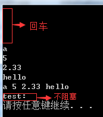

# cin与get（）getline（）输入问题


getline和get这两个函数都读取一行输入直到到达换行符，然而不同的是getline丢弃换行符，而get将换行符保留在输入流中。

```c++
#include <string> 
#include <iostream>
using namespace std;
 
int main() {
char a;
int b;
float c;
string str;
cin>>a>>b>>c>>str;
cout<<a<<" "<<b<<" "<<c<<" "<<str<<endl;
 
string test;
getline(cin,test);        //不阻塞
cout<<"test:"<<test<<endl;
return 0;
}

```

输出：




输入：

```c++
String a;
cin >> a;
cout << a << endl;
string h;
cin >> h;
cout << h << endl;
 
string b;
char g;
getline(cin, b, ':');
cout << b << endl;
//cin.get();
cin.get(g);
cout << "g=" << g << endl;

```

输出：

```
asd zxc
asd
zxc
asd:zxc
 
asd
g=z
```

当 cin\>\> 从缓冲区中读取数据时，若缓冲区中第一个字符是空格、tab或换行这些分隔符时，cin\>\> 会将其忽略并清除，继续读取下一个字符，若缓冲区为空，则继续等待。但是如果读取成功，字符后面的分隔符是残留在缓冲区的，cin\>\> 不做处理。

从结果可以看出，cin\>\> 对缓冲区中的第一个换行符视而不见，采取的措施是忽略清除，继续阻塞等待缓冲区有效数据的到来。但是，getline() 读取数据时，并非像 cin\>\> 那样忽略第一个换行符，getline() 发现 cin 的缓冲区中有一个残留的换行符，不阻塞请求键盘输入，直接读取，送入目标字符串后，因为读取的内容为空，所以程序中的变量 test 为空串。

当getline（）采用特定字符作为标识符时，标识符后面的回车和其他输入字符串会保留在输入流中。


