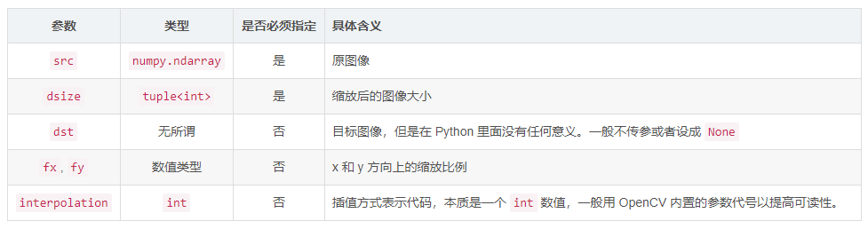

# opencv常用api


## **cvFloor：**

返回不大于参数的最大整数值


## **cvCeil：**

返回不小于参数的最小整数值


## **cvRound：**

四舍五入


## **Range类：**

表示从start到end但是不包含end


## **Mat::rowRange** and **Mat::colRange:** 

返回某些行或者列（只取左边界而不取右边界）

exp:img1.rowRange(10,10);


## **Rect(int x, int y, int width, int height)**;

裁剪图片

参数含义：

Rect（左上角x坐标 ， 左上角y坐标，矩形的宽，矩形的高）

exp:img2 = img1(Rect(10,19,20,29);


## **Mat::reshape(int cn, int rows)**:

cn表示通道数，如果设置值为0则表示拖到不变，rows表示行数，如果设置为0则表示行数不变。 函数对原有矩阵进行序列化


## **Mat::resize() ：**

```
void cv::resize(InputArray src,OutputArray dst,Size dsize,double fx = 0,double fy = 0,int interpolation = INTER_LINEAR)
```



exp：resize(img1, img2, Size(100, 100));


## **copyTo：**

img1.copyTo(img2);


## **clone():** 

img2 = img1.clone();