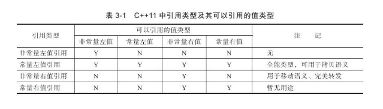

# 一、左值与右值

- 啥是左值和右值呢？

  左值：在[内存](https://so.csdn.net/so/search?q=内存&spm=1001.2101.3001.7020)有确定存储地址、有变量名，表达式结束依然存在的值，简单来说左值就是非临时对象。
  右值：就是在内存没有确定存储地址、没有变量名，[表达式](https://so.csdn.net/so/search?q=表达式&spm=1001.2101.3001.7020)结束就会销毁的值，简单来说右值就是临时对象。

  ```
  int a = 0;  // 在这条语句中，a 是左值，0 是临时值，就是右值。
  ```

- 左值可以分为两类：非常量左值和常量左值；

  ```
  int a=10;              	// a 为非常量左值（有确定存储地址，也有变量名）
  const int a1=10;      //a1 为常量左值（有确定存储地址，也有变量名）
  const int a2=20;      //a2 为常量左值（有确定存储地址，也有变量名）
  ```

- 同理，右值也可以分为两类：非常量右值和常量右值。

  ```
   int a=10;              	// 10 为非常量右值
  const int a1=10;      
  const int a2=20;      
  a1+a2               	// (a1+a2) 为常量右值
  ```

# 二、左值引用于右值引用

- **知道了左值与右值了，那啥是左值引用与右值引用呢？**

  左值引用：其实就是绑定到左值的引用，通过&来获得左值引用。

  - 左值引用举例：

    ```
    int a=10;              //非常量左值（有确定存储地址，也有变量名）
    const int a1=10;       //常量左值（有确定存储地址，也有变量名）
    const int a2=20;       //常量左值（有确定存储地址，也有变量名）
     
    //非常量左值引用
    int &b1=a;            //正确，a是一个非常量左值，可以被非常量左值引用绑定
    int &b2=a1;           //错误,a1是一个常量左值，不可以被非常量左值引用绑定
    int &b3=10;           //错误，10是一个非常量右值，不可以被非常量左值引用绑定
    int &b4=a1+a2;        //错误,（a1+a2）是一个常量右值，不可以被非常量左值引用绑定
    
    //常量左值引用
    const int &c1=a;      //正确，a是一个非常量左值，可以被非常量右值引用绑定
    const int &c2=a1;     //正确,a1是一个常量左值，可以被非常量右值引用绑定
    const int &c3=a+a1;   //正确，（a+a1）是一个非常量右值，可以被常量右值引用绑定
    const int &c4=a1+a2;  //正确,（a1+a2）是一个常量右值，可以被非常量右值引用绑定
    ```

  - 总结归纳：非常量左值引用只能绑定到非常量左值上；常量左值引用可以绑定到非常量左值、常量左值、非常量右值、常量右值等所有的值类型。

  右值引用：其实也是绑定到右值的引用，通过&&来获得右值引用。

  - 右值引用举例：

    ```
    int a=10;             //非常量左值（有确定存储地址，也有变量名）
    const int a1=20;      //常量左值（有确定存储地址，也有变量名）
    const int a2=20;      //常量左值（有确定存储地址，也有变量名）
    
    //非常量右值引用
    int &&b1=a;            //错误，a是一个非常量左值，不可以被非常量右值引用绑定
    int &&b2=a1;           //错误,a1是一个常量左值，不可以被非常量右值引用绑定
    int &&b3=10;           //正确，10是一个非常量右值，可以被非常量右值引用绑定
    int &&b4=a1+a2;        //错误,（a1+a2）是一个常量右值，不可以被非常量右值引用绑定
    
    //常量右值引用
    const int &&c1=a;      //错误，a是一个非常量左值，不可以被常量右值引用绑定
    const int &&c2=a1;     //错误,a1是一个常量左值，不可以被常量右值引用绑定
    const int &&c3=a+a1;   //正确，（a+a1）是一个非常量右值，可以被常量右值引用绑定
    const int &&c4=a1+a2;  //正确,（a1+a2）是一个常量右值，不可以被常量右值引用绑定
    ```

  - 总结归纳：非常量右值引用只能绑定到非常量右值上；常量右值引用可以绑定到非常量右值、常量右值上。

    

    **从上述可以发现，常量左值引用可以绑定到右值上，但右值引用不能绑定任何类型的左值，若想利用右值引用绑定左值该怎么办呢？**

- C++11中提供了一个标准库move函数获得绑定到左值上的右值引用，即直接调用std::move告诉编译器将左值像对待同类型右值一样处理，但是被调用后的左值将不能再被使用。

  - **std::move()函数举例**

    ```
    int a=10;                 //非常量左值（有确定存储地址，也有变量名）
    const int a1=20;          //常量左值（有确定存储地址，也有变量名）
    
    //非常量右值引用
    int &&d1=std::move(a);    //正确，将非常量左值a转换为非常量右值，可以被非常量右值引用绑定
    int &&d2=std::move(a1);    //错误,将常量左值a1转换为常量右值，不可以被非常量右值引用绑定
    
    //常量右值引用
    const int &&c1=std::move(a);      //正确，将非常量左值a转换为非常量右值，可以被常量右值引用绑定
    const int &&c2=std::move(a1);     //正确,将常量左值a1转换为常量右值，可以被常量右值引用绑定
    ```

    最后可以发现，编译器利用std::move将左值强制转换为相同类型的右值之后，引用情况跟右值是一模一样的。

# 三、右值引用与左值引用的区别

- 1、左值引用绑定到有确定存储空间以及变量名的对象上，表达式结束后对象依然存在；

- 2、右值引用绑定到要求转换的表达式、字面常量、返回右值的表达式等临时对象上，赋值表达式结束后就对象就会被销毁。

- 3、左值引用后可以利用别名修改左值对象；右值引用绑定的值不能修改。

# 四、引入右值引用的原因

- 1、替代需要销毁对象的拷贝，提高效率：某些情况下，需要拷贝一个对象然后将其销毁，如：临时类对象的拷贝就要先将旧内存的资源拷贝到新内存，然后释放旧内存，引入右值引用后，就可以让新对象直接使用旧内存并且销毁原对象，这样就减少了内存和运算资源的使用，从而提高了运行效率；

- 2、移动含有不能共享资源的类对象：像IO、unique_ptr这样的类包含不能被共享的资源（如：IO缓冲、指针），因此，这些类对象不能拷贝但可以移动。这种情况，需要先调用std::move将左值强制转换为右值，再进行右值引用。
