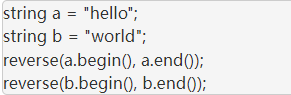

# 常用函数

- ## **swap（）：**

  用于元素的交换

  ```
  swap(a, b)
  ```

  

- ## **substr（）:**

  **形式 ：** s.substr(pos, len)

  **返回值：** string，包含s中从pos开始的len个字符的拷贝（pos的默认值是0，len的默认值是s.size() - pos，即不加参数会默认拷贝整个s）

  substr有2种常用用法：

  假设：string s = “0123456789”;

  ```
  string sub1 = s.substr(5); //只有一个数字5表示从下标为5开始一直到结尾：sub1 = “56789”
  
  string sub2 = s.substr(5, 3); //从下标为5开始截取长度为3位：sub2 = “567”
  ```

  

- ## **compare():**

  两个字符串相同，返回0。

  调用字符串小与被调用字符串，返回-1。

  调用字符串大于被调用字符串，返回1。

  ```
  int compare(const string &s) const;
  
  int conpare(const char *s) const;
  ```

  

  

-   ## **reverse():**

    reverse函数用于反转 [ first , last ）范围内的顺序

    
