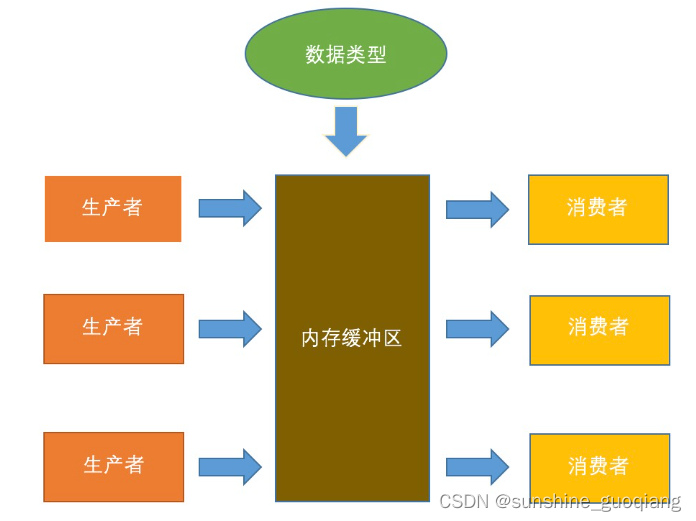

# 设计模式之生产者-消费者模型

### 一、什么是生产者-消费者模型

1、简单理解生产者-消费者模型
假设有两个进程（或线程）A、B和一个固定大小的缓冲区，A进程生产数据放入缓冲区，B进程从缓冲区中取出数据进行计算，这就是一个简单的生产者-消费者模型。这里的A进程相当于生产者，B进程相当于消费者。


2、为什么要使用生产者-消费者模型
在多线程开发中，如果生产者生产数据的速度很快，而消费者消费数据的速度很慢，那么生产者就必须等待消费者消费完数据才能够继续生产数据，因为生产过多的数据可能会导致存储不足；同理如果消费者的速度大于生产者那么消费者就会经常处理等待状态，所以为了达到生产者和消费者生产数据和消费数据之间的平衡，那么就需要一个缓冲区用来存储生产者生产的数据，所以就引入了生产者-消费者模式
简单来说，这里缓冲区的作用就是为了平衡生产者和消费者的数据处理能力，一方面起到缓存作用，另一方面达到解耦合作用。
3、生产者-消费者模型特点
保证生产者不会在缓冲区满的时候继续向缓冲区放入数据，而消费者也不会在缓冲区空的时候，消耗数据
当缓冲区满的时候，生产者会进入休眠状态，当下次消费者开始消耗缓冲区的数据时，生产者才会被唤醒，开始往缓冲区中添加数据；当缓冲区空的时候，消费者也会进入休眠状态，直到生产者往缓冲区中添加数据时才会被唤醒


4、生产者-消费者模型的应用场景
生产者-消费者模型一般用于将生产数据的一方和消费数据的一方分割开来，将生产数据与消费数据的过程解耦开来。
1）Excutor任务执行框架：
通过将任务的提交和任务的执行解耦开来，提交任务的操作相当于生产者，执行任务的操作相当于消费者；例如使用Excutor构建web服务器，用于处理线程的请求：生产者将任务提交给线程池，线程池创建线程处理任务，如果需要运行的任务数大于线程池的基本线程数，那么就把任务扔到阻塞队列（通过线程池 + 阻塞队列的方式比只使用一个阻塞队列的效率高很多，因为消费者能够处理就直接处理掉了，不用每个消费者都要先从阻塞队列中取出任务再执行）
2）消息中间件active MQ：
双十一的时候，会产生大量的订单，那么不可能同时处理那么多的订单，需要将订单放入一个队列里面，然后由专门的线程处理订单。这里用户下单就是生产者，处理订单的线程就是消费者；再比如12306的抢票功能，先由一个容器存储用户提交的订单，然后再由专门处理订单的线程慢慢处理，这样可以在短时间内支持高并发服务
3）任务的处理时间比较长的情况下：
比如上传附近并处理，那么这个时候可以将用户上传和处理附件分成两个过程，用一个队列暂时存储用户上传的附近，然后立刻返回用户上传成功，然后有专门的线程处理队列中的附近
5、生产者-消费者模型的优点
1）解耦合：将生产者类和消费者类进行解耦，消除代码之间的依赖性，简化工作负载的管理。
2）复用：通过将生产者类和消费者类独立开来，那么可以对生产者类和消费者类进行独立的复用与扩展。
3）调整并发数：由于生产者和消费者的处理速度是不一样的，可以调整并发数，给予慢的一方多的并发数，来提高任务的处理速度。
4）异步：对于生产者和消费者来说能够各司其职，生产者只需要关心缓冲区是否还有数据，不需要等待消费者处理完；同样的对于消费者来说，也只需要关注缓冲区的内容，不需要关注生产者，通过异步的方式支持高并发，将一个耗时的流程拆成生产和消费两个阶段，这样生产者因为执行 put() 的时间比较短，而支持高并发。
5）支持分布式：生产者和消费者通过队列进行通讯，所以不需要运行在同一台机器上，在分布式环境中可以通过 redis 的 list 作为队列，而消费者只需要轮询队列中是否有数据。同时还能支持集群的伸缩性，当某台机器宕掉的时候，不会导致整个集群宕掉。
### 二、C++实现生产者-消费者模型

1、依赖
1）C++11 提供的 thread 库

2）互斥锁 mutex

3）条件变量 condition_variable

4）队列 queue

5）原子操作 atomic

6）Windows 临界区

2、实现细节
1）具体的实现逻辑是构建一个queue来存储生产的数据，queue不满时可以生产，不空时可以消费。对于这个队列，采用阻塞队列的实现思路。

2）先实现构造函数，初始化一个unique_lock供condition_variable使用。如何在类里面使用unique_lock等需要初始化，并且初始化会加锁的对象。这要研究下。尝试构造列表初始化，然后函数体里unlock。

3）对于条件变量，申请两个，分别控制consumer和producer。

4）入队和出队列的细节。

5）首先加锁。

6）循环判断一下目前的队列情况，对于各自的特殊情况（队满和队空）进行处理。

6）唤醒一个线程来处理特殊情况。

7）等待处理完毕。

8）处理入和出队列操作。

9）最后释放锁。

10）对于输出 std::cout 可能因为多线程紊乱的问题，加入了临界区。另外因为 std::cout 缓存问题，可能存在其他问题。

3、问题
1）出现的 Bug：在多个 consumer 线程情况下，会出现有线程无法退出情况。在析构函数里，加入 stop，并且唤醒因条件变量阻塞的线程。在 pop 函数中，加入对 stop 的判断，当队列为空并且 stop 时，退出 pop 函数。对 consumer 的条件变量 wait 调用加入 pred，队列为空或者没有停止时阻塞。

2）条件变量的 wait 函数理解：单参数版本，此时传入一个 unique_lock 类型的变量，并且已经加锁，调用 wait 之后释放锁，并阻塞等待 notify 唤醒，唤醒后加锁，要注意的是被唤醒后有可能加锁失败，此时继续阻塞；双参数版本，此时需要再加入一个 Predicate 类型的变量，应该是一个返回 bool 的函数，可用 lamda 表达式代替，返回 false 阻塞，true 解除，要注意这里的意思是即使 notify 了，如果后面的条件不满足，也不会解除阻塞。

3）对于多 consumer 的消息同步暂时搁置，是在外部程序完成调用的 stop。

4、代码
1）阻塞队列

```
// BlockQueue.h
#pragma  once
#include <iostream>
#include <queue>
#include <thread>
#include <mutex>
#include <atomic>
#include <condition_variable>

#define TASK_NUM 8

using namespace std;

class CBlockQueue
{
private:
    mutex _mt;
    condition_variable _cv_con;
    condition_variable _cv_prod;
    queue<int>   _tasks;
    atomic<bool> _stopped;

    const int _capacity;
    
    bool stopped() 
    {
        return _stopped.load();
    }

    bool empty() 
    {
        return _tasks.size() == 0 ? true : false;
    }

    bool full()
    {
        return _tasks.size() == _capacity ? true : false;
    }
    
public:
    CBlockQueue();
    ~CBlockQueue();

    void stop()
    {
        _stopped.store(true);
        _cv_con.notify_all();
    }

    bool available()
    {
        return !stopped() || !empty();
    }

    void push(const int &data);
    void pop(int &data);
};

```

```
// BlockQueue.cpp
#include "BlockQueue.h"

CBlockQueue::CBlockQueue() : _capacity(TASK_NUM), _stopped(false) {}

CBlockQueue::~CBlockQueue()
{
    stop();
    _cv_con.notify_all();
    _cv_prod.notify_all();
}

void CBlockQueue::push(const int &data) 
{
    unique_lock<mutex> _lck(_mt);
    while (full()) 
    {
        _cv_con.notify_one();
        // cout << "Task Queue is full, notify one consumer...\n";
        _cv_prod.wait(_lck);
    }

    _tasks.push(data);
    _cv_con.notify_one();
}

void CBlockQueue::pop(int &data) 
{
    unique_lock<mutex> _lck(_mt);
    while (empty())
    {
        if (this->stopped()) 
            return;

        _cv_prod.notify_one();
        // cout << "Task Queue is empty, notify one producer...\n";
        _cv_con.wait(_lck, [this]() { return this->stopped() || !this->empty(); });
    }

    data = _tasks.front();
    _tasks.pop();
    _cv_prod.notify_one();
}

```

2）主函数

```
#include <iostream>
#include "BlockQueue.h"

#ifdef WIN32
#include <windows.h>
#define sleep(x) (Sleep((x) * 1000))
#else
#include <unistd.h>
#endif

CRITICAL_SECTION cs;
// mutex mt_prod;

void consumer(CBlockQueue *bq)
{
    // CBlockQueue *bq = static_cast<CBlockQueue *>(arg);
    while (bq->available())
    {
        int data = -1;
        bq->pop(data);
        EnterCriticalSection(&cs);
        cout << "<" << this_thread::get_id() << ">: " << data << " comsumed.\n";
        LeaveCriticalSection(&cs);
        // sleep(0.5);
    }

    cout << "<" << this_thread::get_id() << ">: " << "consumer is done.\n";
}

void producer(CBlockQueue *bq, int start, int maxNum) 
{
    // CBlockQueue *bq = static_cast<CBlockQueue *>(arg);
    // unique_lock<mutex> lck(mt_prod);

    int i = 0;
    while (i++ < maxNum) 
    {
        // int data = rand() % 1024;
        int data = i + start;
        bq->push(data);
        EnterCriticalSection(&cs);
        cout << "[" << this_thread::get_id() << "]: " << data << " produced.\n";
        LeaveCriticalSection(&cs);
        // sleep(0.2);
    }

    // if(start + i >= maxNum) bq->stop();
    cout << "[" << this_thread::get_id() << "]: " << "producer is done.\n";
}

int main()
{
    CBlockQueue bqueue;
    InitializeCriticalSection(&cs);

    vector<thread> th_prods;
    const int num_prod = 3;
    for (int i = 0; i < num_prod; ++i) 
    {
        th_prods.emplace_back(producer, &bqueue, i * 100, num_prod * 100);
    }

    vector<thread> th_cons;
    const int num_con = 3;
    for (int i = 0; i < num_con; ++i)
    {
        th_cons.emplace_back(consumer, &bqueue);
    }

    for (auto &t : th_prods) 
    {
        t.join();
    }
    bqueue.stop();
    for (auto &t : th_cons)
    {
        t.join();
    }
    
    DeleteCriticalSection(&cs);
    
    return 0;
}

```

### 三、Reference

1、深入理解生产者消费者模型：https://blog.csdn.net/xiaoqiu_cr/article/details/95756625

2、C++版本的生产者消费者模型：https://blog.csdn.net/h_WuLingFei/article/details/104897449

3、多线程与原子操作和无锁编程：https://guoqiang.blog.csdn.net/article/details/112253541
