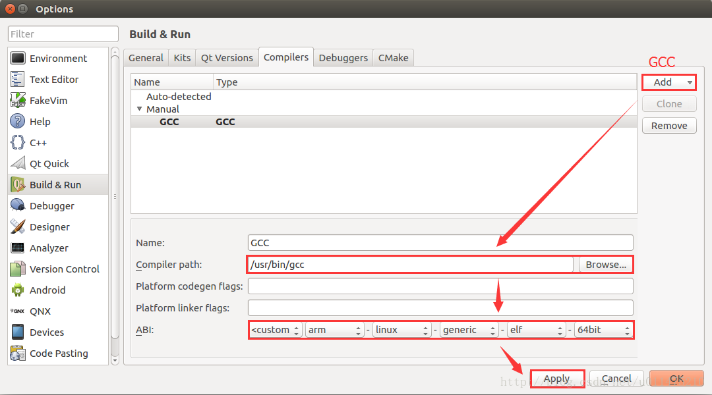

# 基于arm架构的NVIDIA Xavier安装Qt

## **Part1：安装Qt**

#### 1.安装Qt Creator

```shell
sudo apt-get install qt5-default qtcreator -y
```

#### 2.安装Qt示例和文档

```sh
sudo apt-get install qt5-doc qt5-doc-html qtbase5-doc-html qtbase5-examples -y
```


## **Part2：配置Qt**

#### 1.搜索Qt并打开应用程序，当然也可以用命令行直接打开：


#### 2.Tools-\>Options-\>Build & Run-\>Compilers，单击add选择添加GCC编译器，GCC编译器默认路径为/usr/bin/gcc，添加完路径之后还要修改开发平台，如图所示：




#### 3.切换到Kit下，添加开发套件。名称可以随便写，需要注意的是必须先配置上一步的GCC，这一步才能直接添加GCC，否则就会像Desktop套件一样报错：


