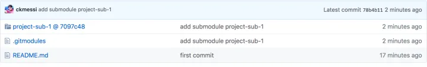

# Git中submodule的使用

## 背景

面对比较复杂的项目，我们有可能会将代码根据功能拆解成不同的子模块。主项目对子模块有依赖关系，却又并不关心子模块的内部开发流程细节。

这种情况下，通常不会把所有源码都放在同一个 Git 仓库中。

有一种比较简单的方式，是在当前工作目录下，将子模块文件夹加入到 `.gitignore` 文件内容中，这样主项目就能够无视子项目的存在。这样做有一个弊端就是，使用主项目的人需要有一个先验知识：需要在当前目录下放置一份某版本的子模块代码。

还有另外一种方式可供借鉴，可以使用 Git 的 `submodule` 功能，也是这篇文章的主题。

实际上 Git 工具的 `submodule` 功能就是建立了当前项目与子模块之间的依赖关系：`子模块路径`、`子模块的远程仓库`、`子模块的版本号`。

## 使用流程

假定我们有两个项目：`project-main` 和 `project-sub-1`，其中 `project-main` 表示主项目，而 `project-sub-1` 表示子模块项目。

其中 `project-main` 的远程仓库地址为 `https://github.com/username/project-main.git`，而 `project-sub-1` 的远程仓库地址为 `https://github.com/username/project-sub-1.git`。

接下来，我们希望在 `project-main` 中添加 `project-sub-1` ，而又保持 `project-sub-1` 自身独立的版本控制。

### **1.创建 submodule**

使用 `git submodule add <submodule_url>` 命令可以在项目中创建一个子模块。

进入项目 `project-main` ，输入：

> ➜ project-main git:(master) git submodule add [https://github.com/username/project-sub-1.git](https://link.zhihu.com/?target=https%3A//github.com/username/project-sub-1.git)
> 正克隆到 '/path/to/project-main/project-sub-1'...
> remote: Enumerating objects: 3, done.
> remote: Counting objects: 100% (3/3), done.
> remote: Total 3 (delta 0), reused 0 (delta 0), pack-reused 0
> 展开对象中: 100% (3/3), 完成.

此时项目仓库中会多出两个文件：`.gitmodules` 和 `project-sub-1` 。

前者的内容是这样的，事实上就是子模块的相关信息；而后者那个文件，实际上保存的是子模块当前版本的版本号信息。

> [submodule "project-sub-1"]
> path = project-sub-1
> url = [https://github.com/username/project-sub-1.git](https://link.zhihu.com/?target=https%3A//github.com/username/project-sub-1.git)

如果此前项目中已经存在 `.gitmodules` 文件，则会在文件内容中多出上述三行记录。

事实上，此时在 `.git/config` 文件中也会多出一些信息，在 `.git/modules` 文件夹下也会多出一份内容。

通常此时可以使用 `git commit -m "add submodule xxx"` 提交一次，表示引入了某个子模块。提交后，在主项目仓库中，会显示出子模块文件夹，并带上其所在仓库的版本号。

### **2.获取 submodule**

上述步骤在创建子模块的过程中，会自动将相关代码克隆到对应路径，但对于后续使用者而言，对于主项目使用普通的 `clone` 操作并不会拉取到子模块中的实际代码。

使用以下命令进行克隆，完成后 `project-main/project-sub-1` 文件夹是空的：

> cd /path/to/temp
> git clone [https://github.com/username/project-main.git](https://link.zhihu.com/?target=https%3A//github.com/username/project-main.git)

如果希望子模块代码也获取到，一种方式是在克隆主项目的时候带上参数 `--recurse-submodules`，这样会递归地将项目中所有子模块的代码拉取。

> cd /path/to/temp2
> git clone [https://github.com/username/project-main.git](https://link.zhihu.com/?target=https%3A//github.com/username/project-main.git) --recurse-submodules

此时 `project-main/project-sub-1` 文件夹是有内容的，并且固定在某个 Git 提交的版本上。

另外一种可行的方式是，在当前主项目中执行：

> git submodule init
> git submodule update

则会根据主项目的配置信息，拉取更新子模块中的代码。

一般使用更多的是，递归得将子项目中目录拉去下来

> git submodule update --init --recursive

### **3.子模块内容的更新**

对于子模块而言，并不需要知道引用自己的主项目的存在。对于自身来讲，子模块就是一个完整的 Git 仓库，按照正常的 Git 代码管理规范操作即可。

对于主项目而言，子模块的内容发生变动时，通常有三种情况：

1）当前项目下子模块文件夹内的内容发生了未跟踪的内容变动；

2）当前项目下子模块文件夹内的内容发生了版本变化；

3）当前项目下子模块文件夹内的内容没变，远程有更新；

> \> 情况1：子模块有未跟踪的内容变动

对于第1种情况，通常是在开发环境中，直接修改子模块文件夹中的代码导致的。

此时在主项目中使用 `git status` 能够看到关于子模块尚未暂存以备提交的变更，但是于主项目而言是无能为力的，使用 `git add/commit` 对其也不会产生影响。

> ➜ project-main git:(master) git status
> 位于分支 master
> 您的分支与上游分支 'origin/master' 一致。
> 尚未暂存以备提交的变更：
> （使用 "git add <文件>..." 更新要提交的内容）
> （使用 "git checkout -- <文件>..." 丢弃工作区的改动）
> （提交或丢弃子模组中未跟踪或修改的内容）
> 修改： project-sub-1 (未跟踪的内容)
> 修改尚未加入提交（使用 "git add" 和/或 "git commit -a"）

在此情景下，通常需要进入子模块文件夹，按照子模块内部的版本控制体系提交代码。

当提交完成后，主项目的状态则进入了情况2，即当前项目下子模块文件夹内的内容发生了版本变化。

> \> 情况2：子模块有版本变化

当子模块版本变化时，在主项目中使用 `git status` 查看仓库状态时，会显示子模块有新的提交：

> ➜ project-main git:(master) ✗ git status
> 位于分支 master
> 您的分支与上游分支 'origin/master' 一致。
> 尚未暂存以备提交的变更：
> （使用 "git add <文件>..." 更新要提交的内容）
> （使用 "git checkout -- <文件>..." 丢弃工作区的改动）
> 修改： project-sub-1 (新提交)
> 修改尚未加入提交（使用 "git add" 和/或 "git commit -a"）

在这种情况下，可以使用 `git add/commit` 将其添加到主项目的代码提交中，实际的改动就是那个子模块 `文件` 所表示的版本信息：

> git diff HEAD HEAD^
> diff --git a/project-sub-1 b/project-sub-1
> index ace9770..7097c48 160000
> --- a/project-sub-1
> +++ b/project-sub-1
> @@ -1 +1 @@
> -Subproject commit ace977071f94f4f88935f9bb9a33ac0f8b4ba935
> +Subproject commit 7097c4887798b71cee360e99815f7dbd1aa17eb4

通常当子项目更新后，主项目修改其所依赖的版本时，会产生类似这种情景的 commit 提交信息。

> \> 情况3：子模块远程有更新

通常来讲，主项目与子模块的开发不会恰好是同时进行的。通常是子模块负责维护自己的版本升级后，推送到远程仓库，并告知主项目可以更新对子模块的版本依赖。

在这种情况下，主项目是比较茫然的。

之前曾经提到，主项目可以使用 `git submodule update` 更新子模块的代码，但那是指 `当前主项目文件夹下的子模块目录内容` 与 `当前主项目记录的子模块版本` 不一致时，会参考后者进行更新。

但如今这种情况下，后者 `当前主项目记录的子模块版本` 还没有变化，在主项目看来当前情况一切正常。

此时，需要让主项目主动进入子模块拉取新版代码，进行升级操作。

通常流程是：

> cd project-sub-1
> git pull origin master

子模块目录下的代码版本会发生变化，转到情况2的流程进行主项目的提交。

当主项目的子项目特别多时，可能会不太方便，此时可以使用 `git submodule` 的一个命令 `foreach` 执行：

> git submodule foreach 'git pull origin master'

> \> 情况汇总

终上所述，可知在不同场景下子模块的更新方式如下：

- 对于子模块，只需要管理好自己的版本，并推送到远程分支即可；
- 对于父模块，若子模块版本信息未提交，需要更新子模块目录下的代码，并执行 `commit` 操作提交子模块版本信息；
- 对于父模块，若子模块版本信息已提交，需要使用 `git submodule update` （git submodule update --init --recursive），Git 会自动根据子模块版本信息更新所有子模块目录的相关代码。

> **4.删除子模块**

网上流传了一些偏法，主要步骤是直接移除模块，并手动修改 `.gitmodules`、`.git/config` 和 `.git/modules` 内容。包含了一大堆类似`git rm --cached <sub-module>`、`rm -rf <sub-moduel>`、`rm .gitmodules` 和 `git rm --cached` 之类的代码。

实际上这是一种比较野的做法，不建议使用。

根据官方文档的说明，应该使用 `git submodule deinit` 命令卸载一个子模块。这个命令如果添加上参数 `--force`，则子模块工作区内即使有本地的修改，也会被移除。

> git submodule deinit project-sub-1
> git rm project-sub-1

执行 `git submodule deinit project-sub-1` 命令的实际效果，是自动在 `.git/config` 中删除了以下内容：

> [submodule "project-sub-1"]
> url = [https://github.com/username/project-sub-1.git](https://link.zhihu.com/?target=https%3A//github.com/username/project-sub-1.git)

执行 `git rm project-sub-1` 的效果，是移除了 `project-sub-1` 文件夹，并自动在 `.gitmodules` 中删除了以下内容：

> [submodule "project-sub-1"]
> path = project-sub-1
> url = [https://github.com/username/project-sub-1.git](https://link.zhihu.com/?target=https%3A//github.com/username/project-sub-1.git)

此时，主项目中关于子模块的信息基本已经删除（虽然貌似 `.git/modules` 目录下还有残余）：

> ➜ project-main git:(master) ✗ gs
> 位于分支 master
> 您的分支与上游分支 'origin/master' 一致。
> 要提交的变更：
> （使用 "git reset HEAD <文件>..." 以取消暂存）
> 修改： .gitmodules
> 删除： project-sub-1

可以提交代码：

> git commit -m "delete submodule project-sub-1"

至此完成对子模块的删除。

## 总结

当项目比较复杂，部分代码希望独立为子模块进行版本控制时，可以使用 `git submodule` 功能。

使用 `git submodule` 功能时，主项目仓库并不会包含子模块的文件，只会保留一份子模块的配置信息及版本信息，作为主项目版本管理的一部分。

本篇文章简单介绍了 `git submodule` 的添加和删除，以及项目开发过程中主项目与子模块不同状态时刻的操作方式。