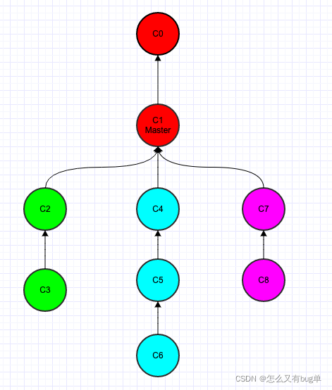

# git cherry-pick

## 前言

对于多分支的代码库，将代码从一个分支转移到另一个分支是常见需求。

这时分两种情况。

你需要另一个分支的所有代码变动，那么就采用合并（git merge）。
你只需要部分代码变动（某几个提交），这时可以采用 Cherry pick。
Cherry pick直译为捡樱桃🍒，它的功能是把已经存在的commit进行挑选，然后重新提交。比较合适的一个场景是把A分支的某次或者多次的提交也提交到B分支上。

## 图示

比如此时分支情况如下：



这幅图中，每个圆圈代表一次commit

一条线是一个分支。

比如c2，c3，这是两次提交，在同一个分支上。

此时需求是：要把绿色分支的C3，蓝色分支的C5，紫色分支的C7合到一条新的分支上。

此时就需要cherry-pick命令了。

首先切到master分支，然后输入

git cherry-pick C3 C5 C7

此时，分支图示就变成了：


## 一、转移一个提交

1. 先切换到 A 分支

   ```git
   $ git checkout A
   ```

2. 找到这次提交

   ```
      $ git log
      commit f038d7ffb1685af7d4f870ad0b798670b6f760e8 (HEAD -> feature/0113_update)
      Author: qxj <qxj@qq.com>
      Date:   Thu Jan 14 15:24:54 2021 +0800
      
          feat: xxx
   ```

3. 再切换到B分支

   ```
   $ git checkout B
   ```

4. 把 A 分支下的这次commit 重新提交到 B 分支下

   ```
   $ git cherry-pick 'f038d7ffb1685af7d4f870ad0b798670b6f760e8'
   ```

当执行完 `git cherry-pick`以后，将会生成一个新的提交，这个新的提交的[hash](https://so.csdn.net/so/search?q=hash&spm=1001.2101.3001.7020)值和原来的不同，但标志名称一样。

## 二、转移多个提交

Cherry pick 支持一次转移多个提交。

```
$ git cherry-pick <HashA> <HashB>
```

上面的命令将 A 和 B 两个提交应用到当前分支。这会在当前分支生成两个对应的新提交。

如果想要转移一系列的连续提交，可以使用下面的简便语法。

```
$ git cherry-pick A..B 
```

如果要包含提交 A，可以使用下面的语法。

```
$ git cherry-pick A^..B 
```

## 三、配置项

git cherry-pick命令的常用配置项如下。

##### （1）-e，--edit

​	打开外部编辑器，编辑提交信息。

##### （2）-n，--no-commit

​	只更新工作区和暂存区，不产生新的提交。

##### （3）-x

​	在提交信息的末尾追加一行(cherry picked from commit ...)，保留原提交者信息，方便以后查到这个提交是如何产生的。

##### （4）-s，--signoff

​	在提交信息的末尾追加一行操作者的签名，表示是谁进行了这个操作。

##### （5）-m parent-number，--mainline parent-number

​	如果原始提交是一个合并节点，来自于两个分支的合并，那么 Cherry pick 默认将失败，因为它不知道应该采用哪个分支的代码变动。

​	-m配置项告诉 Git，应该采用哪个分支的变动。它的参数parent-number是一个从1开始的整数，代表原始提交的父分支编号。

```
$ git cherry-pick -m 1 <commitHash>
```

上面命令表示，Cherry pick 采用提交commitHash来自编号1的父分支的变动。

一般来说，1号父分支是接受变动的分支（the branch being merged into），2号父分支是作为变动来源的分支（the branch being merged from）。

## 四、代码冲突

如果操作过程中发生代码冲突，Cherry pick 会停下来，让用户决定如何继续操作。

##### **（1）`--continue`**

用户解决代码冲突后，第一步将修改的文件重新加入暂存区（`git add .`），第二步使用下面的命令，让 Cherry pick 过程继续执行。

```
$ git cherry-pick --continue
```

##### **（2）`--abort`**

发生代码冲突后，放弃合并，回到操作前的样子。

##### **（3）`--quit`**

发生代码冲突后，退出 Cherry pick，但是不回到操作前的样子。

#### 如果在真实的cherry-pick 的过程中出现了冲突

```
 Automatic cherry-pick failed.
 After resolving the conflicts,mark the corrected paths with 'git add <paths>' or 'git rm <paths>'and commit the result with:
 git commit -c 15a2b6c61927e5aed6111de89ad9dafba939a90b
 // **或者:**
 error: could not apply f038d7f... dev
 hint: after resolving the conflicts, mark the corrected paths
 hint: with 'git add <paths>' or 'git rm <paths>'
 hint: and commit the result with 'git commit'
```

就跟普通的冲突一样，手工解决。

```
$ git status    # 看哪些文件出现冲突
$ vim xxx.js  # 手动解决它。
$ git add xxx.js
	or
$ git add .			# 添加到缓存区
$ git commit -c <新的commit号码>
```

第二步使用下面的命令，让 Cherry pick 过程继续执行。

```
git cherry-pick --continue
```

