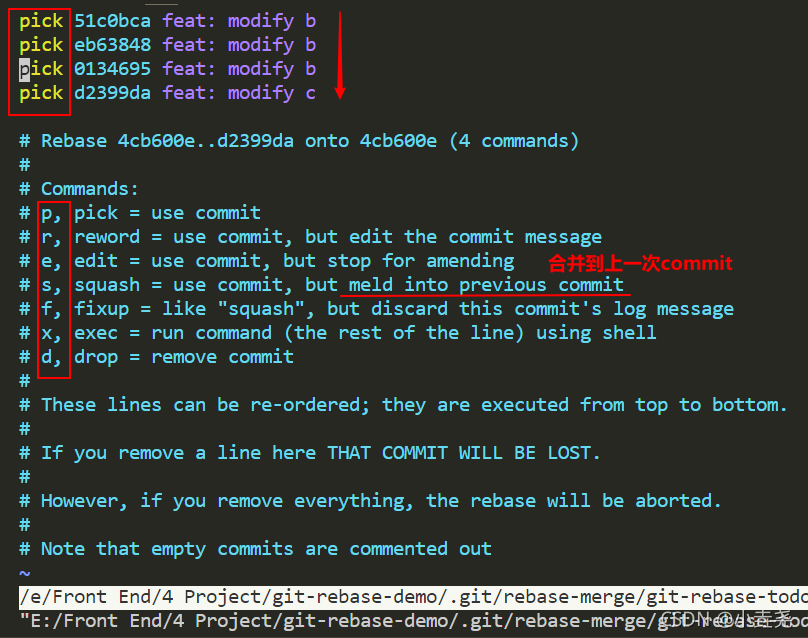
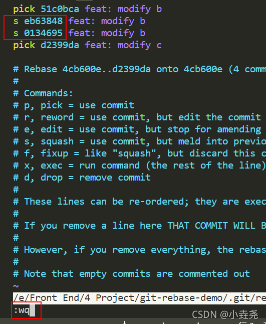
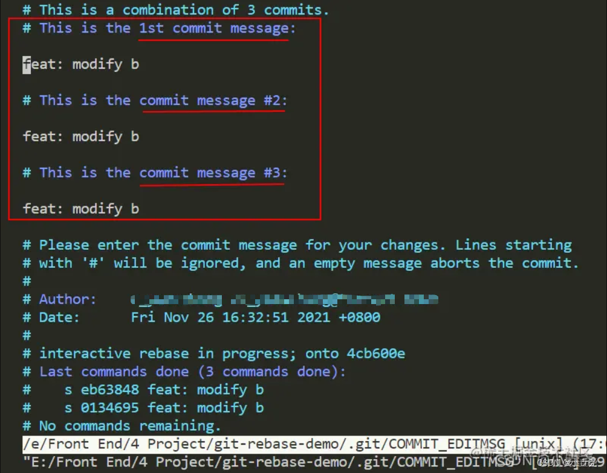
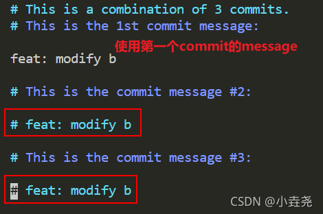
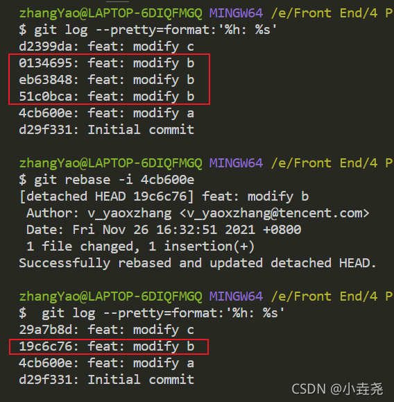
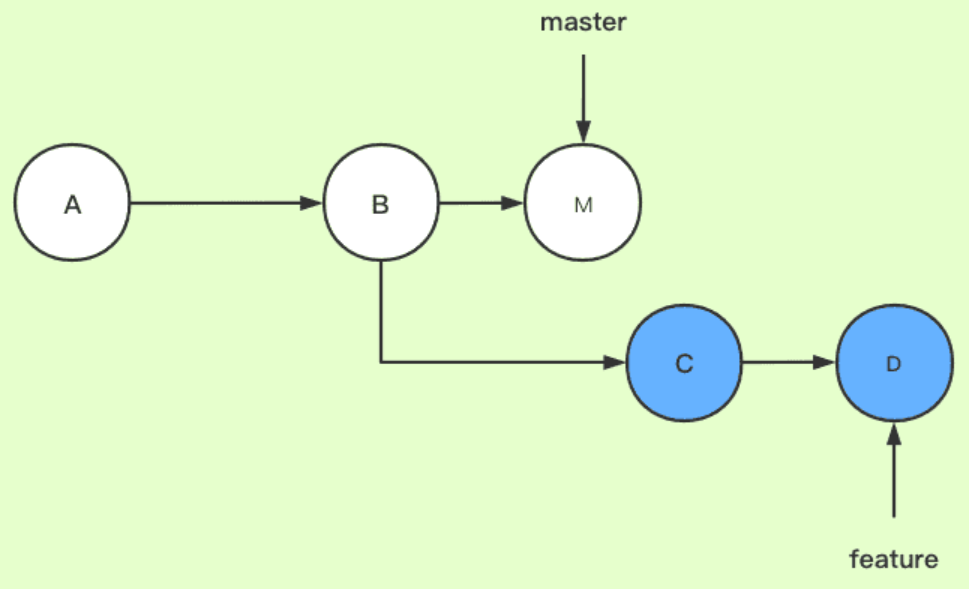
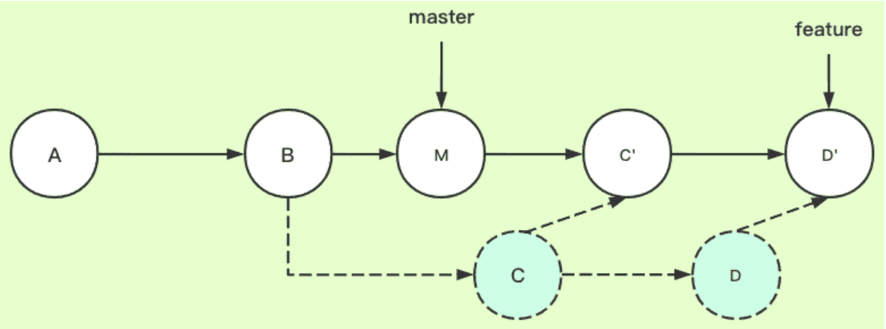
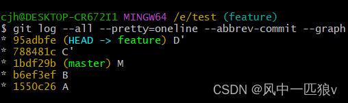

# git rebase的两种用法

## 用法一: 合并当前分支的多个commit记录

你可能出现过对同一处代码进行多次处理的场景。这会导致如下提交记录:

```
$ git log --pretty=format:'%h: %s'
d2399da: feat: modify c
0134695: feat: modify b
eb63848: feat: modify b
51c0bca: feat: modify b
4cb600e: feat: modify a
d29f331: Initial commit
```

其实, 中间的对b的3次提交 完全可以合并成一次commit, 这个时候 rebase就很有用了。

### 1. 找到想要合并的commit, 使用rebase -i

```
$ git rebase -i 4cb600e
```

**注意 git rebase -i [startPonit] [endPoint]**

前开后闭 区间 这里的 [startPonit] 是指需要合并的commit的前一个commit (即当前示例中的 “4cb600e: feat: modify a”)。 因为, 三个commit肯定要基于上一个commit合并成了新的commit。
谨慎使用[endPoint] 省略, 即默认表示从起始commit一直到最后一个，但是一旦你填写了, **则表示 [endPoint]后面的commit全部不要了!**

### 2. 进入Interact交互界面

终端会进入选择交互界面, 让你进行变基选择操作:



- 最上面三行, 就是刚刚选中的三个commit, 按时间顺序依次往下排序（时间最老的在上面）(**和git log的展示顺序是反的, 大家查看的时候要注意**)
- 前面的三个Pick 其实就是下面 **Commands展示的7种命令中的第一个p**, 也就是使用commit。

### 3.使用s命令合并到上一个commit

1. 按i 进入操作, 将**第二、三个commit的pick改成s**
2. 按Esc 退出操作
3. 输入:wq保存并退出



| **命令** | **缩写** |                         **含义**                         |
| :------: | :------: | :------------------------------------------------------: |
|   pick   |    p     |                       保留该commit                       |
|  reword  |    r     |          保留该commit，但需要修改该commit的注释          |
|   edit   |    e     |   保留该commit, 但我要停下来修改该提交(不仅仅修改注释)   |
|  squash  |    s     |               将该commit合并到前一个commit               |
|  fixup   |    f     | 将该commit合并到前一个commit，但不要保留该提交的注释信息 |
|   exec   |    x     |                      执行shell命令                       |
|   drop   |    d     |                       丢弃该commit                       |

### 4.修改commit记录



这里三个信息都是一样的, 我们选用第一个的提交信息, 将其余的全部注释掉,重复上述步骤, 保存退出即可



### 5.查看最新合并情况

会发现原三个一样的提交现在合并成了一个新的commit。



## 用法二: 避免出现分叉合并

### 1.原理介绍

首先通过简单的提交节点图解感受一下rebase在干什么

构造两个分支master和feature，其中feature是在提交点B处从master上拉出的分支

master上有一个新提交M，feature上有两个新提交C和D



此时我们切换到feature分支上，执行rebase命令，相当于是想要把master分支合并到feature分支（这一步的场景就可以类比为我们在自己的分支feature上开发了一段时间了，准备从主干master上拉一下最新改动。模拟了git pull --rebase的情形）

```
# 这两条命令等价于git rebase master feature
git checkout feature
git rebase master
```

下图为变基后的提交节点图，解释一下其工作原理：



- feature：待变基分支、当前分支
- master：基分支、目标分支

#### 官方原文解释：

当执行rebase操作时，git会从两个分支的共同祖先开始提取待变基分支上的修改，然后将待变基分支指向基分支的最新提交，最后将刚才提取的修改应用到基分支的最新提交的后面。

#### 结合例子解释：

当在feature分支上执行git rebase master时，git会从master和featuer的共同祖先B开始提取feature分支上的修改，也就是C和D两个提交，先提取到。然后将feature分支指向master分支的最新提交上，也就是M。最后把提取的C和D接到M后面，注意这里的接法，官方没说清楚，实际是会依次拿M和C、D内容分别比较，处理冲突后生成新的C’和D’。一定注意，这里新C’、D’和之前的C、D已经不一样了，是我们处理冲突后的新内容，feature指针自然最后也是指向D’

#### 通俗解释：

rebase，变基，可以直接理解为改变基底。feature分支是基于master分支的B拉出来的分支，feature的基底是B。而master在B之后有新的提交，就相当于此时要用master上新的提交来作为feature分支的新基底。实际操作为把B之后feature的提交先暂存下来，然后删掉原来这些提交，再找到master的最新提交位置，把存下来的提交再接上去（接上去是逐个和新基底处理冲突的过程），如此feature分支的基底就相当于变成了M而不是原来的B了。（注意，如果master上在B以后没有新提交，那么就还是用原来的B作为基，rebase操作相当于无效，此时和git merge就基本没区别了，差异只在于git merge会多一条记录Merge操作的提交记录）

### 2.冲突解决

在 `rebase` 的过程中，也许会出现冲突 `conflict`。在这种情况，`git` 会停止 `rebase` 并会让你去解决冲突。在解决完冲突后，用 `git add` 命令去更新这些内容。

注意，你无需执行 git-commit，只要执行 continue

```
git rebase --continue
```

这样 `git` 会继续应用余下的 `patch` 补丁文件。

在任何时候，我们都可以用 `--abort` 参数来终止 `rebase` 的行动，并且分支会回到 `rebase` 开始前的状态。

```
git rebase —abort
```

### 3.实际git提交示例

这里严格按照上面的图解，构造了实际的git提交示例（注意，这里重新贴了新图，之前的图逻辑上还是不够清晰）

如下图所示，ABM是master分支线，ABCD是feature分支线。


此时，在feature分支上执行git rebase master后，会提示有冲突，这里是关键，之前没有把这个细节说清楚。冲突其实也简单，因为我们要生成新的C’和D’嘛，那C’的内容如何得到呢？照搬C的？当然不是，C’的内容就是C和M两个节点的内容合并的结果，D’的内容就是D和M两个节点的内容合并的结果。我们手动处理冲突后，执行如下命令即可：

```
# 先处理完C，会继续报D的冲突，所以下面命令一共会执行两次
git add file
git rebase --continue
```

变基完成以后如下图所示，ABM还是没变化，ABMC’D’是rebase完成后的feature节点图，私以为讲到这里就还是比较清楚了



## other：git rebase 和 git pull --rebase

#### 切分支开发与合并分支

```
#你在本地local分支（并没有远程对应,纯粹是本地开发使用），切回主分支，更新master
git checkout master 
#更新master代码
git pull
#切回去
git checkout local

#关键的来了，这个时候，把代码变基到最新的上面。
git rebase master  ---->解决冲突--->git rebase --continue
# 搞完以后，切回主分支
git checkout master
# 把local的改动，全部合并到master这边来
git merge local
#提交
git push
```

> ##### 它完全遵循了git的标准规范来开发代码

**我们就知道区别了**：
pull --rebase是为了直接将远程的代码与本地（因为你就在远程分支下开发的）整合；而rebase的一套操作是为了本地额外分支与远程分支的，整合。

### 参考资料

[git rebase的两种用法(最全)](https://blog.csdn.net/small_white_123/article/details/121563248?spm=1001.2101.3001.6650.5&utm_medium=distribute.pc_relevant.none-task-blog-2%7Edefault%7ECTRLIST%7ERate-5-121563248-blog-119004977.pc_relevant_multi_platform_whitelistv3&depth_1-utm_source=distribute.pc_relevant.none-task-blog-2%7Edefault%7ECTRLIST%7ERate-5-121563248-blog-119004977.pc_relevant_multi_platform_whitelistv3&utm_relevant_index=9)

[git rebase详解（图解+最简单示例，一次就懂）](https://blog.csdn.net/weixin_42310154/article/details/119004977)

[git rebase超详细解读](https://blog.csdn.net/m0_69424697/article/details/125106290)

[git rebase和add -p和git pull --rebase记录](https://blog.csdn.net/jzlhll123/article/details/119776702)