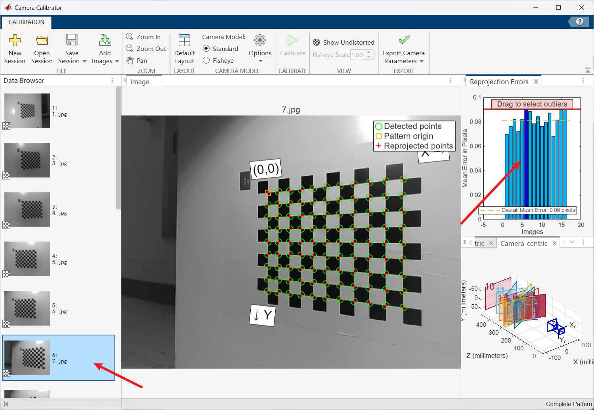

# Matlab标定单目相机内参

我使用的是Matlab 2024，使用不同版本大体流程都是一样的，可能界面显示会稍有不同

## 1.  打开相机标定app

## 2. 上传标定图片

采集标定图片的过程这里不做详细介绍，需要注意的是要采集到不同角度不同距离的棋盘格图片，具体采集要求可以自行百度，差不多采集20幅不同角度，不同距离的图像即可。

选择标定用的图案类型，这里选择的是**棋盘格**（Checkerboard），还支持环形点阵、非对称圆点阵等。**Size of checkerboard square**设置为棋盘格中**单个方格的实际物理边长**，作用是告诉标定程序，棋盘格上相邻角点之间的距离是多少，用来把像素坐标转换成真实世界坐标。

注意：一般指 **内角点间的距离**（不是整块棋盘的大小）。

 **Image distortion**表示让标定软件知道你的镜头畸变大不大。**Low**表示普通镜头，畸变不明显（比如手机、常规工业镜头）。**High**表示广角、鱼眼镜头，畸变很大，需要特殊检测算法来识别角点。

点击确定，matlab会自动剔除不合格的图像，并标出合格图像的角点

## 3. 设置相机参数

设置标定相机是标准模型还是鱼眼模型

设置畸变和计算选项：

### **Radial Distortion（径向畸变）**

指镜头在成像时，由于透镜形状和折射原理，导致直线在图像边缘出现弯曲的现象。

1. **2 Coefficients（两个系数）**（一般选择这个即可）
   - 使用 **四阶多项式** 来估计径向畸变。
   - 对应 OpenCV 里的 `k1, k2`（再加上有时会用 `k3=0`）。
   - 适合大多数镜头，尤其是视场角不是特别大的普通相机。
   - 优点：计算稳定、不过拟合。
2. **3 Coefficients（三个系数）**
   - 使用 **六阶多项式**（`k1, k2, k3`）。
   - 推荐用于 **广角或超广角镜头**（Wide FOV），因为它们的畸变更复杂。
   - 缺点：自由度多，可能在普通镜头下产生不必要的拟合误差。

------

### **Compute（计算相关的畸变/特性）**

1. **Skew（轴不垂直）**
   - 假设 X 轴和 Y 轴 **不是完全垂直**。
   - 意味着像素不是正方形（像素长宽比 ≠ 1），或者成像平面有一定倾斜。
   - 大部分现代相机像素是矩形且对齐的，所以通常不勾选。
2. **Tangential Distortion（切向畸变）**（一般选择这个）
   - 发生在 **镜头的光轴没有完全对准成像传感器中心** 时。
   - 表现为图像被轻微拉扯或倾斜。
   - 对应 OpenCV 的 `p1, p2` 参数。
   - 勾选它会让标定额外估计这两个畸变系数。

## 4. 开始标定

点击按钮开始标定

选中重投影较大的柱状，找到对应的图片，右击移除该图片，**该步骤不是必须的**

点击按钮可以查看矫正之后的图像效果

观察重投影误差，一般小于0.3个像素认为标定效果比较好，点击按钮导出标定结果

## 5. 结果分析

点击相机内参

我将结果含义标注在图片上，这里不做详细介绍了：

