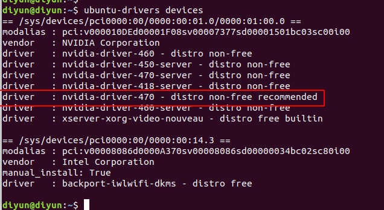
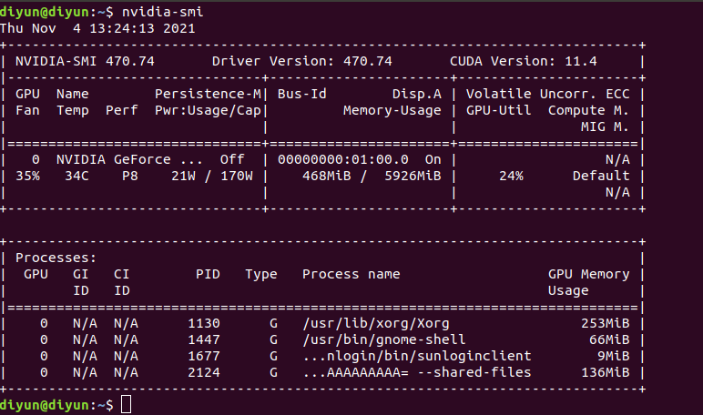
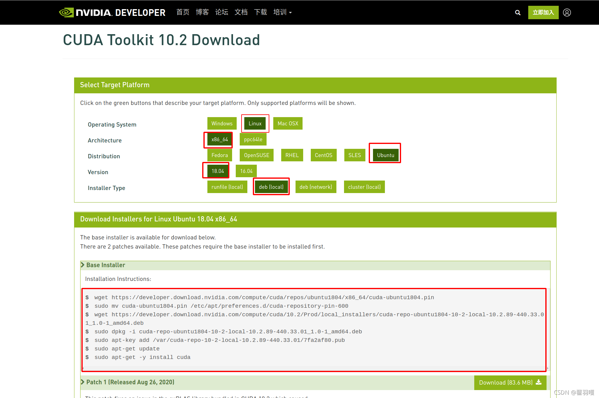
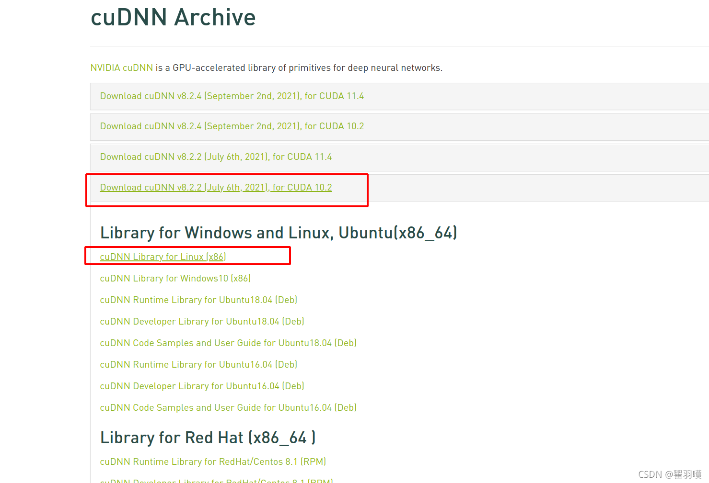
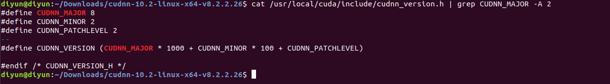

# Ubuntu18.04环境配置

## 1.安装多版本gcc、g++可切换

```
sudo apt-get install gcc-4.8 gcc-4.8-multilib  
sudo apt-get install g++-4.8 g++-4.8-multilib  
sudo apt-get install gcc-5 gcc-5-multilib  
sudo apt-get install g++-5 g++-5-multilib  
sudo apt-get install gcc-6 gcc-6-multilib  
sudo apt-get install g++-6 g++-6-multilib  
sudo apt-get install gcc-7 gcc-7-multilib  
sudo apt-get install g++-7 g++-7-multilib  
sudo update-alternatives --install /usr/bin/gcc gcc /usr/bin/gcc-4.8 48  
sudo update-alternatives --install /usr/bin/gcc gcc /usr/bin/gcc-5 50  
sudo update-alternatives --install /usr/bin/gcc gcc /usr/bin/gcc-6 60  
sudo update-alternatives --install /usr/bin/gcc gcc /usr/bin/gcc-7 70  
sudo update-alternatives --install /usr/bin/g++ g++ /usr/bin/g++-4.8 48  
sudo update-alternatives --install /usr/bin/g++ g++ /usr/bin/g++-5 50  
sudo update-alternatives --install /usr/bin/g++ g++ /usr/bin/g++-6 60  
sudo update-alternatives --install /usr/bin/g++ g++ /usr/bin/g++-7 70  
```

### 切换版本命令，可根据自己想要的环境选择（后面安装显卡驱动需要选择>=5的版本）：

```
sudo update-alternatives --config gcc  
sudo update-alternatives --config g++
```

## 2.安装make：

```
sudo apt install make
```

## 3.安装cmake

建议手动源码编译安装，选择高版本，后续很多库需要使用告版本cmake

## 4.安装python和python3

#### 安装依赖

```
$ sudo apt-get install -y nano curl
# python3
$ sudo apt-get install -y python3-pip python3-dev python3-setuptools
# python2
$ sudo apt-get install -y python-pip python-dev python-setuptools
$ sudo apt-get install -y libcanberra-gtk0 libcanberra-gtk-module
```

#### 安装python-pip

```
# pip3
$ pip3 install -U pip
$ pip install -U pip
# pip
$ pip3 install setuptools wheel cython
$ pip install setuptools wheel cython
```

#### 更改软链接

```
# python
$ sudo rm -rf /usr/bin/python && sudo ln -s /usr/bin/python3 /usr/bin/python
$ which python
# pip
$ sudo rm -rf /usr/bin/pip && sudo ln -s /usr/bin/pip3 /usr/bin/pip
$ which pip
```

## 5.安装NVIDIA显卡驱动

- #### 先把之前的nvidia卸载干净:

```
sudo apt-get remove --purge nvidia*
```

- #### 执行以下命令:

```
sudo apt-get update
```

- #### 查看本机显卡能够配置的驱动信息

```
ubuntu-drivers devices
```



从上图可以看出，推荐安装的版本号是：**nvidia-driver-470 - distro non-free recommended**

- #### 下载你想下载的nvidia驱动版本：

```
sudo apt install nvidia-driver-470
```

- #### 重启电脑(这一步很重要，不重启没有效果):

```
reboot
```

- #### 重启后，输入命令查看nvidia驱动是否安装好了，gpu是否可用。

```
nvidia-smi
```



如上显示，安装成功

## 6.安装CUDA10.2


**这个图说明，我们可以安装11.4及比11.4低的版本。具体需要安装什么版本可以根据情况自己选择。**

- #### 这里我们安装CUDA最新的10.2版本。进入Nvidia cuda下载地址：

[Nvidia 10.2下载地址](https://developer.nvidia.com/cuda-10.2-download-archive?target_os=Linux&target_arch=x86_64&target_distro=Ubuntu&target_version=1804&target_type=deblocal)

然后依次执行下述官方提供的7条命令：



```
wget https://developer.download.nvidia.com/compute/cuda/repos/ubuntu1804/x86_64/cuda-ubuntu1804.pin
sudo mv cuda-ubuntu1804.pin /etc/apt/preferences.d/cuda-repository-pin-600
wget https://developer.download.nvidia.com/compute/cuda/10.2/Prod/local_installers/cuda-repo-ubuntu1804-10-2-local-10.2.89-440.33.01_1.0-1_amd64.deb
sudo dpkg -i cuda-repo-ubuntu1804-10-2-local-10.2.89-440.33.01_1.0-1_amd64.deb
sudo apt-key add /var/cuda-repo-10-2-local-10.2.89-440.33.01/7fa2af80.pub
sudo apt-get update
sudo apt-get -y install cuda
```

- #### 配置CUDA环境变量

打开.bashrc

```
gedit ~/.bashrc
```

在.bashrc末尾添加两行环境变量

```
export PATH=$PATH:/usr/local/cuda-10.2/bin
export LD_LIBRARY_PATH=/usr/local/cuda-10.2/lib64${LD_LIBRARY_PATH:+:${LD_LIBRARY_PATH}}  #根据CUDA版本更换路径
```

最后，使环境变量生效

```
source ~/.bashrc
```

- #### 测试是否安装成功

```
nvcc -V
```

> diyun@diyun:~$ nvcc -V
> nvcc: NVIDIA ® Cuda compiler driver
> Copyright © 2005-2019 NVIDIA Corporation
> Built on Wed_Oct_23_19:24:38_PDT_2019
> Cuda compilation tools, release 10.2, V10.2.89

**出现如下字段则表示安装成功**

## 7.cudnn8.2.2 安装

cudnn下载地址：https://developer.nvidia.com/rdp/cudnn-archive

- #### 需要提前注册，找到对应版本，下载cuDNN Library for Linux压缩包即可



- #### 解压压缩包，并终端进入文件夹，执行以下

```
sudo cp cuda/include/* -R /usr/local/cuda/include/ 
sudo cp cuda/lib64/libcudnn* /usr/local/cuda/lib64/ 
sudo chmod a+r /usr/local/cuda/include/cudnn.h 
sudo chmod a+r /usr/local/cuda/lib64/libcudnn*
```

- #### 测试

```
cat /usr/local/cuda/include/cudnn_version.h | grep CUDNN_MAJOR -A 2
```



安装成功！

## 8.待更新。。
