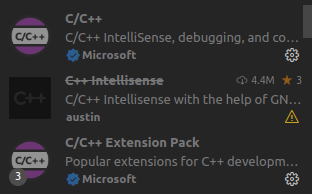

# VSCode使用Clangd

## 1.前言



 vscode c++开大家一般用 vscode 自家出品的c++插件

网络大部分的vcscode c++ 环境搭建也都是讲这个插件的配置，用于提供悬浮提示，代码补全，错误提示，定义声明实现之间的项目跳转等等功能。

先不说导航找实现找引用这种语义分析的基本功能有时候都没办法正确找到实现，速度也一般般,错误和警告也只是有提示，没有quick fix功能，这个功能是能极大提高编程手感的东西，非常好用。

## 2.安装clangd

linux系统下可以先安装一下clang，不安装其实也没关系

```
sudo apt install clang
```

#### 禁用c++插件


如果不禁用可能会导致冲突

#### 下载clangd插件


除了编辑器插件以外，在系统下也要安装，这里以linux系统为例，建议下载12以上版本：

github仓库: https://github.com/clangd/clangd/releases

将bin文件夹下的clangd移动到 **/usr/bin** 目录下：

```
cd bin/
sudo mv clangd /usr/bin/
```

将 lib 目录下，拷贝至 **/usr/local/lib** 目录下：

```
cd …/lib/
sudo mv clang /usr/local/lib
```

也可以直接apt安装

```
sudo apt install clangd
```


可以看见已经安装成功

## 3.配置clangd

打开工作区settings.json或者用户settings.json，由于有些配置可能需要根据项目进行修改，因此推荐在代码工作区settings.json里面进行配置，配置文件在.vscode/settings.json，这个文件是专门针对当前工作区的设置文件，里面的设置项会取代全局的设置项，从而只在当前工作区生效。

vscode的`clangd`插件有如下配置项：

> clangd.fallbackFlags: 设置头文件搜索路径
>
> clangd.path: clangd的可执行文件路径，默认情况下是clangd，防止安装多版本或者windows情况下可能需要手动配置
>
> clangd.arguments: clangd服务运行时传递给可执行文件的参数
>
> clangd.detectExtensionConflicts: 设置clangd是否检测扩展的冲突
>
> clangd.serverCompletionRanking: 设置是否在键入时，对补全结果进行排序。
>

clangd的其他选项没有那么重要，这里就不一一列举， 可以通过clangd --help查看

一个稍显完整的clangd配置如下：

```
"C_Cpp.intelliSenseEngine": "disabled",
"clangd.fallbackFlags": [
    "-I${workspaceFolder}/include"
],
"clangd.path": "the/path/to/clangd/executable/on/windows",
"clangd.detectExtensionConflicts": true,
"clangd.arguments": [
    // 在后台自动分析文件（基于complie_commands)
    "--background-index",
    // 标记compelie_commands.json文件的目录位置
    "--compile-commands-dir=build",
    // 同时开启的任务数量
    "-j=12",
    // 告诉clangd用那个clang进行编译，路径参考which clang++的路径
    // "--query-driver=/usr/bin/clang++",
    // clang-tidy功能
    "--clang-tidy",
    "--clang-tidy-checks=performance-*,bugprone-*",
    // 全局补全（会自动补充头文件）
    "--all-scopes-completion",
    // 更详细的补全内容
    "--completion-style=detailed",
    // 补充头文件的形式
    "--header-insertion=iwyu",
    // pch优化的位置
    "--pch-storage=disk",
    "--log=verbose"
],
"clangd.serverCompletionRanking": true,    
```

**以上`clangd`的配置做一下简单介绍：**

C_Cpp.intelliSenseEngine不是clangd的配置参数，这里默认加上是为了关闭官方包的 intelligence，防止造成冲突；

fallbackFlags数组中，每一项前面都需要加上-I;

arguments数组中，compile-commands-dir选项的值，一般为cmake的构建目录。cmake在构建时可以选择输出compile-commands.json，具体如何开启不在本文的范围内，可自行百度；

clangd.path默认情况下是clangd，可以不做配置，防止安装多版本或者windows情况下可能需要手动配置；

防止有第三方库或者系统库找不到的情况，可以在clangd.fallbackFlags里做手动指定，添加以下内容：

```
-xc //clangd默认检测的源文件为c++，手动设置为检测c
-std=c++17 //c++标准
-I/usr/lib/gcc/x86_64-linux-gnu/11/include
```

## 4.生成 compile_command.json

clang工具是根据compile_commands.json文件中包含的项目中每个文件的编译命令来进行解析的。可以使用bear或者cmake生成，我习惯使用cmake

```
set(CMAKE_EXPORT_COMPILE_COMMANDS ON)
```

编译完成，查看build目录下生成compile_command.json文件，这时候就可以使用clangd跳转了，reload一下可以看见clangd的index文件在Workspace根目录下的.cache/clangd/index目录。在修改了.clangd文件之后你也可以把.cache目录删除然后再打开vscode重新生成index并检查clangd的log文件看看还有没有什么需要修改的。

### 参考：

[Getting started](https://clangd.llvm.org/installation)

[vscode 安装clangd插件 替代 c++自带插件-CSDN博客](https://blog.csdn.net/fightingTony/article/details/128256093?ops_request_misc=%7B%22request%5Fid%22%3A%22c796e5efdb916066156e667968911a49%22%2C%22scm%22%3A%2220140713.130102334..%22%7D&request_id=c796e5efdb916066156e667968911a49&biz_id=0&utm_medium=distribute.pc_search_result.none-task-blog-2~all~sobaiduend~default-3-128256093-null-null.142^v100^control&utm_term=clangd安装&spm=1018.2226.3001.4187)

[vscode配置clangd和clang-format-CSDN博客](https://blog.csdn.net/GeomasterYi/article/details/131216841)

[VSCode使用Clangd_vscode clangd-CSDN博客](https://blog.csdn.net/m0_47329175/article/details/128677511?ops_request_misc=&request_id=&biz_id=102&utm_term=vscode配置clangd&utm_medium=distribute.pc_search_result.none-task-blog-2~all~sobaiduweb~default-8-128677511.142^v100^control&spm=1018.2226.3001.4187)

[VSCode使用clangd帮助进行代码跳转、补全和检查_vscode代码跳转插件-CSDN博客](https://blog.csdn.net/weixin_53139089/article/details/138351000)