# ORB-SLAM3 and HF-NET安装(Windows)

## 1.克隆代码和依赖库到本地

#### orbslam3_opt:

```
git clone https://stash.slamtec.com/scm/np/orbslam3_opt.git
```

#### Hfnet-slam opt：

```
git clone https://stash.slamtec.com/scm/np/hfnet_slam_opt.git
```


#### datasets：

- \\10.254.0.3\Share\temp\csk\datasets\auroravision

#### 3rdparty：

- \\10.254.0.3\Share\temp\csk\datasets\auroravision\3rd libs

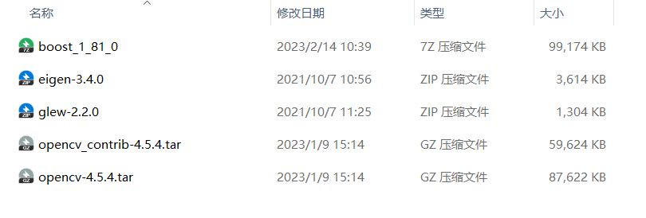

解压到本地目录

- 手动下载Pangolin并切换hash

```
git clone https://github.com/stevenlovegrove/Pangolin.git
cd Pangolin
git reset --hard fe57db532ba2a48319f09a4f2106cc5625ee74a9
```

#### cmake：

https://cmake.org/download/

# 2.编译依赖库

#### Boost：

cmd下运行

```
bootstrap.bat
```

会在当前目录生成一个可执行文件 `b2.exe`，接着执行

```
b2 --build-dir=build/x64 runtime-link=shared address-model=64 threading=multi --build-type=complete --stagedir=./stage/x64
```

等待安装完毕提示生成库的头文件目录和库目录。

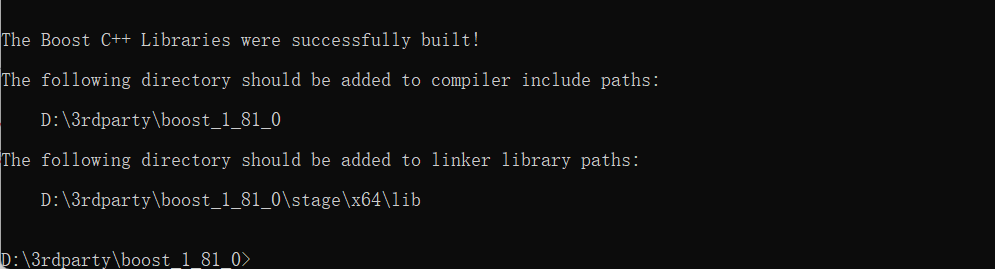

#### Eigen：

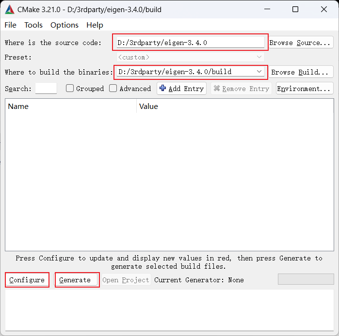

打开cmake选择源码目录和编译目录，点击Configure，设置环境。我使用的是vs2019，平台选x64，点击Finish。

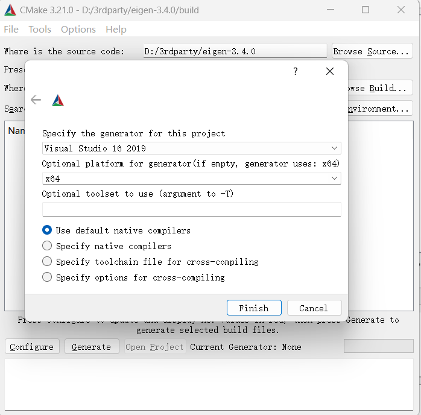

没有问题的话，就会出现输出框中的“Configuring done”了

把**CMAKE_INSTALL_PREFIX**变量的值设置为Eigen的安装目录，默认是安装在c盘

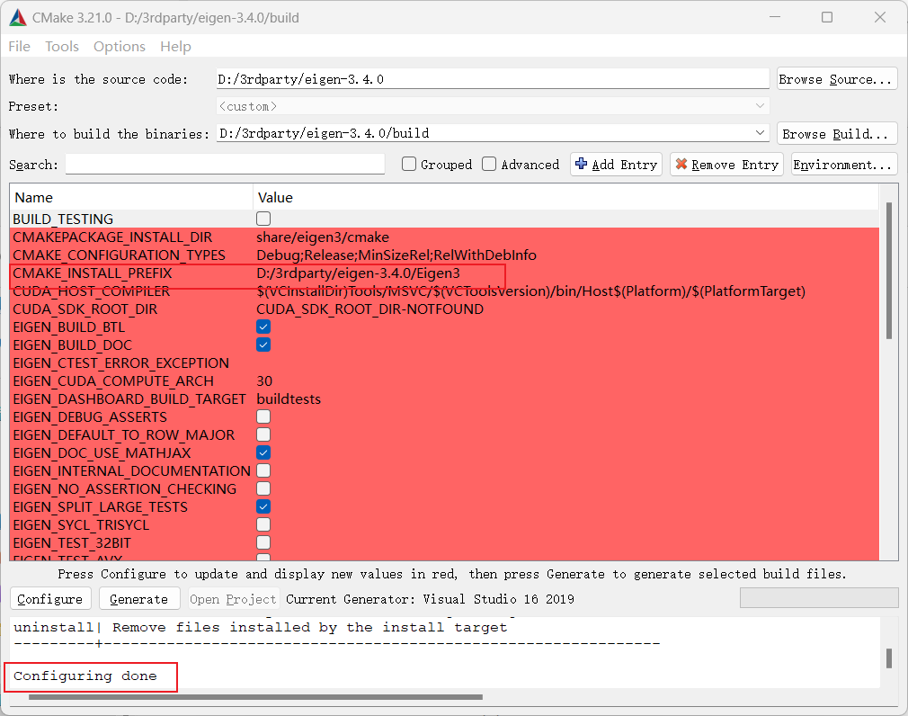

再次点击“Configure”，再次显示“Configuring done”

点击“Geenerate”生成VS工程，输出“Generating done”

再点击“Open Project”，会自动地以管理员方式打开Visual Studio。

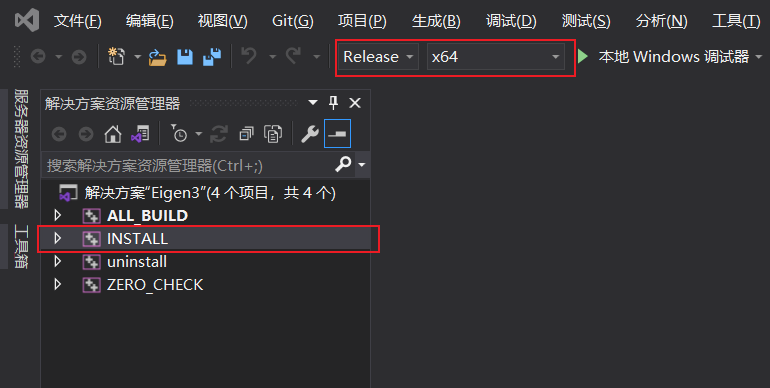

确保VS当前是“Release”和“×64”模式，右键“ALL_BUILD”，点击“生成”。再右键“INSTALL”，点击“生成”。

Eigen安装完成。

#### Glew：

点击"your_path\glew-2.2.0\build\vc15"下的glew.sln

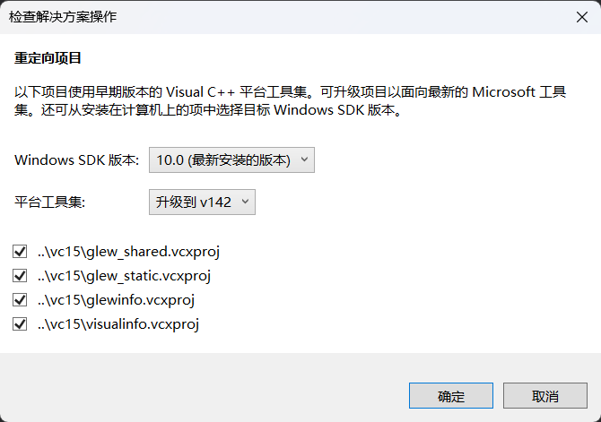

点确定升级到需要的编译器版本。

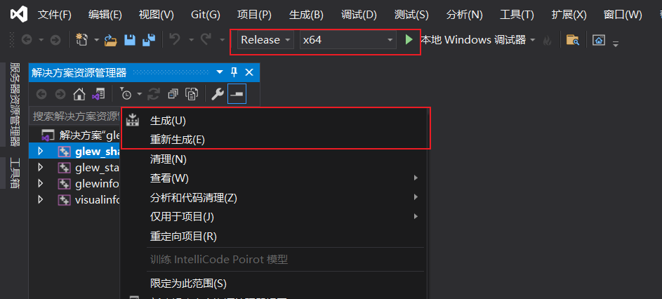

切换模式，依次点击生成。

#### Opencv：

cmake编译，点击“Configure”

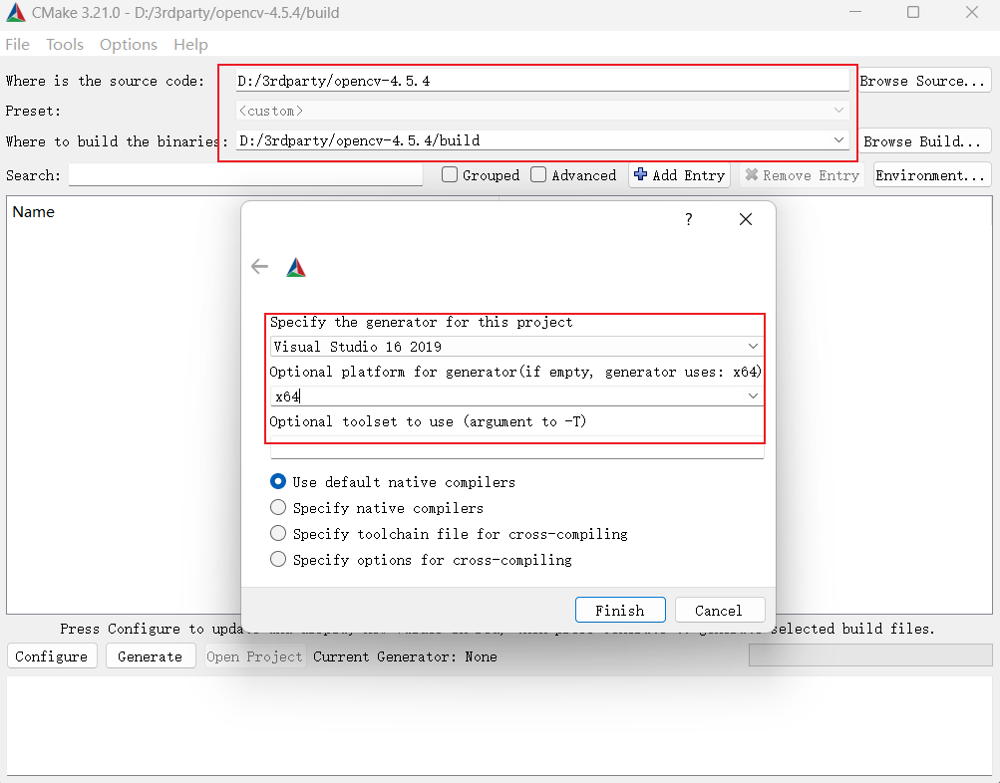

第一次生成会下载一些dll，比较慢可能会导致超时，可以多尝试几次或者手动下载，下载位置在build/3rdparty下。

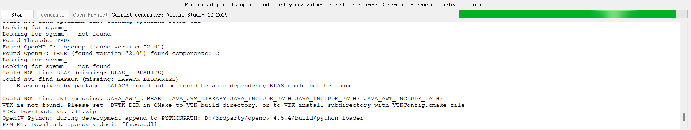

修改cmake 变量：

disable **BUILD_WITH_STATIC_CRT**

enable **BUILD_opencv_world**

enable **OPENCV_ENABLE_NONFREE**

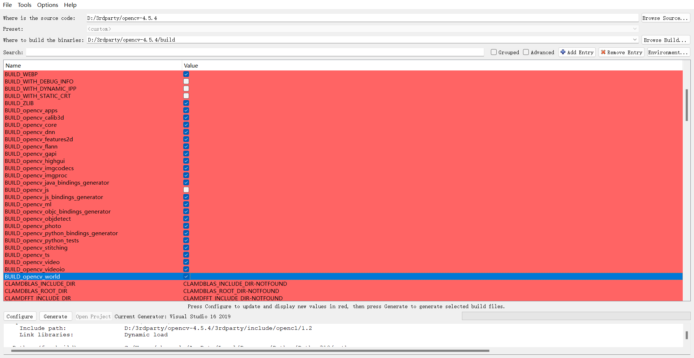

在**OPENCV_EXTRA_MODULES_PATH**中填入contrib模块的modules路径

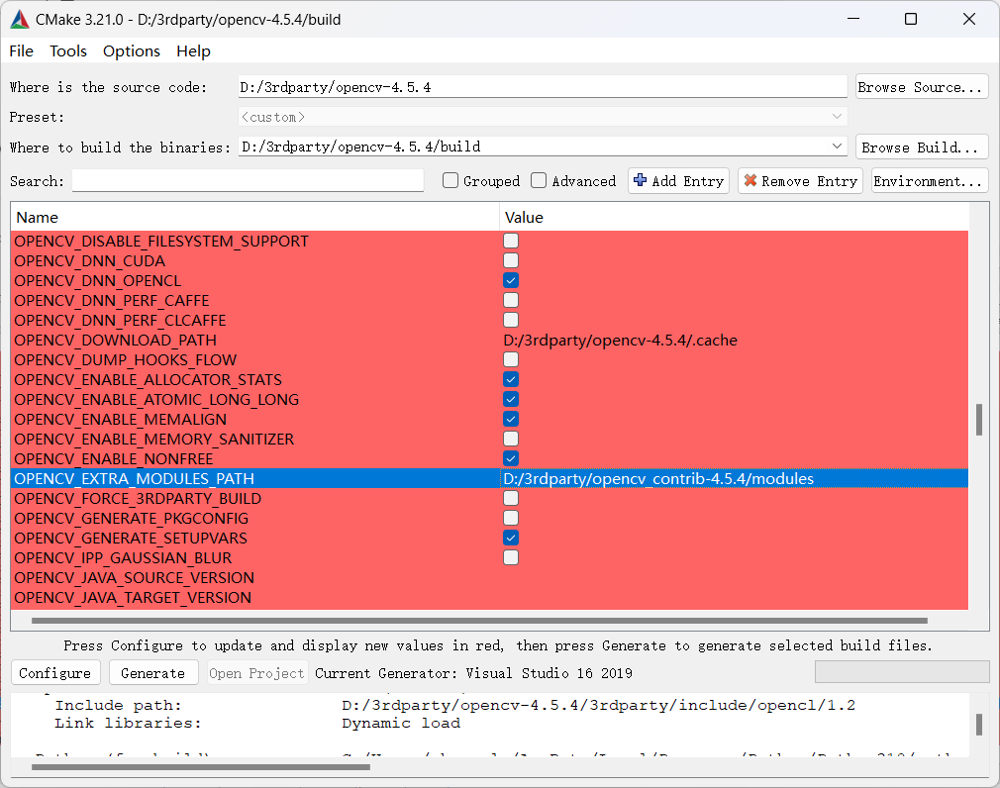

如果系统没有找到Eigen路径，就需要手动设置一下

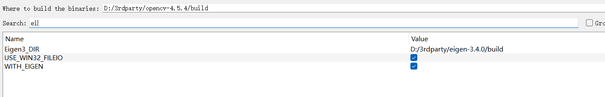

重新点击“Configure”进行配置，依旧会下载一些文件，位于build/downloads下，比较耗时。

等待出现“Configuring done”，点击“Generate”按钮，生成vs工程文件。

Open Project，正确配置模式，选择ALL_BUILD，右键生成，生成库文件。

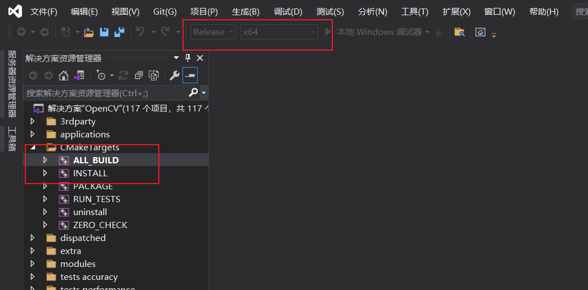

成功生成后，选择INSTALL，右键生成，生成头文件。

#### Pangolin：

CMakeLists中增加一句

```cmake
diff --git a/CMakeLists.txt b/CMakeLists.txt
index 2f3092c5..f5c5e071 100644
--- a/CMakeLists.txt
+++ b/CMakeLists.txt
@@ -35,7 +35,7 @@ endif()
 if(_WIN_)
     option( BUILD_SHARED_LIBS    "Build Shared Library" OFF)
     option( MSVC_USE_STATIC_CRT  "Use static C Runtime with MSVC, /MT instead of /MD" ON)
-
+    add_definitions(-DGLEW_STATIC)
     # Make sure there are no erroneous C Runtime flags
     list(APPEND FLAG_VARS
         CMAKE_CXX_FLAGS CMAKE_CXX_FLAGS_DEBUG CMAKE_CXX_FLAGS_RELEASE CMAKE_CXX_FLAGS_MINSIZEREL CMAKE_CXX_FLAGS_RELWITHDEBINFO
@@ -101,6 +101,7 @@ endif()
 #######################################################
 ## Add all pangolin components
```

点击“Configure”进行配置，会出现报错，找不到相关库路径。

- set GLEW_INCLUDE_DIR to (glew-src)/include
- set GLEW_LIBRARY to (glew-src/cmake_output)/lib/Release/glew32s.lib

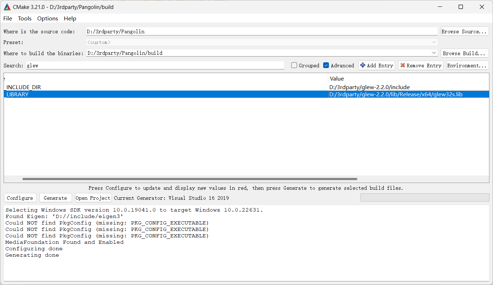

修改头文件安装目录，默认在c盘

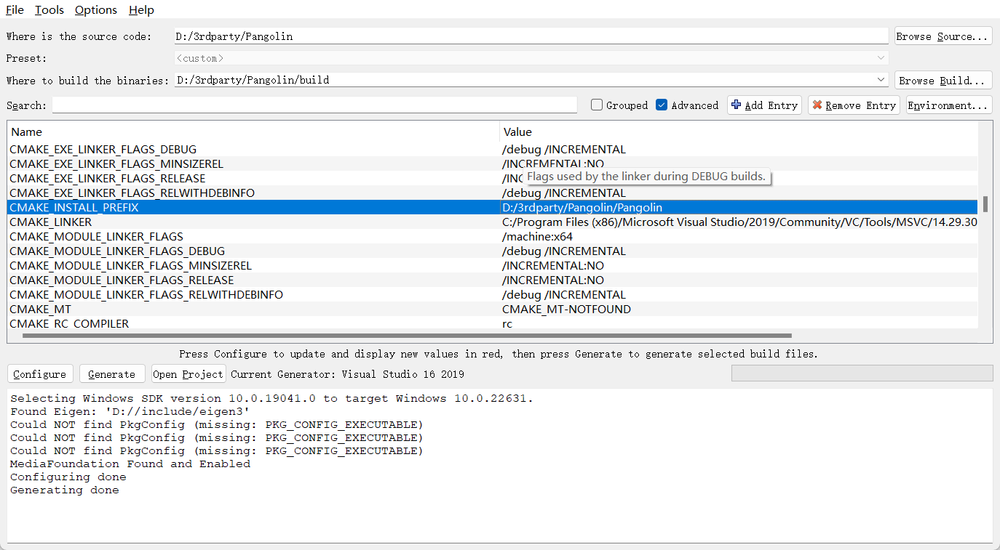

等待出现“Configuring done”，点击“Generate”按钮，生成vs工程文件。

"Open Project"，正确配置模式，选择ALL_BUILD，右键生成，生成库文件。

选择INSTALL，右键生成，生成头文件。

## 3.编译ORB-SLAM3

同样的操作

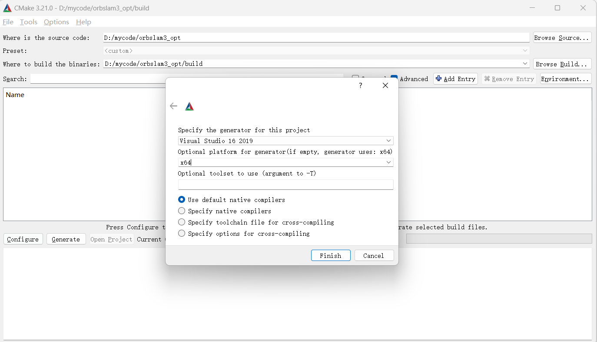

如果提示报错，根据报错信息手动填写依赖库的路径

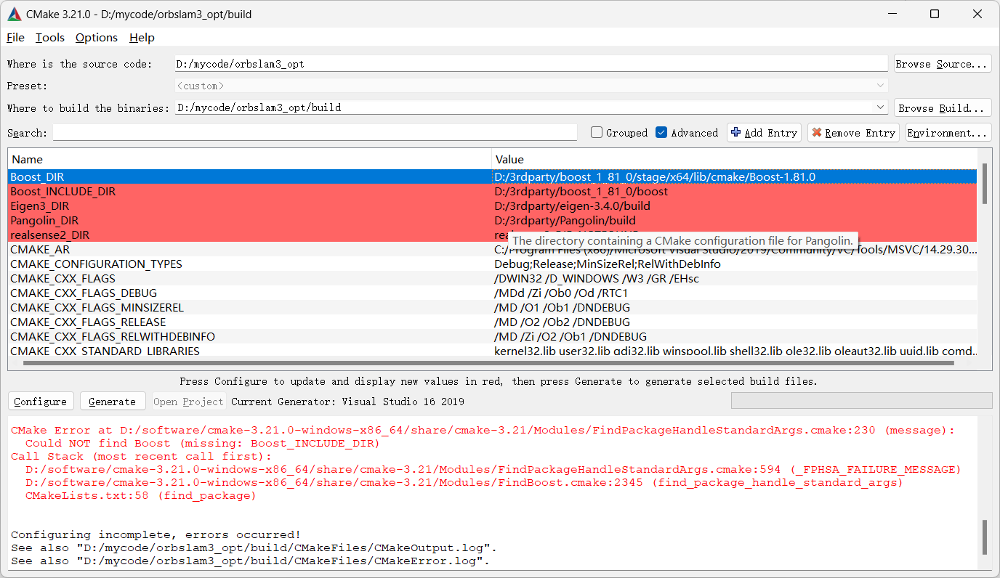

多次“Configure”直到不报红为止，配置路径在自己电脑本地依赖库根目录的如下位置：

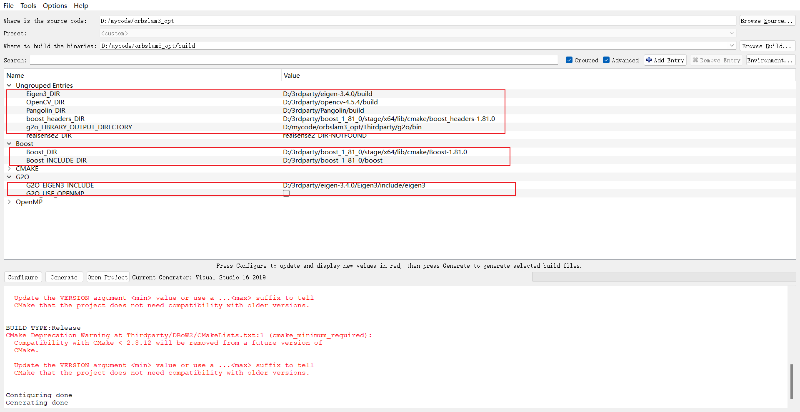

点击“Generate”按钮，生成vs工程文件。

"Open Project"，正确配置模式，选择stereo_inertial_aurora，右键生成，生成可执行文件。或者根据需要跑的数据集生成对应可执行程序。

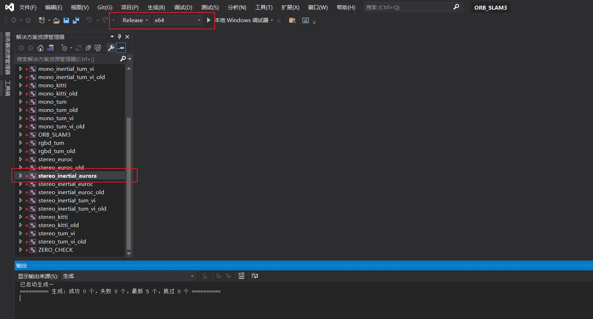

编译完成。

## 4.编译HFNET-SLAM

#### 深度网络预训练模型

\\10.254.0.3\Share\temp\csk\datasets\auroravision\pretrained-model\hfnet-exp-orig-041-doublew23-halfbatch-20230814-150000.7z

#### 安装CUDA和CUDNN

参考教程

https://blog.csdn.net/SHdabai/article/details/131248257

#### 安装TensorRT

参考教程

https://www.yii666.com/blog/489723.html

#### 搭建python虚拟环境

（我使用的anaconda，构建虚拟环境方便管理多版本python和依赖库）

在python环境中运行

```
pip install tensorflow-1.15.4+nv-cp38-cp38-win_amd64.whl
pip install numpy onnx==1.14.0 tf2onnx packaging
pip install onnx_graphsurgeon --index-url https://pypi.ngc.nvidia.com
```

#### 模型转换

在python环境中运行

```
python -m tf2onnx.convert --saved-model <pretrained tf model dir> --output export/HF-Net.onnx --inputs image:0 --outputs scores_dense:0,local_descriptor_map:0,global_descriptor:
```

#### 编译HFNET-SLAM

cmake流程与orb相同