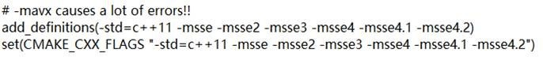
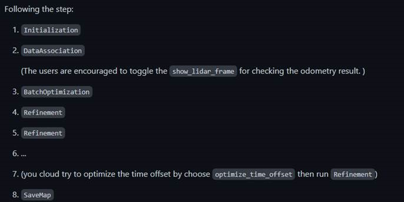

# 激光雷达与IMU联合标定(lidar_IMU_calib）

> 本文档主要介绍浙大开源标定算法lidar_IMU_calib 
>
> Github地址： https://github.com/APRIL-ZJU/lidar_IMU_calib 
>
> 论文地址： https://arxiv.org/pdf/2007.14759.pdf 
>
> 参考资料：https://www.cnblogs.com/chenlinchong/p/14048969.html 

​	lidar_IMU_calib是基于连续时间批量估计的LiDAR-IMU系统的无目标标定，用于校准 6DoF 刚性变换以及 3D LiDAR 和 IMU 之间的时间偏移。基于 IMU 的成本和 LiDAR 点到冲浪距离被联合最小化，这使得校准问题在一般情况下受到很好的约束。 

标定主要需要：Lidar的外参、IMU内参、Lidar与IMU之间的变换。 

## **依赖条件** 

### ROS(tested with Kinetic and Melodic) 

```
sudo apt-get install ros-melodic-pcl-ros ros-melodic-velodyne-msgs 
```

### Ceres(tested with version1.14.0) 

Github地址：https://github.com/ceres-solver/ceres-solver/tree/e51e9b46f6ca88ab8b2266d0e362771db6d98067 

### Kontiki

（需要手动下在安装在文件夹内，地址见下文） 

### Pangolin

（不需要手动下载） 

### Ndt_omp

(不需要手动下载) 

## **环境编译** 

```
# init ROS workspace 
mkdir -p ~/catkin_li_calib/src 
cd ~/catkin_li_calib/src 
catkin_init_workspace 

# Clone the source code for the project and build it. 
git clone https://github.com/APRIL-ZJU/lidar_IMU_calib 

# ndt_omp 
wstool init 
wstool merge lidar_IMU_calib/depend_pack.rosinstall 
wstool update 
  
# Pangolin 
./build_submodules.sh 
```

装完Pangolin后手动将Kontiki编译安装到./src/lidar_IMU_calib/thirdparty/Kontiki中 

Github地址：https://github.com/APRIL-ZJU/Kontiki 

由于xavier是arm架构的限制，需要改动几处编译指令： 

1. ndt_omp中的CMakeLists.txt: 

   

   更改为：

   .png)

2. lidar_IMU_calib中的CMakeLists.txt: 

   更改为： 

   .png)

3. 改名： 

```
sudo mv /usr/include/flann/ext/lz4.h /usr/include/flann/ext/lz4.h.bak 
sudo mv /usr/include/flann/ext/lz4hc.h /usr/include/flann/ext/lz4.h.bak 

 添加软链接： 
sudo ln -s /usr/include/lz4.h /usr/include/flann/ext/lz4.h 
sudo ln -s /usr/include/lz4hc.h /usr/include/flann/ext/lz4hc.h 

## build 
cd ../.. 
catkin_make 
source ./devel/setup.bash 
```

## **数据录制** 

鉴于是基于NDT匹配算法的里程计计算， 

数据录制需要`注意`： 

1.需要在平面多的房间里录制； 

2.xyz轴方向都需要移动 

3.不要旋转过/移动过猛 

```
rosbag -record -o out /velodyne_packets/你的IMU数据话题 
# 注意话题名要匹配。 
```

## **运行** 

在licalib_gui.launch和calib.sh里面修改成你录制的话题 

```
./src/lidar_IMU_calib/calib.sh 
```



点击了初始化（Initialization）及下面的三个按钮，后续就一直是点击下面的按钮 

## **结果** 

标定结果是四元数，将四元数转换为旋转矩阵。放入了LIOSAM的param.yaml文件里。再就行实际效果测试。 

## **问题** 

迭代过程中并不知道自己的标定文件是否是对的，可能需要多录制几次进行测试。 