# 轨迹评估介绍与evo工具使用 

## **介绍** 

本文介绍了轨迹评估的基本概念，包括轨迹对齐、尺度变换、绝对轨迹误差、相对轨迹误差以及计算方法、相关文献，以及evo轨迹评估工具的安装、使用举例、命令参数详解。 

 

## **第一部分：evo 介绍** 

- evo是一款用于视觉里程计和SLAM问题的轨迹评估工具. 核心功能是能够绘制相机的轨迹, 或评估轨迹与真值之间的误差. 
- 它支持多种数据集的轨迹格式(TUM、KITTI、EuRoC MAV、ROS的bag)， 同时支持这些数据格式之间的相互转换。 
- 灵活的输出/绘图和导出选项(例如LaTeX绘图或Excel表格) 
- 强大的可配置的CLI, 可以涵盖多种场景使用 
- 用于自定义扩展的模块化 
- github：[github.com/MichaelGrup…](https://link.juejin.cn/?target=https%3A%2F%2Fgithub.com%2FMichaelGrupp%2Fevo.git) 
- wiki： [github.com/MichaelGrup…](https://link.juejin.cn/?target=https%3A%2F%2Fgithub.com%2FMichaelGrupp%2Fevo%2Fwiki) 

 

## **第二部分：安装 evo 工具** 

#### **Step1： python 3.8虚拟环境搭建** 

`目的`：构筑一个纯净python 3.8环境（github上告知最新的evo版本支持Python 3.8+，若要支持Python2.7需使用 1.12.0及以下版本）。ubuntu18.04自带python 3.6和2.7，如果不使用python虚拟环境，还可以使用 update-alternatives 命令来切换OS所使用的Python版本，以下以使用Python虚拟环境为例（使用conda方式）： 

```
# 下载 anaconda 或 miniconda， 以下以 miniconda 为例 
wget https://repo.anaconda.com/archive/Anaconda3-2019.07-Linux-x86_64.sh 
或 
wget https://mirrors.tuna.tsinghua.edu.cn/anaconda/miniconda/Miniconda2-py27_4.8.3-Linux-x86_64.sh 
 
# 安装 miniconda 
bash iniconda2-py27_4.8.3-Linux-x86_64.sh 
source ~/.bashrc 
 
# 创建 python3.8 虚拟环境 
conda create -n slam_env python=3.8 
 
# 进入虚拟环境 
conda activate slam_env 
 
# 查看python虚拟环境和其pip工具 （此时提示符已经切换为 slam_env ） 
(slam_env) hadoop@ubuntu:~$ pip --version 
pip 21.2.4 from /home/hadoop/miniconda2/envs/slam_env/lib/python3.8/site-packages/pip (python 3.8) 
 
# 查看虚拟环境已安装的python模块 
(slam_env) hadoop@ubuntu:~$ conda list 
# packages inenvironment at /home/hadoop/miniconda2/envs/slam_env:# 
# Name                    Version                   Build  Channel 
_libgcc_mutex             0.1                        main 
_openmp_mutex             4.5                       1_gnu 
ca-certificates           2021.10.26           h06a4308_2 
certifi                   2021.10.8        py38h06a4308_2 
ld_impl_linux-64          2.35.1               h7274673_9 
libffi                    3.3                  he6710b0_2 
(下略） 
 
# 升级 pip 到最新版本 
(slam_env) hadoop@ubuntu:~$ pip install -U pip  
 
# pip 使用国内 pypi 镜像站（清华） 
pip config set global.index-url https://pypi.tuna.tsinghua.edu.cn/simple 
```

至此，完成python虚拟环境搭建完毕，使用时使用 conda activate slam_env 即可进入python虚拟环境提示符。 


#### **Step2： 使用pip安装 evo 到虚拟环境** 

```
# 进入虚拟环境 
(base) hadoop@ubuntu:~$ conda activate slam_env 
 
# 安装evo工具 
(slam_env) hadoop@ubuntu:~$ pip install evo --upgrade --no-binary evo --user 
 
# 查看evo工具 
ls ~/.local/bin 
 
# 编辑 ~/.bashrc， 把 ~/.local/bin 目录加入到 PATH 环境变量 
echo 'export PATH=~/.local/bin:$PATH' >> ~/.bashrc 
source ~/.bashrc 
 
# 确认evo工具可用 
evo_ape --help 
 
# 安装tkinter，防止运行 evo 时报错 tkinter 找不到 
sudo apt install  python3-tk 
```

**备注1: 安装过程会自动安装所依赖的科学计算库和绘图库如numpy、scipy、pandas、matplotlib、pillow等.** 


#### **Step3：工具位置介绍** 

- ##### **安装好的 evo 的命令行工具在目录 ~/.local/bin 下** 

```
$ ls ~/.local/bin 
    activate-global-python-argcomplete  evo_traj    pygmentize 
    evo                                 f2py        python-argcomplete-check-easy-install-script 
    evo_ape                             f2py3       python-argcomplete-tcsh 
    evo_config                          f2py3.8     register-python-argcomplete 
    evo_fig                             fonttools   rosbags-convert 
    evo_ipython                         natsort     ttx 
    evo_res                             pyftmerge 
    evo_rpe                             pyftsubset 
```

- **轨迹误差评估方面**：
  - evo_ape : 计算绝对位姿误差(absolute pose error)，用于整体评估整条轨迹的`全局一致性`； 
  - evo_rpe : 计算相对位姿误差(relative pose error)，用于评价轨迹局部的`准确性`。 
- **绘图方面**：
  - evo_traj : 分析/绘图/导出一条或多条轨迹 
- **评估结果比较方面**：
  - evo_res : 比较一个或多个结果文件, 结果文件来自 evo_ape 或 evp_rpe的输出 
- **其他**： 
  - evo_config : 对evo工具的全局设置
- **需要注意, EUROC数据集、TUM数据集、KITTI数据集使用四元数的顺序是不一样的， 因此在使用 evo 命令时， 需要增加一个命令选项参数进行区分。** 


## **第三部分： 基本概念简介** 

在使用evo工具之前， 先介绍一些evo工具使用过程中会遇到的轨迹评估方面的基本概念，以便于更好的理解工具的输出信息和图表。 

基本介绍信息如下所示。 

### **1. 轨迹对齐** 

在定量轨迹评估过程时，如图所示，首先估计的轨迹（蓝色）要和真值（黑色）对齐，然后再利用特性的误差度量计算对气候的轨迹估计误差。 

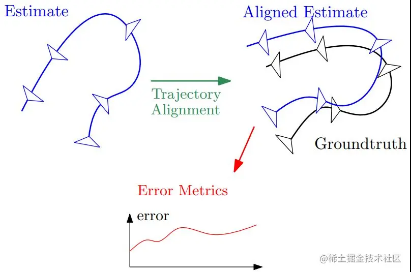

下图左图是对齐前，右图是对齐后； 其中灰色线为对应的状态 


### **2. 尺度变换** 

**尺度歧义性**？ 

根据单目相机相机测量模型可知其尺度歧义性，如图所示，相机将3D点（红色×）投影到成像平面上的2D点（黑色○）。对于单目相机，相同方向但不同距离的3D点（灰色x）投影到相同的2D点，从而导致尺度歧义性。 

**尺度变换**： 相当于添加一个恒定的尺度变换 TsT_sTs到第二个相机，消除该歧义性；

 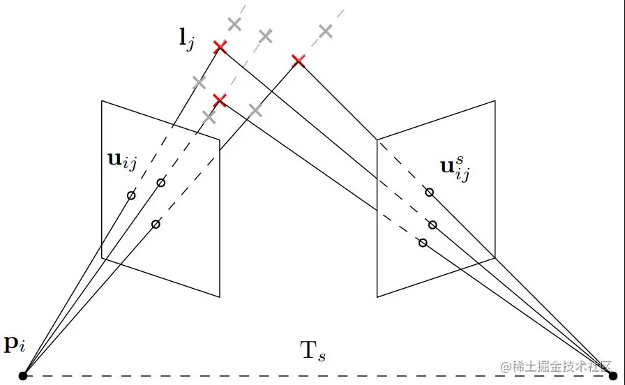

### **3. 绝对轨迹误差和相对轨迹误差** 

- 绝对轨迹误差计算的每一个点对（待评估轨迹的点与真值轨迹的点）的绝对值误差。 
- 相对轨迹误差计算的是，针对两条轨迹，分别计算第 k时刻和 k+Δ时刻的误差，然后这两个误差间再计算绝对值误差。

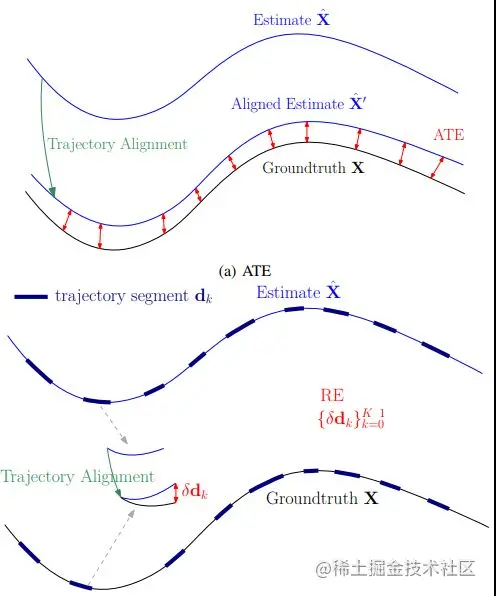

### **4. 补充** 

可以在相关文献获取更加详细的信息: A Tutorial on Quantitative Trajectory Evaluation for Visual(-Inertial) Odometry。 

 

## **第四部分：evo初体验**

### **1.evo_traj 体验** 

- 介绍：evo_traj 可以分析、绘制、导出一个或多个轨迹；可以打开任意多个轨迹，查看统计信息， 还可以将轨迹转换为其他格式； 

- 体验

  ```
  # evo_traj 执行，以KITTI_00_gt为参考，绘制 KITTI_00_ORB  KITTI_00_SPTAMcd evo/test/data 
  evo_traj kitti KITTI_00_ORB.txt KITTI_00_SPTAM.txt --ref=KITTI_00_gt.txt -p --plot_mode=xz 
  ```

- 出现如下的图示 

  

  注：虚线为参考值；由于参数设置了xz，因此只显示轨迹在xz平面上投影；坐标表示活动轨迹范围； 

  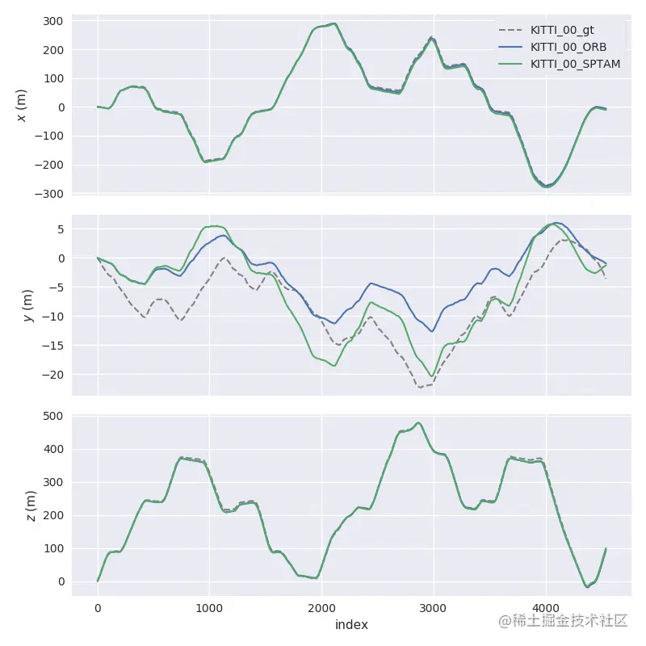

  注： 以起始点作为基准点，针对每个pose点（横），按x/y/z三个方向的分量，描述其距离原点距离（纵）

- 本文后面章节会详细讲解 evo_traj 的每一个命令参数。

### **2.evo_ape 体验 + 绝对轨迹误差计算方法** 

- 介绍：evo_ape 可以评估轨迹绝对位姿误差(absolute pose error) 
- 绝对位姿误差常被用作比较估计轨迹和参考估计并计算整个轨迹误差的统计数据， 适用于测试轨迹的全局一致性。 

```
# 创建存放结果的目录 
mkdir results 
evo_ape kitti KITTI_00_gt.txt KITTI_00_SPTAM.txt -vas  --plot --plot_mode xz --save_results results/SPTAM_APE.zip 
```

- 出现如下图示效果

  - 绝对轨迹误差信息如下图：

    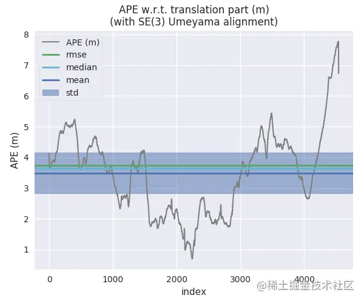

    注：针对所有位姿点描述绝对误差大小，并与均方根误差、中位值、均值、标准差等直观比较；std覆盖区域为 [mean−std, mean+std], 反应组内个体间离散程度； 

    注：默认情况下计算的是ATE(absolute trajectory error)绝对轨迹误差。终端输出 Calculating APE for translation part pose relation... 表示计算的是平移误差；可以使用 -r full 同时计算平移+旋转误差； 

  - 轨迹直观误差信息如下图

    

    注： 针对整个轨迹，使用颜色显示偏差的大小，按蓝-绿-红渐变色偏差依次变大；放大后可更清楚的查看局部轨迹差； 
    本文后面章节会详细讲解 evo_ape 的每一个命令参数。 

- Umeyama算法

  Umeyama算法用于做点云匹配对齐，因为点集合之间的对应关系已知，它可以计算出两组点云数据间的旋转+平移变换矩阵和相似变换矩阵； 
  原理就是通过点对之间距离平方和的最小二乘误差计算出T，和ICP的损失函数是类似的。 

  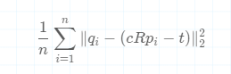

  最后计算得到:

  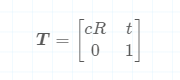

  此外， Eigen 库也封装了函数 Eigen::umeyama（），可直接传入两个点云集合调用求解. 

  SE(3)与Sim(3)，对于双目SLAM和RGB-D SLAM，尺度统一，因此需要通过最小二乘计算估计位姿到真实位姿的转换矩阵 S∈SE(3); 

  对于单目相机，尺度不确定性，因此需要计算从估计位姿到真实位姿的相似变换矩阵 S∈Sim(3)。 默认为SE(3)，加 -s 参数使用 Sim(3); 

  补充说明：可以通过Umeyama的文献获取更进一步的信息： Least-Squares Estimation of Transformation Parameters Between Two Point Patterns 
注：终端输出表示的是用 Umeyama 计算得到的相似矩阵选装、平移和尺度变换的结果。
  
```
   Rotation of alignment: 
    [[ 0.99972834 -0.01321112  0.01920198] 
   [ 0.01357949  0.99972379 -0.01918176] 
     [-0.01894327  0.0194373   0.9996316 ]] 
    Translation of alignment: 
    [1.18538132 2.10165699 2.31548455] 
    Scale correction: 1.0045265524039808 
```

- 绝对轨迹误差（ATE）计算公式 

  为什要计算绝对轨迹误差？ 绝对轨迹误差实际上在计算什么？ 
  对于视觉SLAM系统， 估计轨迹的全局一致性是重要度量，如何评估全局一致性？ 就是通过比较被估计值和真值轨迹之间的绝对距离来得到。 
  首先先将两条轨迹对齐。 记P1:n代表待估计的轨迹，Q1:n代表真值轨迹， 则时间戳 iii处的绝对估计误差为： 

  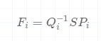

  可以这么理解公式：对 A=[R∣t]∈SE(3), 有A−1A=[I∣0]； 那么这里的 SPi 是估计的 Qi， 计算 Qi−1SPi可以直观得到两条轨迹的差值。 
  则针对所有时刻定义平移分量的 均方根误差(RMSE)、和方差（SSE)：

  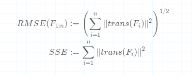

  补充说明：可以通过文献获取更进一步的信息： A Benchmark for the Evaluation of RGB-D SLAM Systems 

### **3.evo_rpe 体验 + 相对轨迹误差计算方法** 

- 介绍： evo_rpe 可以用来计算相对轨迹误差（relative pose error） 

  ```
  evo_rpe kitti KITTI_00_gt.txt KITTI_00_SPTAM.txt  -r full -va --plot --plot_mode xyz --save_results results/SPTAM_RPE.zip 
  ```

  - -r full 指定对平移和旋转的误差均进行计算。 
  - -as 采用SE(3) Umeyama对齐，处理平移和旋转和尺度 

- 终端输出的轨迹对齐的旋转矩阵和平移矩阵， 以及统计信息

  ```
  -------------------------------------------------------------------------------- 
    Aligning using Umeyama's method... (with scale correction) 
    Rotation of alignment: 
    [[ 0.99972834 -0.01321112  0.01920198] 
     [ 0.01357949  0.99972379 -0.01918176] 
     [-0.01894327  0.0194373   0.9996316 ]] 
    Translation of alignment: 
    [1.18538132 2.10165699 2.31548455] 
    Scale correction: 1.0045265524039808 
    -------------------------------------------------------------------------------- 
    Found 4540 pairs with delta 1 (frames) among 4541 poses using consecutive pairs. 
    Compared 4540 relative pose pairs, delta = 1 (frames) with consecutive pairs. 
    Calculating RPE for full transformation pose relation... 
    -------------------------------------------------------------------------------- 
    RPE w.r.t. full transformation (unit-less) 
    for delta = 1 (frames) using consecutive pairs 
    (with Sim(3) Umeyama alignment) 
   
          max      1.136092 
          mean      0.024773 
          median      0.020434 
          min      0.001043 
          rmse      0.035773 
          sse      5.809960 
          std      0.025807 
    -------------------------------------------------------------------------------- 
  ```

- **相对位姿误差(RPE) 计算公式**

  为什要计算相对轨迹误差？ 相对轨迹误差实际上在计算什么？ 
  相对位姿误差测量了轨迹在一个固定的时间区间 Δ\DeltaΔ内的局部准确度。 因此，相对位姿误差对应轨迹的漂移。 
  先定义时间步 iii处的相对位姿误差如下，可知相对位姿误差计算的是相隔固定时间差 Δ 两帧位姿差：

  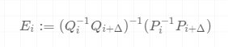

  根据上式，对于一个有n个相机位姿的序列中，我们获得 m=n−Δm=n-\Deltam=n−Δ个独立的沿着序列的相对位姿误差。则可以定义平移分量的的所有时刻的均方根误差RMSE: 

  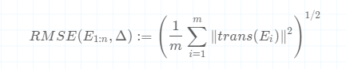

  可以这么理解公式：对 A=[R∣t]∈SE(3), 有 A−1A=[I∣0]. 
  上式中的 (Pi−1Pi+Δ)(P_i^{-1}P_{i+\Delta}) (Pi−1Pi+Δ)是估计的 Qi−1Qi+ΔQ_i^{-1}Q_{i+\Delta}Qi−1Qi+Δ，计算 (Qi−1Qi+Δ)−1(Pi−1Pi+Δ)(Q_i^{-1}Q_{i+\Delta})^{-1} (P_i^{-1}P_{i+\Delta})(Qi−1Qi+Δ)−1(Pi−1Pi+Δ)可以直观的得到两条轨迹的差值； 
  此处计算的是 EiE_iEi的平移分量，旋转误差也可以被估计，但一般平移误差就足够了（因为旋转误差会随着平移误差的上升而增加）。时间参数 Δ\DeltaΔ对于帧速较快的相同，如30Hz的传感器，可选择 Δ=30\Delta=30Δ=30以得到每秒的漂移。 
  补充说明：可以通过文献获取更进一步的信息： A Benchmark for the Evaluation of RGB-D SLAM Systems 

### **4.evo_res 体验** 

- 介绍： evo_res 可以用来比较多个结果文件， 打印统计信息、绘图、保存结果到表格等。 

  ```
  evo_res results/*.zip -p --save_table results/table.csv 
  ```

- 如下图示 

  绝对轨迹误差对比：

  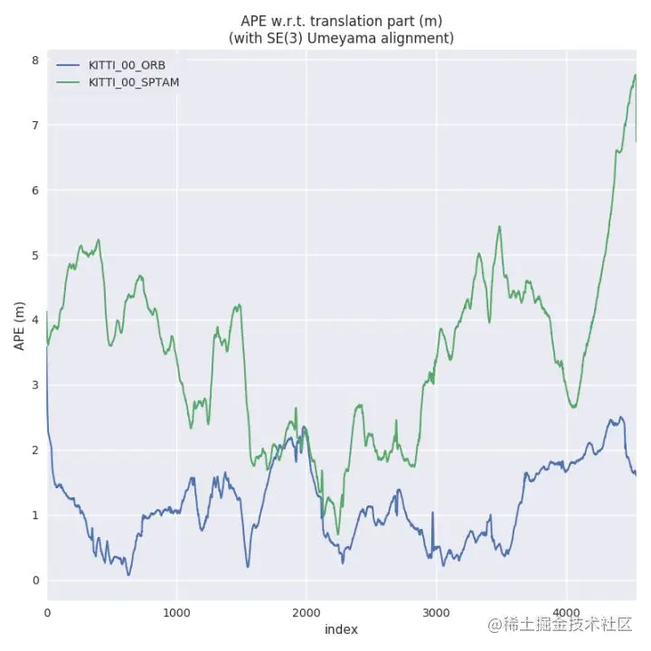

## **第五部分： evo 命令参数详解** 

### **1.evo_ape 命令详解** 

- 用途：计算绝对位姿误差 

- 绝对位姿误差常被用作比较估计轨迹和参考估计并计算整个轨迹误差的统计数据， 适用于测试轨迹的全局一致性。 

- 命令语法： evo_ape 数据格式 参考轨迹 估计轨迹 可选项 

  - 数据格式： euroc, tum, kitti 等 

- 常用命令示例：

  ```
  evo_ape euroc MH_data3.csv pose_graphloop.txt -r full -va --plot --plot_mode xyz --save_plot ./VINSplot --save_results ./VINS.zip 
  ```

  命令含义： 考虑平移和旋转部分误差的ape， 进行平移和旋转对齐，以详细模式显示，画图并保存计算结果。

- 参数说明： 

  - -r : 即 -pose_relation， 此参数可选, 若不添加此参数，则默认为 trans_part。 有如下可选项： 

  | **可选项** | **含义**                                                |
  | ---------- | ------------------------------------------------------- |
  | full       | 表示同时考虑旋转和平移误差得到的ape,无单位（unit-less） |
  | trans_part | 考虑平移部分得到的ape，单位为m                          |
  | rot_part   | 考虑旋转部分得到的ape，无单位（unit-less）              |
  | angle_deg  | 考虑旋转角得到的ape,单位°（deg）                        |
  | angle_rad  | 考虑旋转角得到的ape,单位弧度（rad）                     |

  - -v : 表示 verbose mode， 详细模式 

  - -a ：即 -align, 表示采用 SE(3) Umeyama 对齐。 除了 -a 外，其他可选项如下 

  | **命令**                   | **含义**                                       |
  | -------------------------- | ---------------------------------------------- |
  | -a/–align                  | 采用SE(3) Umeyama对齐，只处理平移和旋转        |
  | -as/–align --correct_scale | 采用Sim(3) Umeyama对齐，同时处理平移旋转和尺度 |
  | -s/–correct_scale          | 仅对齐尺度                                     |

  - -plot ： 表示画图 
    - --plot_mode : 选择画图模式， 二维图或三维图，默认为 xyz， 可选项有[xy, xz, yz, zx, zy, xyz]. 
    - --save_plot : 后跟保存图像的文件路径， 如 ./VINSplot. 保存文件的类型， 可以通过 evo_config 命令设置， 常见的可以保存为 png, pdf等  
  - -save_results : 后跟存储结果的压缩文件路径， 如 ./VINS.zip， 是一个压缩文件。 

  - --help: 显示帮助信息， 格式为： evo_ape 格式 --help , 如 evo_ape euroc --help 

### **2.evo_rpe 命令详解** 

- 用途：计算相对位子误差 

- 相对位姿误差不进行绝对位姿的比较，相对位姿误差比较运动（姿态增量）。相对位姿误差可以给出局部精度，例如slam系统每米的平移或者旋转漂移量。 

- 命令语法： evo_ape 数据格式 参考轨迹 估计轨迹 可选项 

  - 数据格式： euroc, tum, kitti 等 

- 常用命令示例： 

  ```
  evo_rpe euroc MH_data3.csv pose_graphloop.txt -r angle_deg \ 
    --delta 1 --delta_unit m -va --plot --plot_mode xyz \ 
    --save_plot ./VINSplot --save_results ./VINS.zip 
  ```

  命令含义： 求每米的旋转角的rpe，以详细模式显示，画图并保存计算结果。

- 参数说明： 
  - -r : 即 -pose_relation， 此参数可选, 若不添加此参数，则默认为 trans_part。具体参数选项内容 同 evo_ape，具体项可参见前一章节说明.
  - -d/--delta : 表示相对位姿之间的增量，后跟数值，默认为1， 然后通过 -u/--delta_unit 指定单位； 
  - -u/--delta_unit : 表示增量的单位，可选参数为 f, d, r, m 分别表示 frames, deg, rad, meters 。默认为f。 当此参数为 f 时，则 -d/--delta必须为整型， 其余情况可谓浮点型；-d/--delta 和 -u/--delta_unit 联合起来表示衡量局部精度的单位，如 每米、每弧度、每百米等。  
  - -v --plot --plot_mode xyz --save_results results/VINS.zip --save_plot ： 这些参数同 evo_ape， 具体可参见前一章节说明。 

### **3.evo_traj 命令详解** 

- 用途： 轨迹管理工具 

- 可以打开任意多个轨迹，查看统计信息， 还可以将轨迹转换为其他格式 

- 常用命令示例1： 

  ```
  evo_traj euroc MH_data1.csv MH_data3.csv -v --full_check 
  ```

- 参数说明： 
  - -v : 以详细模式显示 
  - --full_check : 对轨迹进行检查 

- 常用命令示例2：对轨迹进行对齐， 此时需要利用 --ref 指定参考轨迹 

  ```
  evo_traj bag ROS_example.bag ORB-SLAM S-PTAM --ref groundtruth -s 
  ```

- 参数说明：  
  
- -a ：即 -align, 轨迹对齐的选项参数， 如 -a/--align, -s/--correct_scale, --n_to_align 等等，与evo_ape 相同，详情可参见前一章节 evo_ape 中轨迹说明中的参数解释。 
  
- 常用命令示例3： 转换格式 

  ```
  evo_traj euroc data.csv --save_as_tum  
  ```

- 参数说明： 
  
- --save_as_tum : 指定目标数据集格式为 tum 
  
- 数据集格式转换表如下： 

| **源数据集** | **ROS Bag**       | **KITTI**       | **TUM**           |
| ------------ | ----------------- | --------------- | ----------------- |
|              | --save_as_bag     | --save_as_kitti | --ave_as_tum      |
| bag          | yes               | yes             | yes               |
| euroc        | yes               | yes             | yes               |
| kitti        | no(no timestamps) | yes             | no(no timestamps) |
| tum          | yes               | yes             | yes               |

### **4.轨迹的对齐和尺度缩放** 

单目相机会存在尺度的不确定性，evo_traj 支持使用-s（或 --correct_scale）参数进行Sim(3)上的对齐（旋转、平移与尺度缩放）。 
例子1： 下图从左到右三幅图中两条曲线的结果分别是：未对齐、SE(3)对齐、尺度缩放 

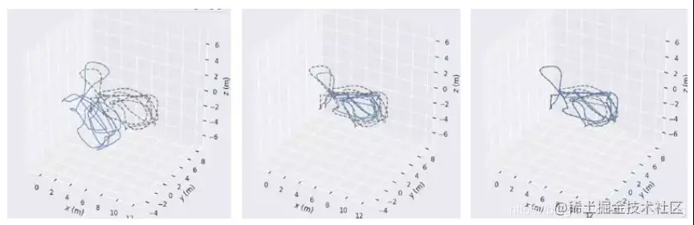

例子2： 不同的对齐命令效果图，分别是未对齐、SE(3)对齐、Sim(3)对齐、尺度缩放 

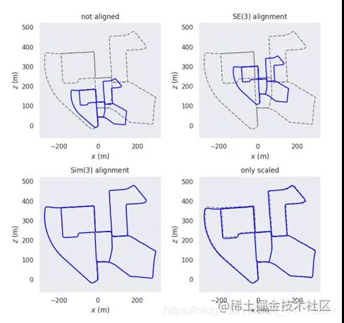

### **5.evo_res 命令详解** 

- 用途：结果比较 

- evo_ape/evo_rpe中将结果保存为.zip文件后，可以利用evo_res对不同的结果进行比较 

- 常用命令示例1： evo_ape得到MH3_1.zip和MH3_2.zip两个文件后，对这两个结果进行比较 

  ```
  evo_res MH3.zip MH3_2.zip -v 
  ```

- 参数说明： 
  
  - -v : 详细模式展示信息 

### **6.evo_config 命令详解** 

- 用途：全局设置和配置文件的操作 

| **命令**                                   | **说明**                 |
| ------------------------------------------ | ------------------------ |
| evo_config show                            | 查看设计文件中的参数配置 |
| evo_config set                             | 进行参数设置             |
| evo_config generate                        | 导出配置到指定的json文件 |
| evo_config reset                           | 将参数还原到默认值       |
| evo_config show\|set\|generate\|reset help | 将参数还原到默认值       |

- evo_config set 命令最为常用，下面是几个常用的参数，其含义以及可选项 

| **参数**                 | **含义**               | **可选项**                    |
| ------------------------ | ---------------------- | ----------------------------- |
| plot_export_format       | 输出图像时图像存储格式 | 常用png,pdf等                 |
| plot_linewidth           | 作图时线的宽度         | matplotlib支持的宽度，默认1.5 |
| plot_reference_color     | 图像中参考轨迹的颜色   | black,red,green等             |
| plot_reference_linestyle | 参考轨迹的线型         | matplotlib支持的线型，默认–   |
| plot_seaborn_style       | 图像背景和网格         | whitegrid,darkgrid,white,dark |
| plot_split               | 是否分开显示/存储图像  | false/true                    |
| plot_figsize             | 画图的图像大小         | 默认宽高均为6，可使用其他值   |
| table_export_format      | 表格数据输出格式       | 常用 csv,excel,latex,json     |

- 命令示例 

  ```
  # 将画图背景更改成白色网格 
  evo_config set plot_seaborn_style whitegrid  
   
  # 将字体改为衬线型并调为1.2倍大小 
  evo_config set plot_fontfamily serif plot_fontscale 1.2  
   
  # 将画图所使用的线型改为  
  evo_config set plot_reference_linestyle -  
   
  # 将所画图的图像大小调整为10 9（宽 高） 
  evo_config set plot_figsize 10 9  
   
  # 将参数还原到默认值 
  evo_config reset       
   
  # 导出配置 
  evo_config generate --pose_relation angle_deg --delta 1 --delta_unit m --verbose --plot --out rpe_config.json 
   
  # 导入配置 
  evo_rpe euroc MH_data3.csv pose_graphloop.txt -c rpe_config.json
  ```

### **7.evo 其他常用命令** 

| **命令**              | **含义**                |
| --------------------- | ----------------------- |
| evo pkg   --version   | 查看evo版本             |
| evo pkg   --info      | 查看evo的简要介绍和描述 |
| evo pkg   --pyversion | 查看python版本          |
| evo pkg   --license   | 查看许可证              |
| evo pkg   --location  | 查看evo安装路径         |
| evo pkg   --logfile   | 查看日志文件路径        |
| evo pkg   --open_log  | 打开日志文件            |
| evo pkg   --clear_log | 清除日志文件            |

## **第六部分： 在程序中调用 evo 函数**

除了在命令行中使用外， 还可以在程序中使用 evo 能力。 

### **例子1：轨迹对齐** 

调用 evo 函数实现不同对齐方式的轨迹结果绘图并比较 

alignment_demo.py: 

```
#!/usr/bin/env python 

""" 
trajectory alignment functions 
""" 

import copy 
import logging 
import sys 

import evo.core.lie_algebra as lie 
from evo.core import trajectory 
from evo.tools import plot, file_interface, log 

import numpy as np 
import matplotlib.pyplot as plt 

logger = logging.getLogger("evo") 
log.configure_logging(verbose=True) 

# 读取参考轨迹数据和待评估轨迹数据 
traj_ref = file_interface.read_kitti_poses_file("./data/KITTI_00_gt.txt") 
traj_est = file_interface.read_kitti_poses_file( "./data/KITTI_00_ORB.txt") 

# add artificial Sim(3) transformation 
traj_est.transform(lie.se3(np.eye(3), np.array([0, 0, 0]))) 

# 尺寸缩放 
traj_est.scale(0.5) 

logger.info("\nUmeyama alignment without scaling") 
traj_est_aligned = copy.deepcopy(traj_est) 

# 对齐轨迹（但不做尺寸缩放） 
traj_est_aligned.align(traj_ref) 

logger.info("\nUmeyama alignment with scaling") 
traj_est_aligned_scaled = copy.deepcopy(traj_est) 
# 对齐轨迹（同时尺寸缩放） 
traj_est_aligned_scaled.align(traj_ref, correct_scale=True) 

logger.info("\nUmeyama alignment with scaling only") 
traj_est_aligned_only_scaled = copy.deepcopy(traj_est) 
# 对齐轨迹（仅仅尺寸缩放） 
traj_est_aligned_only_scaled.align(traj_ref, correct_only_scale=True) 

# 以下部分为绘图部分 
fig = plt.figure(figsize=(8, 8)) 
plot_mode = plot.PlotMode.xz 

ax = plot.prepare_axis(fig, plot_mode, subplot_arg=221) 
plot.traj(ax, plot_mode, traj_ref, '--', 'gray') 
plot.traj(ax, plot_mode, traj_est, '-', 'blue') 
fig.axes.append(ax) 
plt.title('not aligned') 

ax = plot.prepare_axis(fig, plot_mode, subplot_arg=222) 
plot.traj(ax, plot_mode, traj_ref, '--', 'gray') 
plot.traj(ax, plot_mode, traj_est_aligned, '-', 'blue') 
fig.axes.append(ax) 
plt.title('$\mathrm{SE}(3)$ alignment') 

ax = plot.prepare_axis(fig, plot_mode, subplot_arg=223) 
plot.traj(ax, plot_mode, traj_ref, '--', 'gray') 
plot.traj(ax, plot_mode, traj_est_aligned_scaled, '-', 'blue') 
fig.axes.append(ax) 
plt.title('$\mathrm{Sim}(3)$ alignment') 

ax = plot.prepare_axis(fig, plot_mode, subplot_arg=224) 
plot.traj(ax, plot_mode, traj_ref, '--', 'gray') 
plot.traj(ax, plot_mode, traj_est_aligned_only_scaled, '-', 'blue') 
fig.axes.append(ax) 
plt.title('only scaled') 

fig.tight_layout() 
plt.show() 
```

执行后如图所示：

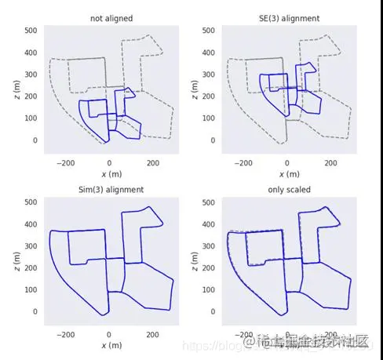

### **例子2：计算APE** 

调用 evo 函数计算APE和统计值MEAN 

calc_ape.py: 

```
#!/usr/bin/env python 

""" 
caculate ape of two trajectories 
""" 

print("loading required evo modules") 
from evo.core import trajectory, sync, metrics 
from evo.tools import file_interface 

# 读取参考轨迹数据和待评估轨迹数据 
print("loading trajectories") 
traj_ref = file_interface.read_tum_trajectory_file( "./data/fr2_desk_groundtruth.txt") 
traj_est = file_interface.read_tum_trajectory_file( "./data/fr2_desk_ORB.txt") 

# 调用时间同步算法进行同步，主要是根据 timestamps进行同步 
# 具体实现参考 evo/core/syn.py 源码 
print("registering and aligning trajectories") 
traj_ref, traj_est = sync.associate_trajectories(traj_ref, traj_est) 

# 对齐轨迹（不带尺度缩放） 
traj_est.align(traj_ref, correct_scale=False) 

# 计算APE 
print("calculating APE") 
data = (traj_ref, traj_est)     

# 仅针对平移部分计算 
ape_metric = metrics.APE(metrics.PoseRelation.translation_part) 

# 对SE(3)的位姿点集合计算APE 
# 详细实现参见 evo/core/metrics.py 源码 
ape_metric.process_data(data) 

# 得到rmse，sse，mean，median,max,min,std等统计值 
ape_statistics = ape_metric.get_all_statistics() 
print("mean:", ape_statistics["mean"]) 

# 以下为绘图部分 
print("loading plot modules") 
from evo.tools import plot 
import matplotlib.pyplot as plt  

print("plotting") 
plot_collection = plot.PlotCollection("Example") 
# metric values 
fig_1 = plt.figure(figsize=(8, 8)) 
plot.error_array(fig_1.gca(), ape_metric.error, statistics=ape_statistics, 
                                 name="APE", title=str(ape_metric)) 
plot_collection.add_figure("raw", fig_1) 

 
# trajectory colormapped with error 
fig_2 = plt.figure(figsize=(8, 8)) 
plot_mode = plot.PlotMode.xy 
ax = plot.prepare_axis(fig_2, plot_mode) 
plot.traj(ax, plot_mode, traj_ref, '--', 'gray', 'reference') 
plot.traj_colormap(ax, traj_est, ape_metric.error, plot_mode, 
                                   min_map=ape_statistics["min"], 
                                   max_map=ape_statistics["max"], 
                                   title="APE mapped onto trajectory") 
plot_collection.add_figure("traj (error)", fig_2) 

# trajectory colormapped with speed 
fig_3 = plt.figure(figsize=(8, 8)) 
plot_mode = plot.PlotMode.xy 
ax = plot.prepare_axis(fig_3, plot_mode) 
speeds = [ 
        trajectory.calc_speed(traj_est.positions_xyz[i], 
                                traj_est.positions_xyz[i + 1], 
                                traj_est.timestamps[i], traj_est.timestamps[i + 1]) 
        for i in range(len(traj_est.positions_xyz) - 1) 
] 
speeds.append(0) 
plot.traj(ax, plot_mode, traj_ref, '--', 'gray', 'reference') 
plot.traj_colormap(ax, traj_est, speeds, plot_mode, min_map=min(speeds), 
                        max_map=max(speeds), title="speed mapped onto trajectory") 
fig_3.axes.append(ax) 
plot_collection.add_figure("traj (speed)", fig_3) 
 
plot_collection.show()  
```

终端输出信息： 

```
loading required evo modules 
loading trajectories 
registering and aligning trajectories 
calculating APE 
mean: 0.0074917768702161495 
```

计算并打印了MEAN信息 

## **附录：数据集以及 evo 使用例子** 

### **TUM数据集** 

- 数据格式为 ： timestamp tx ty tz qx qy qz qw 每行8个元素， 结尾没有空格， 时间戳以秒为单位， 精确到小数点后9位 

  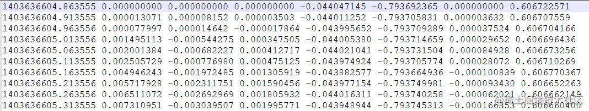

- evo_ape 计算轨迹绝对误差的例子

  ```
    mkdir results 
  
    # 计算轨迹绝对误差 evo_ape 
    evo_ape tum fr2_desk_groundtruth.txt  fr2_desk_ORB.txt -va --plot --plot_mode xz --save_results results/ORB_fr2_desk.zi 
  
   # 分析多条曲线 evo_res 
   evo_res results/*.zip -p --save_table results/table.csv 
  
   # 绘制多条轨迹 evo_traj
   evo_traj tum freiburg1_xyz-ORB_kf_mono.txt freiburg1_xyz-rgbdslam.txt  --ref=freiburg1_xyz-groundtruth.txt -va --plot --plot_mode xy 
  ```

### **KITTI数据集** 

- KITTI数据集格式： r11 r12 r13 tx r21 r22 r23 ty r31 r32 r33 tz 存储变换矩阵的前三行,每行12元素，空格隔开, 无时间戳 

  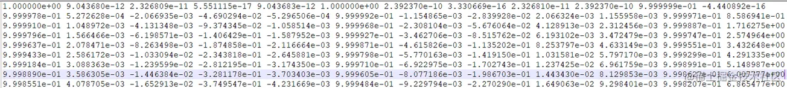

- evo_ape 计算轨迹绝对误差, evo_traj 绘制多条曲线轨迹 

  ```
   mkdir results 
  
   # 计算轨迹绝对误差 evo_ape 
   evo_ape kitti KITTI_00_gt.txt KITTI_00_ORB.txt -va --plot --plot_mode xz --save_results results/KITTI_00_ORB.zip 
  
   # 分析多条曲线 evo_res 
   evo_res results/*.zip -p --save_table results/table.csv 
  
   # 绘制多条轨迹 
   cd test/data 
   evo_traj kitti KITTI_00_ORB.txt KITTI_00_SPTAM.txt --ref=KITTI_00_gt.txt -p --plot_mode=xz  
  ```

### **EUROC数据集** 

- EUROC数据格式为：timestamp,px,py,pz,qw,qx,qy,qz,vx,vy,vz,bwx,bwy,bwz,bax,bay,baz 每行17个元素，逗号隔开，时间以纳秒为单位, 无小数

  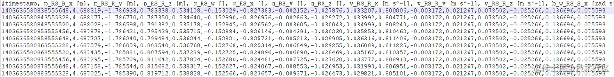

- evo_ape 计算轨迹绝对误差 

  ```
  mkdir results 
  
   # 计算轨迹绝对误差 evo_ape 
   evo_ape euroc V102_groundtruth.csv V102.txt -va --plot --plot_mode xy --save_results results/EUROC.zip 
  ```

## **附录：相关文献** 

- Z. Zhang, D. Scaramuzza. A Tutorial on Quantitative Trajectory Evaluation for Visual(-Inertial) Odometry. *IEEE/RSJ International Conference on Intelligent Robots and Systems*, 7244-7251, 2018. 基本概念介绍教程，包括尺度、对齐等等 
- J. Sturm, N. Engelhard, F. Endres, W. Burgard, D. Cremers. A Benchmark for the Evaluation of RGB-D SLAM Systems. *IEEE International Conference on Robotics and Automation*, 573-580, 2012. 讲解绝对轨迹误差和相对轨迹误差的概念，以及计算 
- Least-Squares Estimation of Transformation Parameters Between Two Point Patterns, 讲解Umeyama轨迹对齐算法原理和最小二乘过程 

### [参考教程](https://juejin.cn/post/7063041669725159461)

