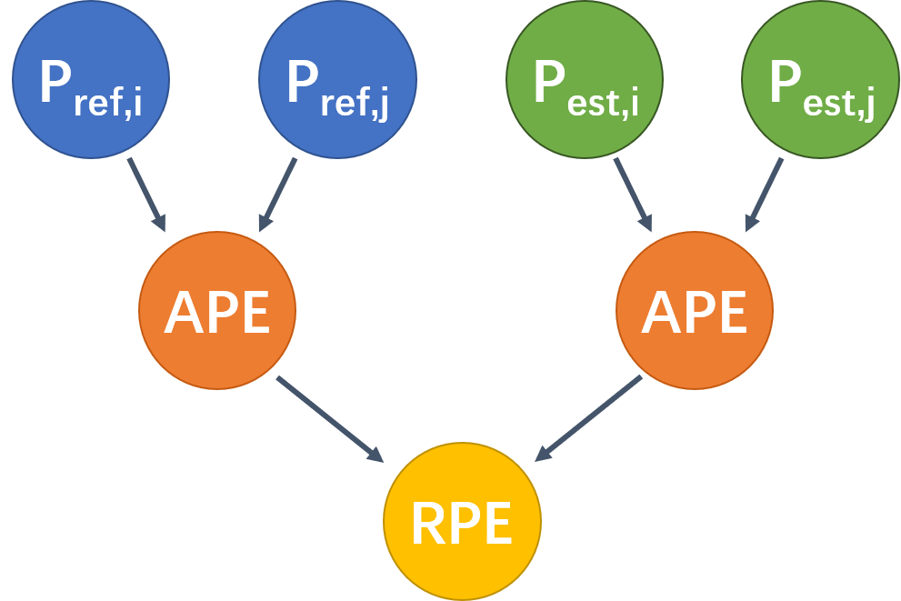
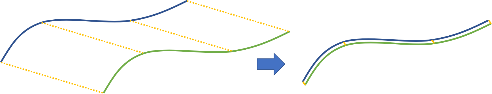

# SLAM中的位姿变换与轨迹评价指标:APE、RPE、ATE、RTE

## 1.位姿变换的表示

这里首先需要说明的是，当我们说一个位姿的时候，一定是相对于某个参考系的。它并不会独立于参考系而存在，即使有些时候我们没有显式地说明参考系。比如，我们说天上有只鸟在飞。在我们说这句话的时候其实默认参考系是我们自己，然后才会有鸟“在天上”这样的概念。

然后，我们需要了解的是，“位姿”包含位置和姿态两部分内容，是位置(位移)+姿态(旋转)的简称，不是打错的“位置”。一般情况下，旋转可以用旋转矩阵R表示，平移可以用平移向量t表示。当然我们也可以把旋转和位移统一在一个变换矩阵T中，以此来表示位姿。需要注意的一点是，位姿和位姿的变化都是用旋转平移或者变换来表示。这类似于在坐标系中的坐标点与向量，如果我们从坐标角度看，它就是一个状态、一个点，而如果我们从向量的角度来看，它就是一个矢量。前面说了，位姿一定是相对于某个参考系的。而位姿的变化(位移+旋转)除了相对于参考系，还有一个重要的属性就是方向。任何一个位姿的变化必然有方向，不然就没有意义了。例如，我们说旋转30°，这个旋转可以是顺时针，也可以是逆时针，缺少了方向就会产生歧义。因此我们可以说位姿的变换包含两个要素：参考系和方向。当我们判断两个变换是不是相同时就可以看它们的这两个要素是不是相同。这个概念需要在后面介绍内容的时候时刻记住，不然就容易把自己绕晕了。

上面，我们说了，位姿的变换包含参考系和方向。如下图所示，对于两个状态A和B，从A到B的变换和从B到A的变换就是两个相反的变换。因为从A到B的变换参考系是A，而从B到A的变换参考系是B。


下面再从数学的角度介绍一下旋转矩阵、平移向量和变换矩阵的一些性质。对于旋转矩阵，三维旋转就是一个3×3的正交矩阵，也就是说矩阵的逆等于矩阵的转置。而且矩阵的逆等于一个逆变换。例如$\R_{AB}^{-1}=R_{AB}^{T}=R_{BA}$。而对于变换矩阵$T$，按下式构成。
$$
T = \begin{bmatrix}
\mathbf{R} & \mathbf{t}\\
\mathbf{0} & 1
\end{bmatrix}=\begin{bmatrix}
R_{1,1} & R_{1,2} & R_{1,3} & t_{1}\\ 
R_{2,1} & R_{2,2} & R_{2,3} & t_{2}\\ 
R_{3,1} & R_{3,2} & R_{3,3} & t_{3}\\ 
0 & 0 & 0 & 1
\end{bmatrix}
$$
与旋转矩阵类似的，变换矩阵的逆表示一个反变换，所以$T_{AB}=T_{BA}^{-1}$。具体而言，如果我们有一个变换矩阵T，我们当然可以直接用矩阵求逆，得到$T^{-1}$，这没有错。但这里需要说明的一点是，我们并不能想当然地以为是对各部分求逆或取负,尤其是对于平移部分，当有旋转的时候，不能直接添加一个负号作为其逆变换。下面解释为什么。对于一个由$R$和$t$构成的变换矩阵$T$，其逆变换矩阵$T^{-1}$表示为：
$$
T^{-1} = \begin{bmatrix}
\mathbf{R^{T}} & -\mathbf{R^{T}}\mathbf{t}\\
\mathbf{0^{T}} & 1
\end{bmatrix}
$$
这里旋转部分都比较好理解，关键在于平移部分，并不是我们想当然地直接添个负号，而是还会乘一个旋转矩阵的逆(转置)。对于这一部分要如何理解呢？我们可以先从简单的情况看起，如下图所示。


我们先忽视旋转，认为只有平移。在A状态，其在世界坐标系下的位置是$(10,8,6)$，其经过一个变换$T_{AB}$，变换到了B状态，B状态在世界坐标系下的位置是(14,10,4)。求变换矩阵$T_{AB}$以及逆变换矩阵$T_{BA}$。由于没有旋转，很容易可以看出，我们在A的基础上，$x$坐标加上4，$y$坐标加上2，$z$坐标减去2就可以得到B状态。所以可以十分简单地构造出从A到B的变换矩阵$T_{AB}$。还记得我们上面说的位姿变换的两个要素吗？用更数学一点的话来描述上面的这句话就是，$T_{AB}$这个变换的参考系是A状态，变换方向是从A到B。参考系决定了变换的尺度或者说大小，比如说这里变换的尺度是$x$方向为4，$y$方向为2，$z$方向也为2。但正如前面说的，仅有尺度是不够的，还得有方向，更进一步说就是运算的顺序：是$B$状态减去$A$状态还是$A$状态减去$B$状态。一般而言，对于一个从A到B的变换，我们习惯用B状态(终止状态)减去A状态(起始状态)来作为运算顺序。这样我们可以得到平移向量为$t=(4,2,−2)$。因此，根据上面的介绍，我们可以写出：
$$
T_{AB}=\begin{bmatrix}
1 & 0 & 0 & 4\\ 
0 & 1 & 0 & 2\\ 
0 & 0 & 1 & -2\\ 
0 & 0 & 0 & 1
\end{bmatrix}
$$
而对于逆变换，我们有两种求法。一种就是简单粗暴地直接对$T_{AB}$求逆，比如，对上面的矩阵求逆如下：
$$
T_{BA}=T_{AB}^{-1}=\begin{bmatrix}
1 & 0 & 0 & -4\\ 
0 & 1 & 0 & -2\\ 
0 & 0 & 1 & 2\\ 
0 & 0 & 0 & 1
\end{bmatrix}
$$
另一种是根据上面提到的$T^{-1}$和$R、t$的关系来构造。从A到B的过程，由于我们认为只有平移，所以旋转矩阵$R=I$，为一个3×3的单位阵。平移向量$t=(4,2,−2)$，所以，自然地，我们可以构造出如下矩阵：
$$
T_{BA}=\begin{bmatrix}
\mathbf{R^{T}} & -\mathbf{R^{T}}\mathbf{t}\\
\mathbf{0^{T}} & 1
\end{bmatrix}=\begin{bmatrix}
1 & 0 & 0 & -4\\ 
0 & 1 & 0 & -2\\ 
0 & 0 & 1 & 2\\ 
0 & 0 & 0 & 1
\end{bmatrix}
$$
对于$-\mathbf{R^{T}}\mathbf{t}$这部分可能不是很好理解。这里因为R为单位阵，所以该部分就是−t。为什么会有负号呢？还是按照刚刚我们说的变换两要素就可以明白了。我们要进行的是一个由B到A的变换，参考系是B状态。因此，按照终止状态减去起始状态的原则，我们可以得到t=(10−14,8−10,6−4)=(−4,−2,2)，而这恰恰就是从A到B变换的平移向量取负号。这也就是$T^{-1}$公式中负号的来历。可以发现，两者殊途同归，得到了同样的结果。

上面的例子比较简单，因为我们没有考虑旋转的情况。接下来我们就单独考虑一下纯旋转的情况，看看会发生什么，如下图所示。


我们从A状态开始，绕着x轴顺时针旋转45°，求A到B的变换矩阵TAB。对于旋转，我们可以使用以前几何学的知识，比如在A状态时y轴上的某个点(0,1,0)，旋转45度之后，它的位置就变成了(0,√2/2,√2/2)。根据这个映射关系，就可以很容易得到旋转矩阵R如下。
$$
R=\begin{bmatrix}
1 & 0 & 0\\ 
0 & \sqrt{2}/2 & -\sqrt{2}/2\\ 
0 & \sqrt{2}/2 & \sqrt{2}/2\\ 
\end{bmatrix}
$$
当然，这里涉及到了一些方向余弦相关的内容。而且只要涉及到旋转需要注意的地方就多一些。首先，在这里其实我们无形之中规定了顺时针旋转为正。这种定义的不同会导致旋转矩阵的反对角线元素的负号相反。感兴趣的话可以参考[这篇博客](http://zhaoxuhui.top/blog/2018/03/13/RelationBetweenQ4&R&Euler.html#23d旋转)。 然后，由于是绕x轴旋转，所以旋转矩阵的x轴所在的行和列应该就是1，0，0。再结合sinθ和cosθ就可以很容易得到上面的旋转矩阵。而由于没有平移，所以t=(0,0,0)。所以$T_{AB}$为：
$$
T_{AB} = \begin{bmatrix}
\mathbf{R} & \mathbf{t}\\
\mathbf{0} & 1
\end{bmatrix}=\begin{bmatrix}
1 & 0 & 0 & 0\\ 
0 & \sqrt{2}/2 & -\sqrt{2}/2 & 0\\ 
0 & \sqrt{2}/2 & \sqrt{2}/2 & 0\\ 
0 & 0 & 0 & 1
\end{bmatrix}
$$
对于由B到A的逆变换，我们同样可以用矩阵求逆的方式得到$T_{BA}$，如下：
$$
T_{BA}=T_{AB}^{-1}=\begin{bmatrix}
1 & 0 & 0 & 0\\ 
0 & \sqrt{2}/2 & \sqrt{2}/2 & 0\\ 
0 & -\sqrt{2}/2 & \sqrt{2}/2 & 0\\ 
0 & 0 & 0 & 1
\end{bmatrix}
$$
由于我们知道R、t，所以我们可以用第二种方法对上面的结果进行验证。
$$
T_{BA}=\begin{bmatrix}
\mathbf{R^{T}} & -\mathbf{R^{T}}\mathbf{t}\\
\mathbf{0^{T}} & 1
\end{bmatrix}=\begin{bmatrix}
1 & 0 & 0 & 0\\ 
0 & \sqrt{2}/2 & \sqrt{2}/2 & 0\\ 
0 & -\sqrt{2}/2 & \sqrt{2}/2 & 0\\ 
0 & 0 & 0 & 1
\end{bmatrix}
$$
可以看到，结果还是一模一样的。这里，由于平移向量t为0，所以最终变换矩阵平移部分也为0。

最后，我们同时考虑旋转和平移，并解释$T^{-1}$的公式的平移部分为什么是长这个样子。


如图所示，从A状态变换到B状态既有平移又有旋转。根据上面的知识，可以很自然地得到A到B的变换矩阵$T_{AB}$。
$$
T_{AB} = \begin{bmatrix}
\mathbf{R} & \mathbf{t}\\
\mathbf{0} & 1
\end{bmatrix}
$$

同时，根据上面的经验，$T_{BA}$肯定等于$T_{AB}$的逆。对于一个变换矩阵T，对其求逆就可以得到一个逆变换。当然，如果你事先知道R、t，也可以根据$T^{-1}$公式直接求出，无需求逆。

另外需要提醒一点的是，在对两个状态做差的时候，一定要明确各自的参考系，其数据一定要是同一个参考系下的才有意义。如果参考系不同，需要转换统一以后再运算。比如在坐标系A下某点的坐标是(10,20)，在坐标系B下另一个点的坐标也为(10,20)。但显然，它们并不在同一位置。我们需要把它们都统一到一个坐标系下后再比较。比如我们知道坐标系A到坐标系B仅存在平移，平移向量为t=(2,6)。那么我们就有两种方法，一种是将A中的坐标变换到B中比较，另一种则是将B中的坐标变换到A中比较。先看第一种，A的坐标变换到B以后为(12,26)，用终止状态(10,20)减去起始状态(12,26)，所以它们的差异为(-2，-6)。第二种情况，B中的坐标变换到A中，为(8,14)，终止(10,20)减起始(8,14)，结果为(2,6)。如果我们忽略方向上的差异，只看大小，它们是一样的。

另外，我们可以从两个角度推导得出$T^{-1}$公式。一是从纯矩阵求逆的法则，二是从从变换的基本原理出发。

首先从矩阵求逆角度，T是一个4×4的矩阵，如下。我们可以分块来看，把它就看做是一个2×2的矩阵。
$$
T = \begin{bmatrix}
\mathbf{R} & \mathbf{t}\\
\mathbf{0} & 1
\end{bmatrix}
$$
我们要求一个矩阵x，使得：
$$
Tx = \begin{bmatrix}
\mathbf{R} & \mathbf{t}\\
\mathbf{0} & 1
\end{bmatrix} x =I
$$
根据矩阵求逆法则，可以得到：
$$
\left\{\begin{matrix}
Rx_{1}+tx_{2}=I\\ 
Rx_{3}+tx_{4}=0\\ 
x_{2}=0\\ 
x_{4}=I\\ 
\end{matrix}\right.
$$
所以，可以顺利求解矩阵x的各个元素：
$$
\left\{\begin{matrix}
x_{1}=R^{-1}\\ 
x_{2}=0\\ 
x_{3}=-R^{-1}t\\ 
x_{4}=I\\ 
\end{matrix}\right.
$$
再把它们拼接起来，就得到了$T^{-1}$公式。
$$
x = \begin{bmatrix}
R^{-1} & -R^{-1}t\\
\mathbf{0} & I
\end{bmatrix}
$$
这是第一种方法。另一种方法是从变换的原理进行推导。而对于逆变换，由于同时有平移和旋转，所以处理起来稍微复杂一些。

从A状态变换到B状态，旋转为$R_{AB}$，平移为$t_{AB}$，它们共同构成了变换$T_{AB}$。当我们求反变换$T_{BA}$的时候，除了直接对$T_{AB}$求逆，还可以根据物理意义求解。变换由旋转和平移构成，所以只要得到对应部分，填到变换矩阵T的对应位置就可以了。对于旋转部分，根据上面说的，逆旋转等于对旋转矩阵求逆，而旋转矩阵的逆又等于转置。所以旋转部分，就是$R^{T}$。比较麻烦的是平移部分，根据上面的介绍，只有当两个坐标或平移的参考系相同时运算才有意义。对于现在我们已知的平移$t_{AB}$，其参考系是旋转了$R_{AB}$以后的A坐标系，方向是从A到B。B是在这个坐标系下按照平移向量移动得到的，所以B坐标系在旋转$R_{AB}$后的A坐标系下的坐标就是$t_{AB}$。我们对其添加一个负号，得到$-t_{AB}$，即表示从B到A的平移。所以，对其乘上一个旋转矩阵的逆，就可以得到其在原始A坐标系下的坐标。最终也就写成了$-\mathbf{R^{T}t}$，这也就是$T^{-1}$公式里的平移部分了。至此，我们也就推导得到了$T^{-1}$公式。

另外，需要说明的是，对于同时有平移和旋转的变换而言，其实有两种变换顺序。一种是先平移再旋转，另一种是先旋转再平移。我们可以分别推导看看，这两种方式最后得到的结果是否一样。对于某个从A到B的变换T，由旋转R和平移t组成。对于A中的某个坐标点$x_{A}$，按照先旋转再平移的顺序，有如下公式。
$$
x_{B}=R x_{A} + t
$$
而按照先平移再旋转，则可以得到。
$$
x_{B}=R(x_{A} + t)
$$
可以看到，公式是不一样的。但这里需要注意的是，平移t也是不一样的。按照前面说的，两个坐标运算，一定要在同一个参考系下。对于第一种情况，其平移向量的参考系是旋转以后的A坐标系。而对于第二种情况，其参考系则是原始A坐标系。所以对于旋转和平移的顺序问题，也需要明确一下。一般而言，在SLAM中，都是先旋转再平移的顺序。

最后，简单小结一下。对于旋转，通过3×3的正交阵表示，它的逆等于它的转置，通过矩阵求逆得到其逆旋转。对于平移，通过1×3的向量表示，通过添加正负号表示平移方向。对于变换，通过4×4的矩阵表示，通过矩阵求逆得到其逆变换。

## 2.位姿评价指标

在明确了位姿的表示之后，我们需要思考下一个问题。如何求解两个位姿之间的变化。其实这也非常简单，和上面介绍的是一样的。我们只需要求解得到两个位姿之间的变换矩阵即可，这个矩阵就可以作为两个位姿之间的变化(误差)度量。如果这个变换矩阵旋转部分为单位阵，平移部分为0，则说明这两个位姿是一样的，没有误差(变化)。秉持着这个基本思想，我们进一步需要思考，如何实现它。为了方便，这里所有的位姿都用变换矩阵T来表示。如下图所示。


有两个位姿$T_{1}$和$T_{2}$，这里$T_{1}$、$T_{2}$都是在一个全局统一的参考系下。要求解它们之间的差异，其实就可以看作是求解$T_{2}$相对于$T_{1}$的位姿变换，也就是图中问号对应的变换。回想一下变换的合成公式：
$$
\begin{matrix}
b=T_{1}a\\ 
c=T_{2}b\\ 
c=T_{2}b=T_{2}T_{1}a
\end{matrix}
$$
可以看到，变换的合成都是不停地左乘变换矩阵。所以在这里，我们同样可以有类似的式子。我们不妨设要求的变换为x，则有：
$$
\begin{matrix}
T_{1}=T_{1}I\\ 
T_{2}=xT_{1}\\ 
\end{matrix}
$$
对于上面这个式子，等式两边左乘$T_{1}^{-1}$就可以得到$x=T_{1}^{-1}T_{2}$。这便是对于两个位姿之间变换的求解，我们进一步可以对其分解，得到旋转和平移。当然了，这里还是需要强调一下，$T_{1}$和$T_{2}$都是在同一参考系下的，如果不在同一参考系下，需要先将它们转化到同一参考系后再计算。有了以上的理解，再看下面的东西就会容易很多了。

### (1) APE

如下图所示，是EVO中计算APE的算法。Absolute Pose Error可以用于评价SLAM轨迹的整体一致性。


在i时刻，我们现在有两个位姿，$P_{est,i}$和$P_{ref,i}$。前者是我们估计的位姿，后者是真值。根据上面我们得到的结论，要求解它们之间的差异，也就是求它们之间的变换。而它们之间的变换直接可以根据上面推导得到的公式计算。只不过这里$T_{1}$变成了$P_{ref,i}$，$T_{2}$变成了$P_{est,i}$。所以我们自然就能得到下面的式子：
$$
E_{i}=P_{ref,i}^{-1}P_{est,i}
$$
它也就和EVO文档里给出的公式是对应的了，而且我们可以看到它求解的这个变换的方向是从$P_{ref,i}$到$P_{est,i}$。得到了变换$E_{i}$之后，我们就可以按需取出各个部分进行分析了。例如取出平移部分、旋转部分等，就比较好理解了。最后的RMSE求解公式也都比较好理解。需要注意的是，这里用到了矩阵的F范数，F范数是矩阵是把矩阵中每个元素的平方求和后开根号。这其实和之前在我的毕业设计论文里用到的思路是一致的，只不过差了个平方而已，如下图所示。


另外，除了RMSE还有和方差(SSE)、均方差(MSE)等不同统计量，计算其实也都非常简单，彼此之间的关系如下式所示。
$$
RMSE = \sqrt{MSE} = \sqrt{SSE/n} = \sqrt{\frac{1}{n}\sum_{i=1}^{n}w_{i}(y_{i}-\hat{y_{i}})^2}
$$
如果想了解更多内容可以参考[这个网页](https://blog.csdn.net/hellocsz/article/details/91490787)。

### (2) RPE

在明白了APE的计算之后，其实RPE就更好理解了。


Relative Pose Error虽然说是相对误差，但是其实计算方式是和APE一样的。我们依然还是要计算两个位姿之间的变换关系，但不同的是，这两个位姿并不是估计的绝对位姿，而是两个绝对位姿之间的差异。再简单一点说，RPE计算的是两个绝对位姿差异之间的差异。而如果你细心的话，会发现APE算的就是两个绝对位姿之间的差异。所以从这个角度来说RPE计算的是两个APE之间的差异，如下图所示。



根据计算方式，其实我们也就很容易知道RPE的好处了，RPE只使用位姿的变化而不关心估计的绝对位姿，因此消除了估计的绝对位置对于最终结果的影响。所以我们再看EVO文档中计算RPE的公式，就会比较好理解了。首先，我们求解$P_{ref,i}$和$P_{ref,j}$之间的位姿变化$APE_{ref}$(以$P_{ref,i}$为参考系)、$P_{est,i}$和$P_{est,j}$之间的位姿变化$APE_{est}$(以$P_{est,i}$为参考系)。然后，我们再比较这两个APE之间的的差异。同理，按照计算APE的方式，可以自然地得到$APE_{ref}^{-1}APE_{est}$。而这也就是EVO文档中RPE的计算公式了。其它的几个指标和APE都是一样的，这里就不多介绍了。

最后需要强调一下的是，不管是APE还是RPE，求解的都是位姿和位姿之间的关系，而不是整个轨迹上的总误差。总误差可以用上面给出的RMSE公式对求出的各个APE或RPE进行累加计算。

最后，是一个用Python写的计算APE和RPE的脚本，以供参考。

```python
import numpy as np
import math


def composeTransMat(rot_mat, trans_vec):
    trans_mat = np.array([[0, 0, 0, 0], [0, 0, 0, 0], [0, 0, 0, 0], [0, 0, 0, 1]], np.float)
    trans_mat[0, 0] = rot_mat[0, 0]
    trans_mat[0, 1] = rot_mat[0, 1]
    trans_mat[0, 2] = rot_mat[0, 2]
    trans_mat[1, 0] = rot_mat[1, 0]
    trans_mat[1, 1] = rot_mat[1, 1]
    trans_mat[1, 2] = rot_mat[1, 2]
    trans_mat[2, 0] = rot_mat[2, 0]
    trans_mat[2, 1] = rot_mat[2, 1]
    trans_mat[2, 2] = rot_mat[2, 2]

    trans_mat[0, 3] = trans_vec[0]
    trans_mat[1, 3] = trans_vec[1]
    trans_mat[2, 3] = trans_vec[2]
    return trans_mat


def decomposeTransMat(trans_mat):
    trans_vec = np.array([0, 0, 0], np.float)
    rot_mat = np.array([[0, 0, 0], [0, 0, 0], [0, 0, 0]], np.float)

    rot_mat[0, 0] = trans_mat[0, 0]
    rot_mat[0, 1] = trans_mat[0, 1]
    rot_mat[0, 2] = trans_mat[0, 2]
    rot_mat[1, 0] = trans_mat[1, 0]
    rot_mat[1, 1] = trans_mat[1, 1]
    rot_mat[1, 2] = trans_mat[1, 2]
    rot_mat[2, 0] = trans_mat[2, 0]
    rot_mat[2, 1] = trans_mat[2, 1]
    rot_mat[2, 2] = trans_mat[2, 2]

    trans_vec[0] = trans_mat[0, 3]
    trans_vec[1] = trans_mat[1, 3]
    trans_vec[2] = trans_mat[2, 3]
    return rot_mat, trans_vec


def quat2rot(qx, qy, qz, qw):
    # 求四元数的模长
    qmod = math.sqrt(qx * qx + qy * qy + qz * qz + qw * qw)
    # 四元数归一化
    qx = qx / qmod
    qy = qy / qmod
    qz = qz / qmod
    qw = qw / qmod

    # 计算旋转矩阵
    rot = np.array([[0, 0, 0], [0, 0, 0], [0, 0, 0]], np.float)
    rot[0, 0] = 1 - 2 * (qy * qy + qz * qz)
    rot[0, 1] = 2 * (qx * qy - qw * qz)
    rot[0, 2] = 2 * (qx * qz + qw * qy)
    rot[1, 0] = 2 * (qx * qy + qw * qz)
    rot[1, 1] = 1 - 2 * (qx * qx + qz * qz)
    rot[1, 2] = 2 * (qy * qz - qw * qx)
    rot[2, 0] = 2 * (qx * qz - qw * qy)
    rot[2, 1] = 2 * (qy * qz + qw * qx)
    rot[2, 2] = 1 - 2 * (qx * qx + qy * qy)
    # 返回旋转矩阵(与Matlab quat2dcm函数保持一致)
    return rot.transpose()


if __name__ == '__main__':
    # Poses: qx,qy,qz,qw,x,y,z
    pose_ref1 = [-0.757610, -0.348629, -0.497711, 0.238261, 4.460675, -1.680515, 0.579614]
    pose_ref2 = [-0.518605, -0.636519, -0.358444, 0.444310, 3.704039, 1.424990, 1.403680]
    pose_est1 = [-0.757610, -0.348629, -0.497711, 0.238261, 4.460675, -1.680515, 0.579614]
    pose_est2 = [-0.518605, -0.636519, -0.358444, 0.444310, 3.704039, 1.424990, 1.403680]

    # 不同的姿态可以观察不同的结果
    # pose_est2 = [-0.518605, -0.636519, -0.358444, 0.444310, 3.704039, 5.424990, 1.403680]

    rot_ref1 = quat2rot(pose_ref1[0], pose_ref1[1], pose_ref1[2], pose_ref1[3])
    rot_ref2 = quat2rot(pose_ref2[0], pose_ref2[1], pose_ref2[2], pose_ref2[3])
    rot_est1 = quat2rot(pose_est1[0], pose_est1[1], pose_est1[2], pose_est1[3])
    rot_est2 = quat2rot(pose_est2[0], pose_est2[1], pose_est2[2], pose_est2[3])

    trans_ref1 = composeTransMat(rot_ref1, pose_ref1[4:])
    trans_ref2 = composeTransMat(rot_ref2, pose_ref2[4:])
    trans_est1 = composeTransMat(rot_est1, pose_est1[4:])
    trans_est2 = composeTransMat(rot_est2, pose_est2[4:])

    ape_est1 = np.matmul(np.linalg.inv(trans_ref1), trans_est1)
    ape1_rot, ape1_trans = decomposeTransMat(ape_est1)
    ape_est2 = np.matmul(np.linalg.pinv(trans_ref2), trans_est2)
    ape2_rot, ape2_trans = decomposeTransMat(ape_est2)

    diff_ref = np.matmul(np.linalg.inv(trans_ref1), trans_ref2)
    diff_est = np.matmul(np.linalg.inv(trans_est1), trans_est2)
    rpe = np.matmul(np.linalg.inv(diff_ref), diff_est)
    rpe_rot, rpe_trans = decomposeTransMat(rpe)

    print("\nAPE1:")
    print(ape_est1)
    print("APE rotation part:")
    print(ape1_rot)
    print("APE translation part:")
    print(ape1_trans)

    print("\nAPE2:")
    print(ape_est2)
    print("APE rotation part:")
    print(ape2_rot)
    print("APE translation part:")
    print(ape2_trans)

    print("\nRPE:")
    print(rpe)
    print("RPE rotation part:")
    print(rpe_rot)
    print("RPE translation part:")
    print(rpe_trans)
```

代码中有ref1、ref2、est1、est2四个状态，以便我们计算。首先，我们可以计算我们估计的est1的APE，它是ref1和est1之间的差异，同理再计算ref2和est2的APE。最后，再计算从1到2这段的RPE。我们可以把从1到2真值的位姿差异当做是一种APE，这样，我们只需要再计算两个APE，最后就可以得到RPE了。可以这样理解：某时刻，位姿真值是ref1，但是我们估计得到的是ref2，求它们之间的变换。

### (3) ATE与RTE

最后，再来说一下ATE和RTE，来自于《A Tutorial on Quantitative Trajectory Evaluation for Visual(-Inertial) Odometry》这篇文章。它们是Absolute Trajectory Error和Relative Trajectory Error的简称。那么它们和上面的APE和RPE有什么不同呢？其实从本质上来说，它们没有什么不同。如果硬要说的话，上面说的APE和RPE更像是一种计算ATE和RTE的基础或原子操作。而计算ATE和RTE的最大区别在于，我们需要对于轨迹进行对齐。而我们在计算APE和RPE的时候则不用考虑这些，拿到位姿直接算就完了。但对于轨迹而言，则不能这样。因为很简单的，即使是两段完全相同的轨迹，如果放在不同的地方，然后直接计算它们对应的位姿差异，也会有非常大的差异，如下图所示。



左边是未对齐直接计算轨迹的误差，可以看到差异非常大。右边是对齐以后的误差。所以轨迹对齐在计算ATE和RTE的时候是十分重要的预处理步骤。

绝对轨迹误差(ATE):将对齐后的轨迹直接与真值比较，求取每个状态的RMSE作为整段轨迹总误差。其计算步骤主要包含两个：(1)轨迹对齐 (2)在对齐轨迹与真值之间计算RMSE。这里需要注意的是对于角度的处理。在得到旋转误差的旋转矩阵后，有多种办法衡量角度误差：(1)将旋转矩阵转成角轴，以“角”作为误差(2)将旋转矩阵转为欧拉角，依次计算三轴误差。具体可见论文里的计算公式23、24。

相对轨迹误差(RTE):将整段轨迹按一定规则截取成若干小段。取每一小段的第一个状态求取与真值的变换，利用这个变换将最后一个状态与真值对齐，计算误差。该计算结果即作为该段的误差。重复上述步骤即可以得到多段误差。计算步骤主要包含：(1)轨迹分段 (2)利用小段的的一个状态对齐轨迹 (3)计算小段最后一个状态与真值的差异 (4)在每一小段上重复上述步骤 (5)对于不同分段方法重复上述步骤。这便是RTE。RTE是一串数，可以对其进行统计分析，评价算法的一致性等等。具体见论文公式25、26、27。根据定义，虽然每一小段都有多个状态，但其实我们只用每一小段的起始与终止状态计算。它的中间状态并没有参与计算。不是想当然地在每一小段上进行轨迹对齐然后计算ATE作为该段结果，这个需要注意。

最后，简单提一下轨迹对齐。轨迹对齐有非常多的方法，一个简单的方法是获得各自轨迹起始位姿，然后求解它们起始位姿之间的变换，以此作为全部轨迹之间的变换，将其应用到其它位姿上。这样的好处是十分方便、简单，容易理解。问题也很明显，非常容易受误差影响。而且必须要保证求解变换的两个位姿要是对应的，一旦不对应就会有问题。另一种思路就是求解多个对应位姿之间的变换矩阵，然后取均值。而一个看起来更“可靠”的办法是进行迭代。我们以初始状态求得的位姿间的变换作为迭代的初值，然后得到一个变换就用该变换计算一下这两个轨迹之间的ATE。以此作为判断条件，不断迭代，直到ATE收敛为止。我们认为此时的变换就是最可靠的了。而关于如何判断两个位姿是否对应，可以通过时间窗口来判断。对于位姿A所对应的时间t，如果在t±Δt时刻内在另一个轨迹上可以找到位姿B，则取B作为对应位姿。如果直接找不到对应位姿，则寻找距离这个时间窗口最近的两个位姿，然后进行内插，得到t时刻的位姿。


> 本文转载自：http://zhaoxuhui.top/blog/2021/05/14/APE-RPE-ATE-RTE-Mmetric-in-SLAM.html