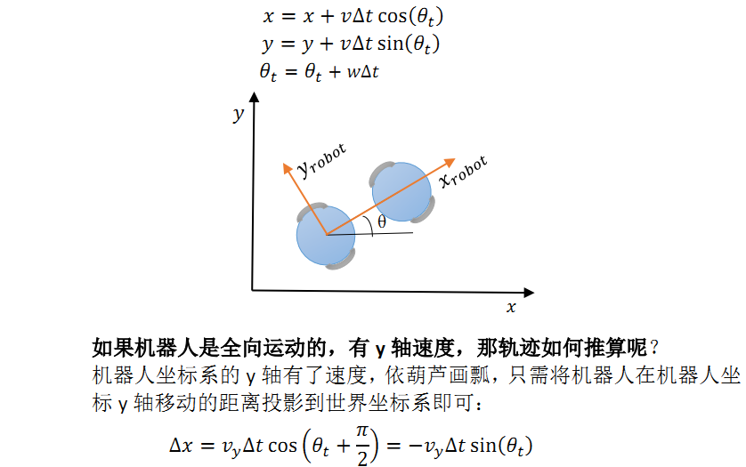
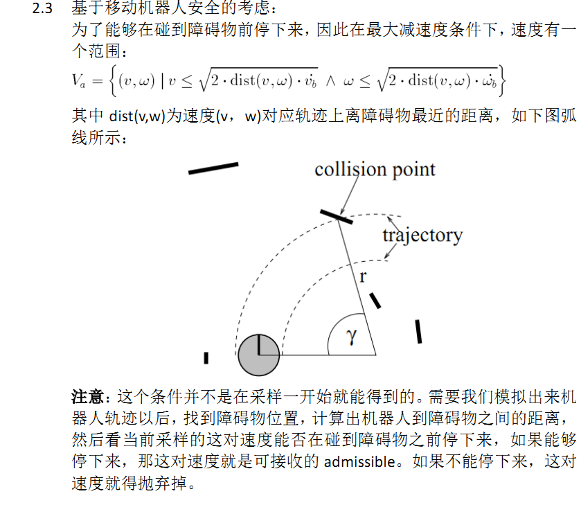
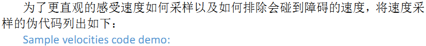
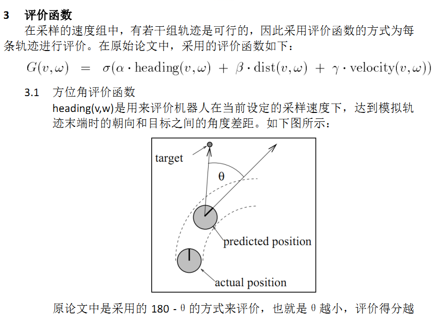
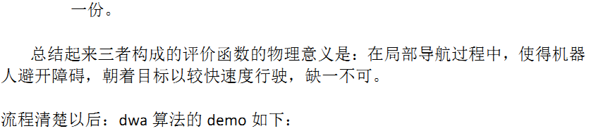

# 局部规划算法：DWA算法原理

> DWA算法（dynamic window approach），其原理主要是在速度空间（v,w）中**采样多组速度**，并模拟出这些速度在一定时间内的**运动轨迹**，并通过**评价函数**对这些轨迹进行评价，**选取最优轨迹**对应的（v,w）驱动机器人运动。
>
> 注：速度空间（v,w）：速度搜索空间，受到各种限制条件，后面会详细谈到。评价函数可以根据自己的需求进行更改，原始论文和ROS中的评价函数不一样。
>
> **优点：**
>
> - **计算复杂度低**：考虑到速度和加速度的限制，只有安全的轨迹会被考虑，且每次采样的时间较短，因此轨迹空间较小
> - **可以实现避障**：可以实时避障，但是避障效果一般
> - **适用于两轮差分和全向移动模型**
>
> **缺点：**
>
> - **前瞻性不足**：只模拟并评价了下一步，如在机器人前段遇见“C”字形障碍时，不能很好的避障
> - **动态避障效果差：** 模拟运动轨迹断，动态避障效果差
> - **非全局最优路径：** 每次都选择下一步的最佳路径，而非全局最优路径
> - **不适用于阿克曼模型**










```
首先在V_m∩V_d的范围内采样速度：
allowable_v = generateWindow(robotV, robotModel)
allowable_w  = generateWindow(robotW, robotModel)
然后根据能否及时刹车剔除不安全的速度：
    for each v in allowable_v
       for each w in allowable_w
       dist = find_dist(v,w,laserscan,robotModel)
       breakDist = calculateBreakingDistance(v)//刹车距离
       if (dist > breakDist)  //如果能够及时刹车，该对速度可接收
	如果这组速度可接受，接下来利用评价函数对其评价，找到最优的速度组
```






```
来源:http://adrianboeing.blogspot.com/2012/05/dynamic-window-algorithm-motion.html
BEGIN DWA(robotPose,robotGoal,robotModel)
   laserscan = readScanner()
   allowable_v = generateWindow(robotV, robotModel)
   allowable_w  = generateWindow(robotW, robotModel)
   for each v in allowable_v
      for each w in allowable_w
      dist = find_dist(v,w,laserscan,robotModel)
      breakDist = calculateBreakingDistance(v)
      if (dist > breakDist)  //can stop in time
         heading = hDiff(robotPose,goalPose, v,w) 
          //clearance与原论文稍不一样
         clearance = (dist-breakDist)/(dmax - breakDist) 
         cost = costFunction(heading,clearance, abs(desired_v - v))
         if (cost > optimal)
            best_v = v
            best_w = w
            optimal = cost
    set robot trajectory to best_v, best_w
END
```


## 参考资料：

https://www.guyuehome.com/5500

https://heyijia.blog.csdn.net/article/details/44983551

https://zhuanlan.zhihu.com/p/519958218