# 本质矩阵，基础矩阵，自由度及其解法 

## **常用重要性质：** 

### **（1）正交矩阵相乘仍然是正交矩阵** 

 *A**、**B*是正交矩阵,那么*AA'=E BB'=E* 

 *(AB)\*(AB)'=AB\*B'A'=A(BB')A'=AEA'=AA'=E* 

### **（2）一个矩阵乘以正交矩阵，范数不变**（保范性）

 *||Ux||^2=(Ux)^T(Ux)=x^TU^TUx=x^Tx=||x||^2* 

### **（3）一个矩阵乘以可逆矩阵秩不变** 

### **（4）初等变换只是不影响矩阵的秩，其他的特性都改变了。对于计算矩阵的行列式，不能进行初等变换，但是可以做行列的进加减，不能乘以系数。** 

### **（5）矩阵的迹：矩阵的主对角线上各个元素的总和，是矩阵所有特征值的和** 

### **（6）对角矩阵的特征值是其对角线上的各个元素** 

### **（7）矩阵的秩等于非零奇异值的个数，等于非零特征值的个数** 

### **（8）任意矩阵都能进行奇异值分解，只有方阵才可以进行特征值分解** 

####  **特征值分解：** 

如果一个向量 *v* 是方阵 *A*的特征向量，将可以表示成下面的形式： *Av= λv**，**λ* 称为特征向量 *v* 对应的特征值，并且一个矩阵的一组特征向量是一组正交向量。 

特征值分解：**Q**是这个矩阵A的特征向量组成的矩阵，**Σ**是一个对角阵，每一个对角线上的元素就是一个特征值

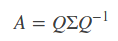

#### **奇异值分解：** 

假设*A*是一个N * M的矩阵，*U*是一个N * N的方阵（正交矩阵），*Σ* 是一个N * M的矩阵（对角线上的元素为奇异值），*VT*是一个M * M的矩阵（正交矩阵） 

#### **特征值和奇异值的关系：** 

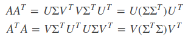

（1）*U*的列向量，是 *AA^T*的特征向量； 

（2）*V*的列向量，是 *A^TA* 的特征向量； 

（3）*A*的奇异值（*Σ*的非零对角元素）则是 *AA^T* 或者 *A^TA* 的非零特征值的平方根。 

### **（9）秩与自由度（ 方阵A(n\*n) ）** 

 矩阵的秩，指的是经过初等变换之后的非零行（列）的个数，若不存在零行（列），则为满秩矩阵（Rank(A)=n；关于矩阵的秩的另一种理解：A矩阵将n维空间中的向量映射到k（k<=n）维空间中，k=Rank(A) 

 矩阵（参数矩阵）的自由度，指的是要想求解出矩阵的所有元素至少需要列几个线性方程组。若矩阵本身带有 x 个约束，则只需要列n*n-x个方程组即可求出所有参数，即矩阵A的自由度为n*n-x。 

### **（10）齐次线性方程组求解（秩表示可以列几个方程）** 

1.r(A)=未知数个数n（约束较强） 

该解空间只含有零向量 

2.r(A)<未知数个数n（约束不够） 

由齐次线性方程组解空间维数 = n - r(A) >0，所以该齐次线性方程组有非零解，而且不唯一，存在一个基础解系（基础解系中的向量个数为 n - r(A)个)。 

 

## **一：为什么本质矩阵(E)的秩为2？** 

**（1）因为一个矩阵乘以可逆矩阵秩不变，因为可逆矩阵可以表示为初等矩阵的乘积，而初等变换不改变矩阵的秩。** 

对于一个矩阵施行一次初等**列变换**相当于在这个矩阵**右乘**一个相应的初等矩阵 

对于一个矩阵施行一次初等**行变换**相当于在这个矩阵**左乘**一个相应的初等矩阵 

*Rank(R)=3,*可逆矩阵

*Rank(t^)=2* 

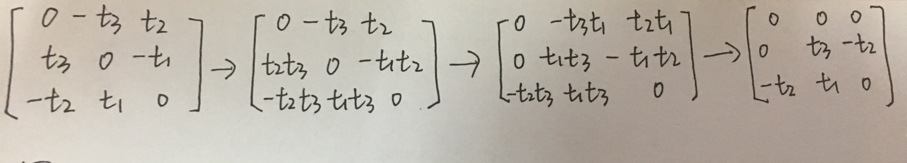

R不会改变矩阵的秩，因此E矩阵的秩为2. 

*Rank(E)=Rank(t^)=2* 

**（2）因为本质矩阵 E 的奇异值必定是 [σ, σ, 0] T 的形式，矩阵的秩等于非零奇异值的个数** 

**证明一：三维反对称矩阵的分解** 

**证明二：SVD分解与矩阵的迹** 

## **二：为什么基础矩阵(F)的秩为2**

两个相机内参矩阵和旋转矩阵R都是满秩矩阵（可逆矩阵），[T]x是一个秩为2的矩阵，同样，矩阵乘以可逆矩阵秩不变，因为可逆矩阵可以表示为初等矩阵的乘积，而初等变换不改变矩阵的秩（左乘-行变换，右乘-列变换）。 

 

## **三：为什么尺度等价性要减少一个自由度？** 

以本质矩阵为例，表达两帧的相机归一化坐标之间的对应关系

将矩阵写成向量，转化为下式： 

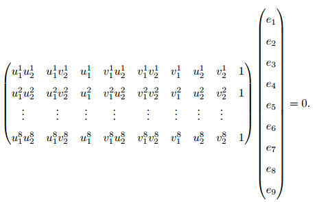

由于等式右侧是0，所以上面两式子乘以任意常数以后还是表示同样两点之间的变换，所以E是尺度等价的。 

由于尺度等价性，所以对于9个参数的向量e，我们只需要通过8个方程计算出其中8个未知数即可， 8个数都用第9个数表示，由于尺度等价，所以第9个数取什么值都是对的。 

 

## **四：为什么基础矩阵自由度是7？** 

左右相机内参的待定参数各为4，平移[T]x的待定参数是3，旋转矩阵R的自由度是3，加在一起是14个参数，也就是正常来说把14个参数都确定了才能确定F，但是实际上F是一个3*3的矩阵，只包含9个参数，所以计算F的自由度最大是9，也就是9个参数就可以确定F。 

同时F满足下面两个约束，所以F的自由度是9-2=7. 

（1）尺度等价性 

（2）秩为2，行列式为0，det(F)=0 

 

## **五：为什么本质矩阵自由度是5？** 

平移[T]x的自由度是3，旋转矩阵R的自由度是3，加在一起是6个参数，也就是要想确定E矩阵，确定6个参数就够了，不用考虑E矩阵的所有9个参数 

同时E满足下面约束，所以E的自由度是6-1=5. 

（1）尺度等价性 

 

## **六：为什么单应矩阵自由度是8？** 

单应矩阵也具有尺度等价性：9-1=8 

## **七：计算基础矩阵** 

### **1. 基于代数误差的线性估计** 

#### **(1) 8点法，线性最小二乘法** 

 **a. 线性解** 

计算基础矩阵 *f*, 8组对应坐标点构成系数矩阵A，维度为8*9。 

若A的秩正好为8，则 *f* 存在唯一解，可以通过线性算法求解 *f*，将 *f* 确定到只差一个常数因子。 

但是实际上，不可能得到精确的图像点对应，所以需要构建多于8个图像点的对应关系，构成一个超定方程，即不一定存在 *f* 使得上式成立，需要通过最小二乘法求解。 

根据多视图几何P412 A3.4.2，对于上述方程，若 *f* 是一个解，则k*f*也是解，一个合理的约束是只求|| *f* ||=1的解。 

**问题转化为求使得|| Af||最小化并满足||** **f** **||=1的** **f** **:** 

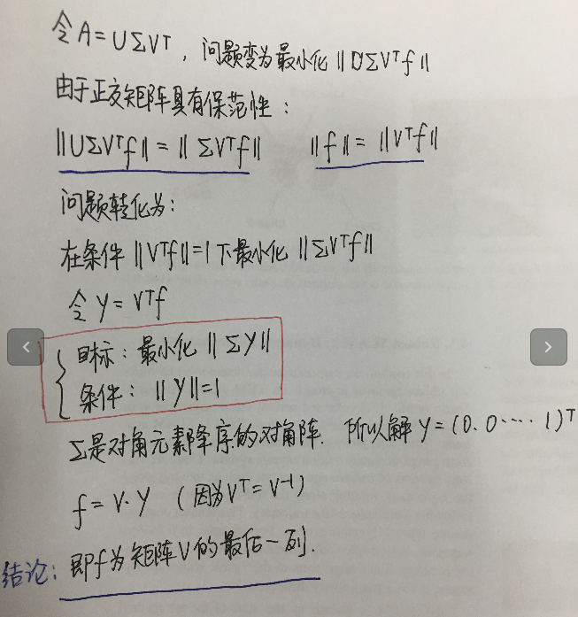

**结论：** **f** **的最小二乘解是对应于A的最小奇异值的奇异向量** 

 **b. 强迫约束（因为方程的个数>自由度）：用最接近F的矩阵F’ 代替F** 

上述求得的 **f** 转化为的矩阵**F**一般不满足秩为2的约束，所以需要对**F**进行修正，将**F**的三个奇异值修正为2个，就**F**满足了秩为2的约束。 

所以需要对**F**进行SVD分解，然后修正中间的奇异值矩阵 

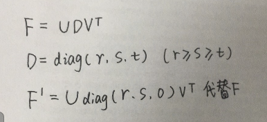

#### **(2) 归一化 8点法**（ORB-SLAM：FindFundamental）（OpenCV：findFundamentalMat—runkenel—run8point） 

8点法成功的关键是在构造解的方程之前应对输入的数据认真进行适当的归 一化，图像点的一个简单变换(平移或变尺度)将使这个问题的条件极大地改善，从而提高结果的稳定性 

**算法步骤：** 

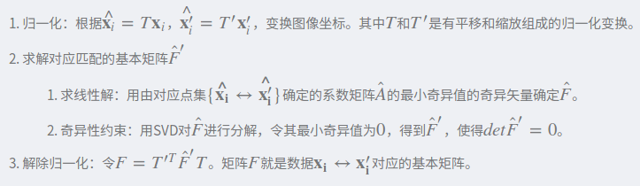

**a. 归一化变换** 

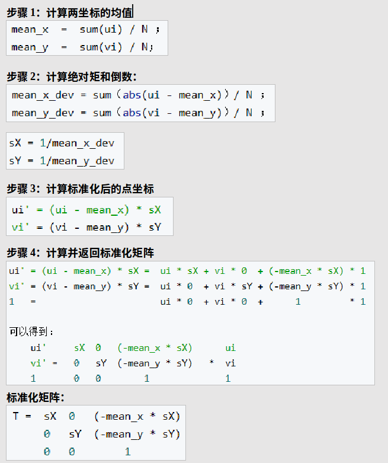

**b. 求解基础矩阵F，步骤在8点法里** 

 **c. 解除归一化** 

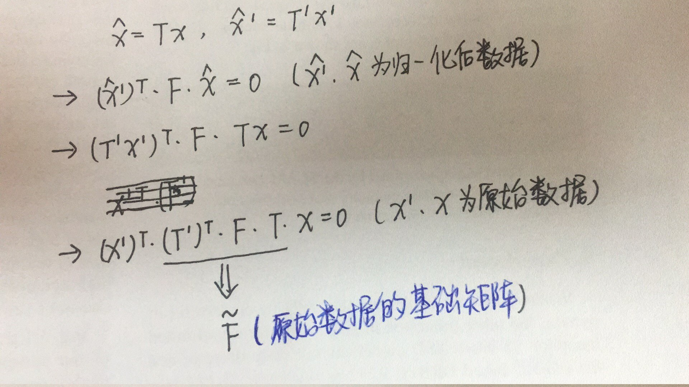

#### **(3) 最小点对应算法** 

 **a. 7-点：仅用 7 组点对应来估计 F**（OpenCV：findFundamentalMat—runkenel—run7point） 

 好处（1）：因为考虑7自由度，必定生成 一 个秩 2 的矩阵，从而无需添加强迫约束 

 好处（2）：保证一个高概率的没有野值的结果所需的采样次数是样本集大小的指数函数，例如，8 组时达 99% 的监性度时所需的采样数是 7 组时所需采样数的两倍 

 坏处：它可能给出 F 的 3 个实数解，且所有 3 个解都要通过检验来选择 

 对于**Af=0** **，**Rank(A)=7**f1, f2** , 

即为**A=U∑VT**中**VT**的最后两行. **f1=VT(7), f2=VT(8)** ， 则方程组的基础解系 **f=k\*f1+(1-k)\*f2** ，由 **f, f1, f2**组成的矩阵 **F**也满足这个关系：**F=k\*F1+(1-k)\*F2**，再加入**det(F)=0**的约束， 

即**det(k\*F1+(1-k)\*F2)=0** ，得到一个关于**k**的三次多项式，可以求解出来三个可能的**F**解。 

 

**b. 6-点：根据基础矩阵与单应矩阵的关系** 

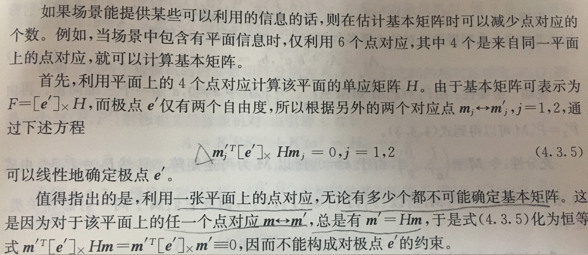

### **2. 基于几何误差的非线性估计** 

将估计基本矩阵的问题化为数学的最优化问题，然后使用某种优化迭代算法求解。算法如下: 

(1) 构造基于几何意义的目标函数 

(2) 选取8点算法的结果作为迭代算法的初始值 

(3) 选取一种迭代方法(L-M方法)， 迭代求解最小化问题 

构造基于几何意义的目标函数 

常用准则: 

#### **(1)点到对应极线距离的平方和（一般是通过数值求解之后出F矩阵之后用这个判断是否满足要求）** 

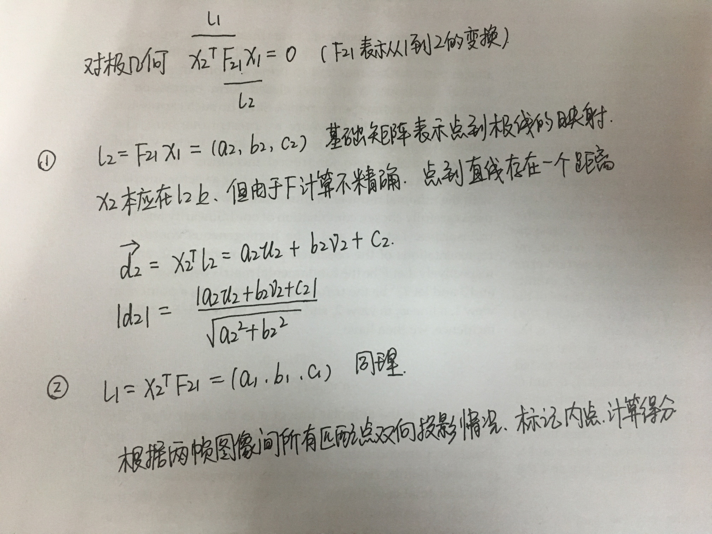

#### **(2)反投影距离** 

**就是最常见的重投影误差** 

## **八：计算本质矩阵（ORBSLAM是先计算基础矩阵F，然后通过相机内参计算E，没有直接计算E）**

**（1）8点法** 

基本做法与基础矩阵8点法相同，不同之处在于第二步：强迫约束 

**（2）5点法**（OpenCV：findEssentialMat—EMEstimatorCallback—runkenel） 

原理参考文献：An Efficient Solution to the Five-Point Relative Pose Problem 

具体步骤为： 

## **九：计算单应矩阵** 

 **归一化4点法** 

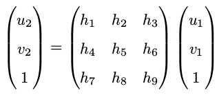

将第三个约束带入前两个： 

因为H有8个自由度，所以分为以下两种方式计算单应矩阵 

**a. 设置** **h9=1** 

这样一组匹配点对就可以构造出两项约束，于是自由度为 8 的单应矩阵可以通过 4 对匹配特征点算出(注意:这些特征点不能有三点共线的情况) 

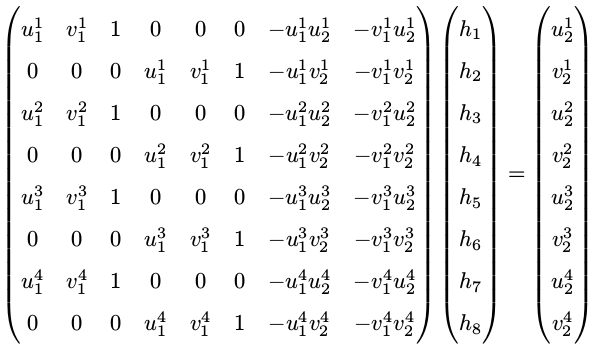

**b. 设置** **||h9||=1**

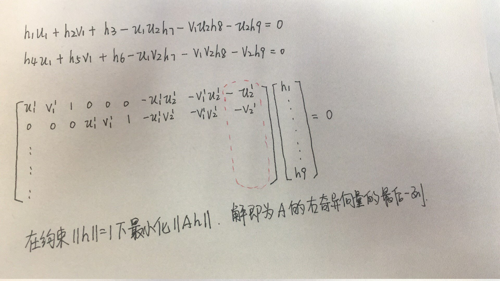

## **十：本质矩阵的分解** 

**（1）分解出四种可能的 (R,t) 组合** 

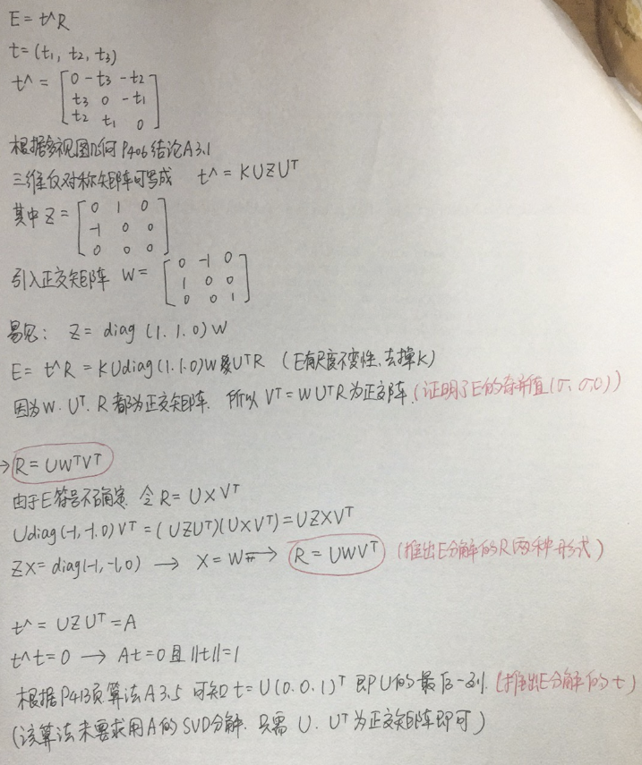

 **b. 检查3D点和两个相机的视差** 

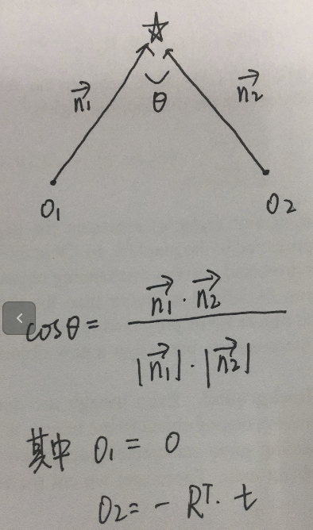

**c. 检查3D点的深度** 

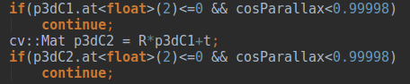

 **d. 检查3D点在两个相机的重投影误差，在误差允许范围内的计算内点数** 

 

## **十一：单应矩阵的分解** 

**8. 单应矩阵的推导** 

**（1）3D景物平面π的表达** ( *n^TX*=*d* ) 

过相机1的光心 **O1** **(0,0,0)** 向景物平面作垂线，该垂线即可表示平面的单位法向量 **n**，垂线与平面的交点记为 **X1, **|O1X1| = d 为景物平面到相机1的距离 **，**对于景物平面上的任意一个3D点**X**，与相机1的光心 **O1** 连线形成向量 **O1X=X-O1=X** **。**可以得到以下公式：

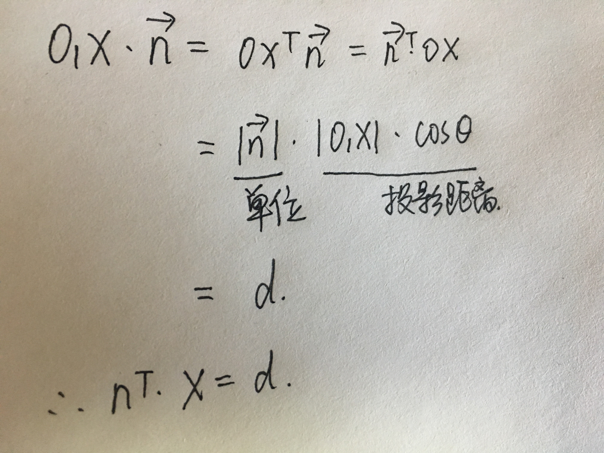

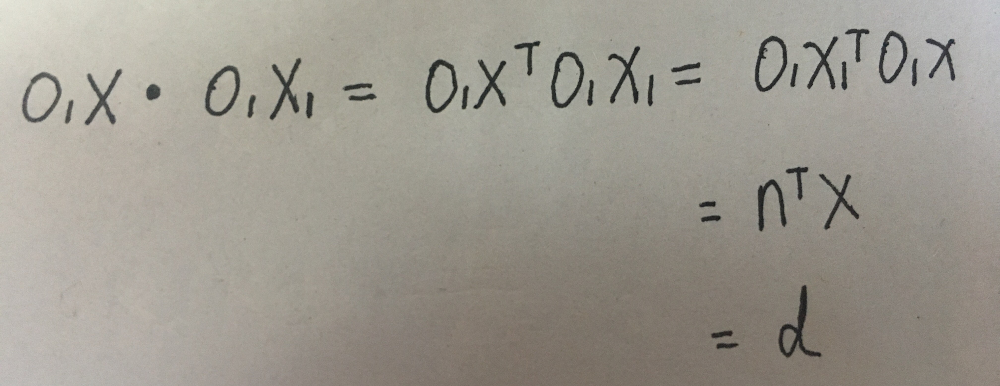

两个向量的点乘**O1X** **·** **O1X1** 表示**O1X** 在**O1X1** 上的投影，由图上的几何关系可知，该投影的距离为 **|O1X1| = d，** 所以可以推出平面π在相机O1坐标下的方程：

**（2）单应矩阵的推导** ( *p*2=*H p*1 )

**（3）单应矩阵的分解** 

 a. 将A进行SVD分解，取对角矩阵构造*R',t',d',n'，*再根据对应的公式计算*R,t,d,n* 

 b. 将法向量表示成基坐标的形式，消去 *t'* 

 c. 等式两边取范数，消去 *R'* *，*根据*x1,x2,x3*具有非零解得出系数矩阵行列式*=0，*从而推出*d'=±d2* 

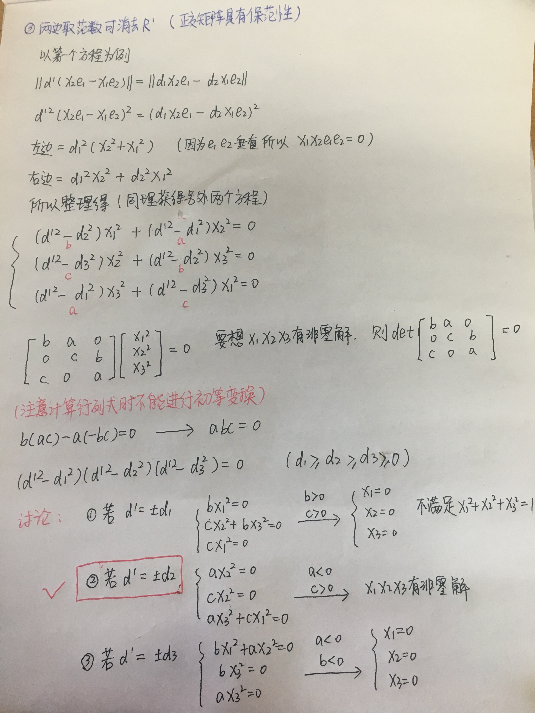

c. 根据 *d',d1,d2,d3* 的大小关系，讨论可能的6种情况 

d. 对第一种情况（11）进行求解*R',t',d',n'*，后续对（12）,（13）求解发现是（11）的特例，所以实际上只有（11）这一种情况，（11）计算出来的（R,t）组合有四种可能的情况 

是根据法向量 *n* 的坐标*x1,x3* 的正负决定的，所以四种情况分别对应*x1,x3取* (+,+),(+,-),(-,+),(-,-) 

e. 对第二种情况（14）进行求解 *R',t',d',n'*，与第一种情况同理，（15）,（16）是（14）的特例，所以计算的（R,t）组合实际上就是（14）对应的四种可能，、 

是根据法向量 *n* 的坐标*x1,x3* 的正负决定的，所以四种情况分别对应*x1,x3取* (+,+),(+,-),(-,+),(-,-) 

f. 综上所述，H分解能够得到可能的运动组合（R,t）一共8组，分别是d'=d2 对应4组，d'=-d2 对应4组 ，得到R', t'后根据定义式转化回R,t 

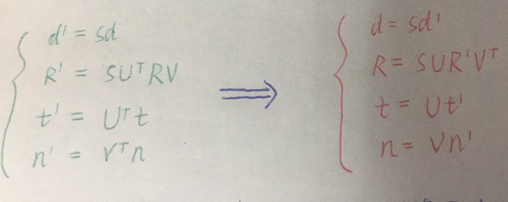