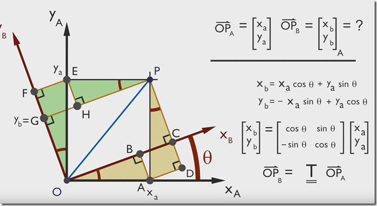

# 欧拉角与坐标系旋转变换

## 坐标系旋转变换，内在旋转，外在旋转

从一个坐标系到另一个坐标系的转换有多种方法：欧拉角法、方向余弦矩阵法、四元数法等。
其中欧拉角法的核心思想是：一个坐标系可以用另一个参考坐标系的三次空间旋转来表达。旋转坐标系的方法又有两种：

- Proper Euler angles, 第一次与第三次旋转相同的坐标轴（z-x-z,x-y-x, y-z-y,z-y-z, x-z-x, y-x-y）。
- Tait–Bryan angles, 依次旋转三个不同的坐标轴（x-y-z,y-z-x, z-x-y,x-z-y, z-y-x, y-x-z）；
  Tait–Bryan angles are 也叫作 Cardan angles; nautical angles; heading, elevation, and bank; or yaw, pitch, and roll. 有时候这两种变换序列都叫做 "Euler angles". 这种情况下，前者叫做 proper or classic Euler angles.

对于每个旋转序列，又有内在旋转（intrinsic rotations）和外在旋转（extrinsic rotations）两种方式。设有两个坐标系 P1和 P2，P1 是固定不动的参考系，P2 是需要被旋转的坐标系，初始时两个坐标系重合。内在旋转指每次旋转的旋转轴都是上次变换后新系 P2的坐标轴，外在旋转指每次旋转的旋转轴都是固定参考系 P1 的坐标轴。

## 绕一个坐标轴旋转的转动矩阵

绕不同轴的旋转结果**（注意这是从目标坐标系旋转到初始坐标系的旋转矩阵）**
$$
[R(X,\theta)] = 
\left[
\begin{matrix}
1 & 0 & 0 \\
0 & \cos\theta & -\sin\theta \\
0 & \sin\theta & \cos\theta
\end{matrix}
\right] \tag{1-6}
$$

$$
[R(Y,\theta)] = 
\left[
\begin{matrix}
\cos\theta & 0 & \sin\theta \\
0 & 1 & 0 \\
-\sin\theta & 0 & \cos\theta
\end{matrix}
\right] \tag{1-7}
$$

$$
[R(Z,\theta)] = 
\left[
\begin{matrix}
\cos\theta & -\sin\theta & 0 \\
\sin\theta & \cos\theta & 0 \\
0 & 0 & 1
\end{matrix}
\right] \tag{1-8}
$$

举例说明：

以 A 系为参考系，绕 *z* 轴旋转 θ到 B 系
$$
P_B =
\left[
\begin{matrix}
\cos\theta & \sin\theta & 0 \\
-\sin\theta & \cos\theta & 0 \\
0 & 0 & 1
\end{matrix}
\right]
P_A
$$
则 B 系坐标 *PB* 变换到 A 系为（转动矩阵为正交阵，逆矩阵等于转置矩阵）：
$$
P_A =
\left[
\begin{matrix}
\cos\theta & -\sin\theta & 0 \\
\sin\theta & \cos\theta & 0 \\
0 & 0 & 1
\end{matrix}
\right]
P_B
$$
绕 *x, y* 轴同理。

## 旋转的本质

### 内在旋转

坐标系 b1(其上有一个点p，坐标也用p表示)，先绕X轴转 α 角度，再绕Y轴转 β ，再绕Z轴转 γ ，得到 b2坐标系:

1）先绕X轴转 α
$$
p=R_x∗p'
$$
2）再绕Y轴转 β
$$
p'=R_y∗p''
$$
3）再绕Z轴转 γ
$$
p''=R_z∗p'''
$$
所以合并之后可得：
$$
p = R_xR_yR_z * p'''
$$
反之可得
$$
p''' = R_z^TR_y^TR_x^T * p
$$
可见，**内在旋转要将绕各轴的旋转矩阵从左至右连乘**。

### 外在旋转

因为每次都是绕固定的坐标系（记为，P）进行旋转，那么不管旋转之后的 P' 系在哪里，都可以认为 P 和 P' 系是刚性连接的（第一次旋转之前，可认为P 和 P' 是重合的），当发生了旋转之后，那么它们之间就会相差了一个旋转矩阵外参：假设先对 P 做了一次绕 X 轴的旋转，接着再对 P 做一次绕Y轴的旋转，再绕 P 做一次绕Z轴的旋转，直接给出结论：
$$
P = R_zR_yR_xp'''
$$
可知，**外在旋转要将绕各轴的旋转矩阵从右至左连乘**

并且可知，`绕固定轴旋转的XYZ旋转顺序`和`绕旋转之后的轴的ZYX旋转顺序`是等价的,也就是`改变第一三次旋转顺序`之后旋转矩阵是等价的。

### 由以上推导我们可以总结出结论

1. **内在旋转，转动矩阵右乘；外在旋转，转动矩阵左乘；内在旋转与外在旋转的绕轴旋转序列倒序时，两者等效。**
2. **内在旋转与外在旋转颠倒第一三次旋转顺序得到的旋转矩阵是相等的，也就是说绕固定轴旋转的XYZ旋转顺序和绕旋转之后的轴的ZYX旋转顺序是等价的，得到的旋转矩阵相同。**

#### 参考资料

https://blog.csdn.net/hzwwpgmwy/article/details/101547949

https://www.cnblogs.com/armme/p/10596697.html

https://www.zhihu.com/question/280577092