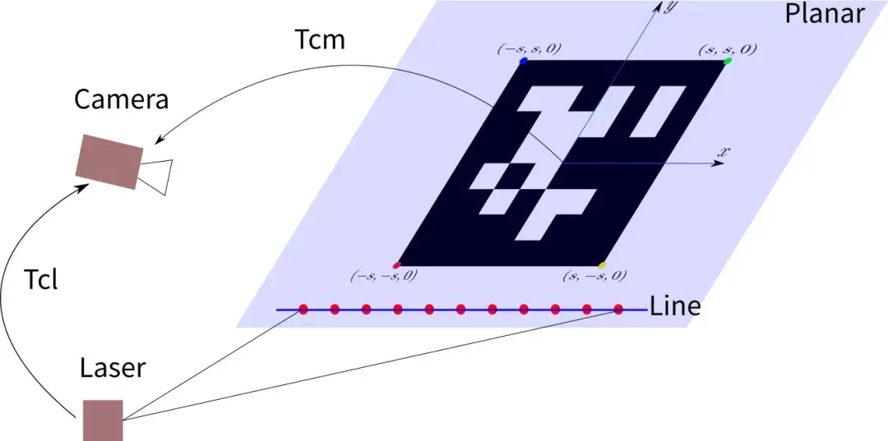

# 激光雷达与相机外参联合标定调研

## 相机的内参标定原理：

#### 张正友标定法:

https://zhuanlan.zhihu.com/p/668358597

## 一些比较通用的3D激光雷达和RGB相机外参标定算法：

### 1. Autoware

https://github.com/autowarefoundation/autoware

### 2. cam_lidar_calibration

https://github.com/acfr/cam_lidar_calibration

### 3. direct_visual_lidar_calibration

https://github.com/koide3/direct_visual_lidar_calibration

### 4. Apollo

这个工具要求相对较高，需要广角相机，里程计和惯导，而且求用户提供初始外参值作为参考.

由于Camera-to-LiDAR标定方法用于自然环境，因此良好的地点可以显着提高标定的准确性。 建议选择包含树木，电线杆，路灯，交通标志，静止物体和清晰交通线等物体的标定场地。

### 5. but_velodyne

https://github.com/robofit/but_velodyne

这是一个最简单、最单纯的lidar和cam联合标定的方案，但是需要openCV2.4.9

### 6. lidar_camera_calibration

https://github.com/ankitdhall/lidar_camera_calibration

## 激光雷达与相机外参标定原理浅析：

激光雷达与相机之间的外参标定方法一共分为了**四大类**：手动有目标标定（Manual target-based）、自动有目标标定（Automatic target-based）、手动无目标标定（Manual targetless）和自动无目标标定（Automatic targetless）。

有目标即标定过程中需要用到一些辅助工具如标定板、ArUco 标签、标定球等，相应的无目标标定方法则是标定时不依赖特定的工具，直接利用周围的场景信息进行标定。自动标定的方法在标定过程中无需人工干预，算法自动寻找对应点。

### 自动有目标标定

https://github.com/MegviiRobot/CamLaserCalibraTool

https://blog.csdn.net/weixin_41010198/article/details/115672711

对于传统有目标标定类，标定激光和相机之间的外参数有两类方法：一类是利用 3D-3D 的约束，即利用激光测量的三维激光点 和相机测量的标定板三维坐标点两者来构建约束；另一类是利用 3D-2D 的约束，即利用激光测量的三维激光点和图像二维特征（2D、点特征、线段特征）来构建约束。**标定过程的通常做法是先利用少量观测求解外参数的初始值，然后利用多帧数据的约束进行最小二乘优化对初始值进行优化。**

#### 3D-3D 约束求解**2D激光和相机外参数初始值求解**

假设标定板平面在相机坐标系 $c$中的参数为$\pi^c =[{\mathbb n}^c, d] \in \mathbb R^4$,其中$\mathbb n^c \in \mathbb R^3$是平面的三维法向量， $d$是相机坐标系原点到平面的距离。平面上的一个三维点在相机坐标系下的坐标为$\textbf P^c \in \mathbb R^3$，点在平面上满足：
$$
\mathbf{n}^{c\top}\mathbf{P}^{c} + d = 0\\
$$
假设从激光坐标系 $l$ 到相机坐标系之间的旋转和平移为$\textbf R_{cl}$,$\textbf t_{cl}$。如果知道激光坐标系中某个激光点$\textbf P^l$落在标定板上，则通过点在平面上这个约束能够构建关于外参数的方程：
$$
\mathbf{n}^{c\top}\left(\mathbf{R}_{cl}\mathbf{P}^{l}+\mathbf{t}_{cl}\right) + d^c= 0\quad(1)\\
$$
上述方程能够提供一个约束，通过多个这样的约束就能求解外参数。

算法估计的参数为从相机坐标系到激光坐标系的变换矩阵$\textbf R_{cl}$,$\textbf t_{cl}$，由此激光点从激光坐标系变换到相机坐标系为：
$$
\mathbf{P}^{c} = \mathbf{R}_{lc}^{\top}\left(\mathbf{P}^{l}-\mathbf{t}_{lc}\right)\\
$$
考虑到激光为 2D 激光，激光束形成的平面不妨假设为 xy 平面，即$z=0$，此时有$\textbf P^l=[x,y,0]^{\top}$，则上述坐标系变换可以写成更紧凑的形式：
$$
\mathbf{P}^{c} = \mathbf{R}_{lc}^{\top}\left(\begin{bmatrix}x\\y\\0\end{bmatrix}-\mathbf{t}_{lc}\right)=\underbrace{\mathbf{R}_{lc}^{\top}\begin{bmatrix} 1 & 0 & \\0 & 1 &-\mathbf{t}_{lc} \\ 0 & 0 & \end{bmatrix}}_{\mathbf{H}} \begin{bmatrix}x \\ y \\1\end{bmatrix} = \mathbf{H}\bar{\mathbf{P}}^{l}
$$
由此可以将公式 (1) 也写成紧凑形式：
$$
\mathbf{n}^{c\top}\mathbf{H}\bar{\mathbf{P}}^{l} = -d^{c}\\
$$
如果把 3 乘 3 的$\textbf H$ 矩阵当做新的未知量（ 9 个参数）进行估计，那上述约束就变成了一个**线性**最小二乘问题。对于单线激光而言，一帧激光可以提供两个有效约束（直线上两个点在平面上即能确定直线在平面上），因此大于等于 5 帧激光（不同姿态）就能得到 10 个以上的约束，来直接求得 9 参数的$\textbf H$。然后恢复出 $\textbf R_{cl}$,$\textbf t_{cl}$:
$$
\begin{split} \mathbf{R}_{lc} &= \begin{bmatrix}\mathbf{h}_1 & \mathbf{h}_2 & \mathbf{h}_1\times \mathbf{h}_2 \end{bmatrix}^{\top} \\ \mathbf{t}_{lc} &= -\begin{bmatrix}\mathbf{h}_1 & \mathbf{h}_2 & \mathbf{h}_1\times \mathbf{h}_2 \end{bmatrix}^{\top}\mathbf{h}_3 \\ \end{split}\\
$$
但是，利用上述方式求得的旋转矩阵并不满足旋转矩阵的性质 $\textbf R^{\top} \textbf R=\textbf I_{3\times3}$。假设期望的旋转矩阵为$\hat {\textbf R}_{lc}$ ，则可以通过计算带约束的最小化 Frobenius norm 问题来估计 $\hat {\textbf R}_{lc}$：
$$
\arg \min \left\| \hat{\mathbf{R}}_{lc} - {\mathbf{R}}_{lc} \right\|_{F},\quad \text{subject to} \ \hat{\mathbf{R}}^{\top}_{lc}\hat{\mathbf{R}}_{lc} = \mathbf{I}\\
$$

#### **外参数优化**

通过上述方式计算出外参数的初始值之后，再对采集的 $N$组数据进行联合优化得到最优估计，假设第$i$帧激光有$N_i$个激光点落在标定板上，同时第$i$帧激光对应的标定板平面方程在相机坐标系的表示为$[\textbf n^c_i, d^c_i]^\top$:
$$
\hat{\mathbf{R}}_{cl},\hat{\mathbf{t}}_{cl}=\arg\min_{\mathbf{R}_{cl},\mathbf{t}_{cl}}\sum_{i=1}^{N}\frac{1}{N_i}\sum_{m=1}^{N_i}\left\|\mathbf{n}_i^{c\top}\left(\mathbf{R}_{cl}\mathbf{P}_{im}^{l}+\mathbf{t}_{cl}\right)+d_i^{c}\right\|^2\\
$$

而 3D-2D 这一方法其实就是获取激光雷达坐标系和相机坐标系之间的变换矩阵（外参），其本质还是一个PnP问题。

PnP问题即给定**空间中n个点的三维坐标**以及其在**图像平面上的投影点的像素坐标**，求解**该图像对应的相机的位姿**。换句话说，空间中的点先转换至相机坐标系下，然后通过相机的内参投影到2D图像平面坐标系下得到图像上的一个点，相机的视野范围内的所有空间点通过这样一个流程，就可以生成一张完整的2D图像。

如果**把激光雷达坐标系设为空间的全局坐标系**，那么上述过程中**空间点向相机坐标系转换时就需要用到激光雷达和相机之间的外参**。所以当外参未知时，我们只要知道**空间点、相机内参以及这些空间点对应的图像位置**，就可以建立数学模型求出外参。

所以将外参标定问题转换为PnP问题后，解决问题的核心在于如何有效准确的找到**空间点和图像点之间的对应关系**，不少工作都是在用各种方法尽可能的提高对应点的匹配率。

### 自动无目标标定

对于自动无目标类，可以进一步分为四类：基于信息论方法（Information theory based methods）、基于特征的方法（Feature based methods）、基于自运动的方法（Ego‑motion based methods）和基于学习的方法（Learning based methods）。

- **基于信息论的方法**通过比较激光雷达和相机生成数据的相似性来优化外参标定结果，比如可用的信息有：激光雷达生成点云的反射率（强度信息）、平面法向量、梯度大小和方向、语义信息等和相机图像的灰度值强度、梯度大小和方向、像素语义信息等。基于各自的数据信息，使用信息论的一些方法来计算彼此之间的距离，通过各种优化方法改变外参提高两者的相似性来得到最佳的标定结果。

  https://github.com/koide3/direct_visual_lidar_calibration

  https://staff.aist.go.jp/k.koide/assets/pdf/icra2023.pdf

  

- **基于特征的方法**通过提取点云与图片之间的特征，并对他们进行匹配来实现标定，整个流程可具体分为特征提取、特征匹配和外参估计三个步骤。在特征提取步骤中可以利用点（Sobel算子、SIFT算法、Förstner算子等）、边缘（深度信息、3D线、Canny算法等）和语义（天际线、车道和电线杆等）这些信息作为特征，然后对这些特征进行匹配并计算外参。

  https://github.com/hku-mars/livox_camera_calib

  https://arxiv.org/abs/2103.01627

  - 

- **基于自运动的方法**利用激光雷达和相机自身的特性产生冗余的数据进行标定，例如通过激光SLAM算法估计时刻1到时刻2的激光雷达运动位姿，同时使用SfM算法估计相机从时刻1到时刻2的位姿，利用两者相同时间内的运动轨迹估计出外参参数，再进一步使用优化算法得到更精确的外参。

  

- **基于学习的方法**即使用近些年很火的深度学习算法进行标定，有端到端的方法（输入点云和图片数据，输出标定外参），也有在整个标定过程中的某一步使用深度学习方法处理（特征提取、特征匹配等）。