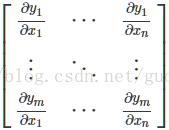
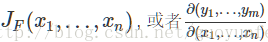
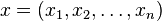

# 雅克比矩阵和海塞矩阵 

## **雅可比（Jacobian）矩阵**  

（雅克比算子又称为行偏导算子） 

在向量分析中, 雅可比矩阵是**一阶偏导数**以**一定方式排列**成的**矩阵**。其行列式称为雅可比行列式。还有, 在代数几何中, 代数曲线的雅可比量表示雅可比簇：伴随该曲线的一个代数群, 曲线可以嵌入其中. 它们全部都以数学家卡尔·雅可比(Carl Jacob, 1804年10月4日－1851年2月18日)命名。 

雅可比矩阵的重要性在于它体现了一个可微方程与给出点的最优线性逼近. 因此, 雅可比矩阵类似于多元函数的导数。 

 

表示为: 

如果p是Rn中的一点, F在p点可微分, 那么在这一点的导数由*JF(p)*给出(这是求该点导数最简便的方法). 在此情况下, 由F(p)描述的线性算子即接近点p的F的最优线性逼近, x逼近于p: 

## 海塞矩阵（Hessian）

Hessian Matrix（黑塞矩阵、海森矩阵、海瑟矩阵、海塞矩阵 etc.）,它是一个多元函数的二阶偏导数构成的方阵，用以描述函数的局部曲率。黑塞矩阵最早于19世纪由德国数学家Ludwig Otto Hesse提出，并以其名字命名。黑塞矩阵常用于[牛顿法](http://baike.baidu.com/view/1504001.htm)解决优化问题。 

在[数学](http://zh.wikipedia.org/wiki/数学)中，**海塞矩阵**（*Hessian matrix* 或 *Hessian*）是一个自变量为向量的实值函数的二阶[偏导数](http://zh.wikipedia.org/wiki/偏导数)组成的[方块矩阵](http://zh.wikipedia.org/wiki/方块矩阵)，此函数如下： 

如果 *f* 所有的二阶导数都存在，那么 *f* 的海塞矩阵即： 

其中  

 ，即 

二阶偏导数矩阵也就所谓的海赛矩阵(Hessian matrix) 

一元函数就是二阶导，多元函数就是二阶偏导组成的矩阵 

求向量函数最小值时用的，矩阵正定是最小值存在的充分条件。 

经济学中常常遇到求最优的问题，目标函数是多元非线性函数的极值问题尚无一般的求解方法，但判定局部极小值的方法是有的，就是用海赛矩阵，是变量向量二阶偏导数构成的矩阵，矩阵正定是局部极小点的充分条件。 