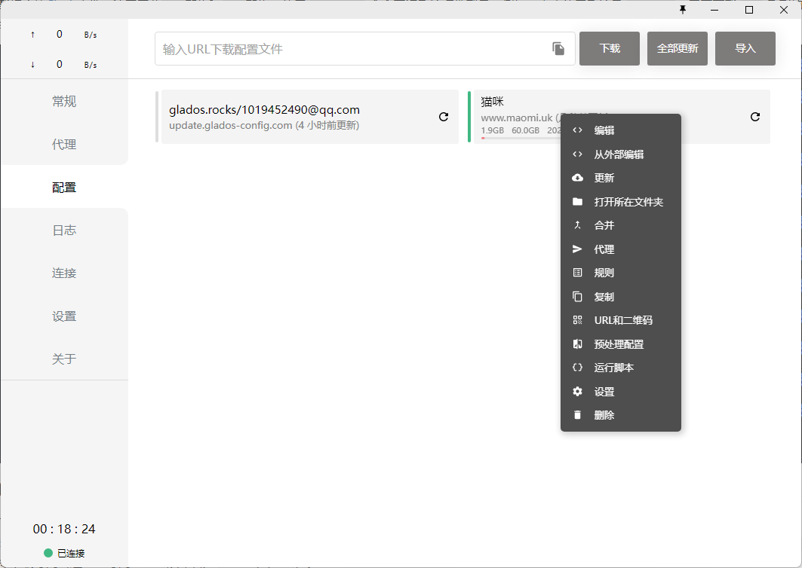
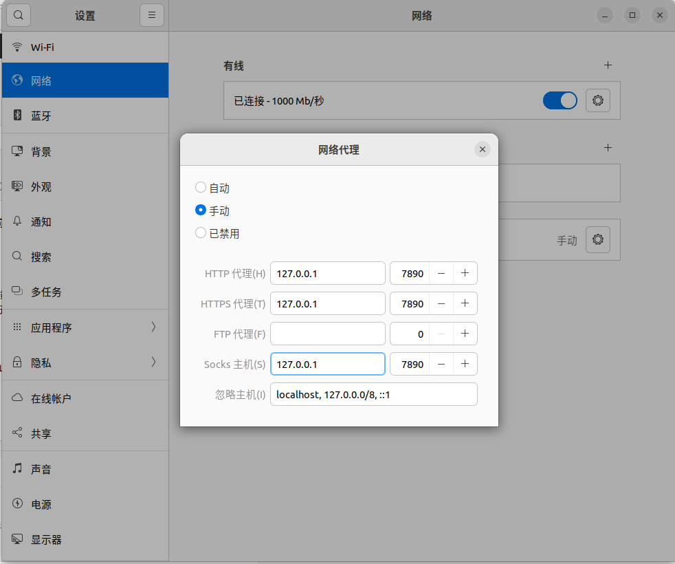

# 如何在Linux中使用Clash

## Step 1

下载相应的[Clash](https://github.com/Dreamacro/clash/releases)文件，注意区分`amd`架构和`arm`架构，使用 `uname -m` 命令查询系统硬件型号。例如，本文使用系统是 `aarch64`，需要下载 `arm` 系列的Clash，选择下载 `clash-linux-arm64-v1.13.0.gz`


## Step 2

将下载好的文件传输到Linux系统，解压文件夹或者在系统中解压缩都可以。在 `/etc` 目录下创建 `clash` 目录，使用 `cd /etc/clash` 命令切换到该目录。使用 `gzip -d clash-linux-amd64` 命令解压缩安装包到目标文件夹。使用 `wget -O config.yaml <url>` 命令下载订阅或者从windows版本订阅中打开编辑导出配置文件（这里的订阅文件必须命名为 `config.yaml`）。



## Step 3

接着运行下面的命令修改运行文件名并运行：

```
mv clash-linux-amd64  clash

chmod +x clash

./clash
```

启动服务后，会自动下载 `Country.mmdb` 文件，需要等待一会儿，如果失败建议多尝试几次，如果网速不行也可以在[这里](https://pan.baidu.com/share/init?surl=0C7SvnoH3abTZF2j3aT4sw)下载，密码76kn

## Step 4

打开linux的网络链接，配置代理地址为Clash提供的地址，一般都是`127.0.0.1:7890`，如下图所示:



浏览器打开地址：https://clash.razord.top/#/proxies，就可以看到Linux下基于WEB的ClashUI，选择对应的节点

## Step 5

设置开机自启动，创建 `/etc/systemd/system/clash.service` 文件，并更改内容如下：

```
sudo touch /etc/systemd/system/clash.service
```

```
[Unit]
Description=Clash daemon, A rule-based proxy in Go.
After=network.target

[Service]
Type=simple
Restart=always
ExecStart=/usr/local/bin/clash -d /etc/clash

[Install]
WantedBy=multi-user.target
```

使用 `systemctl enable clash` 命令设置Clash服务在系统启动时运行。

使用 `systemctl start clash` 命令立即运行Clash服务。

使用 `systemctl stop clash` 命令立即运行Clash服务。

使用 `systemctl status clash` 命令查看Clash服务的运行状态。